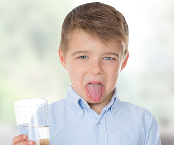

```{r setup, include=FALSE}
knitr::opts_chunk$set(echo = FALSE, warning = FALSE, message = FALSE, dpi = 300)
```

# Problem Statement
::::::{.columns}
:::{.column}
- Chlorine levels about 0.6 mg/L are acceptable by only 50% of customers
- A minimum chlorine residual is required for public health
- Exploratory analysis of chlorine levels for all Gormsey suburbs
:::
:::{.column}

:::
::::::

# Laboratory Data

```{r}
library(tidyverse)
labdata <- read_csv("data/labdata.csv")
chlorine <- filter(labdata, Measure == "Chlorine Total")
```

::::::{.columns}
:::{.column}
* Monthly samples are taken from customer taps in each town.
* Sampled between `r min(chlorine$Date)` and `r max(chlorine$Date)`.
* Fields:
    * `Sample_No`: Number of the sample
    * `Date`: Date the sample was taken
    * `Sample_Point`: Sample point asset number
    * `Suburb`: Gormsey suburb
    * `Result`: Test result
:::
:::{.column}

:::
::::::

# Explore results
```{r, fig.width=9, fig.height=4}
ggplot(chlorine, aes(Date, Result)) + 
    geom_line(col = "white") + 
    geom_hline(yintercept = 0.6, col = "red") + 
    scale_x_date(date_breaks = "year", date_labels = "%Y") + 
    facet_wrap(~Suburb) + 
    theme_dark() + 
    theme(plot.background = element_rect(fill = "black"),
          title = element_text(colour = "white"),
          axis.text = element_text(colour = "white")) + 
    labs(title = "Gormsey chlorine levels",
         caption = "Source: Laboratory data",
         x = NULL)
```

# Taste Experience
```{r}
chlorine_suburb <- group_by(chlorine, Suburb)

chlorine_results <- summarise(chlorine_suburb,
                              Minimum = min(Result),
                              Mean = mean(Result),
                              Max = max(Result),
                              Taste = round(sum(Result > 0.6) / n() * 100))

knitr::kable(arrange(chlorine_results, Taste), digits = 2,
             col.names = c("Suburb", "Minimum Cl", "Mean Cl", 
                           "Maximum Cl", "Negative taste %"))
```

# Conclusion and Recommendation
- Chlorine levels in some Gormsey suburbs show a high percentage of levels that lead to negative customer experiences
- Further research required to correlate taste complains with chlorine levels
