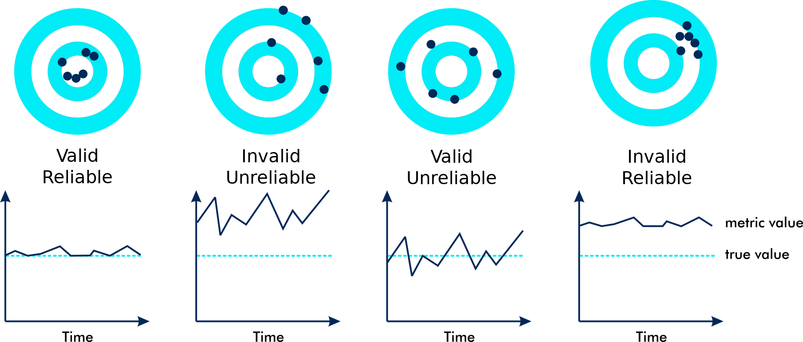
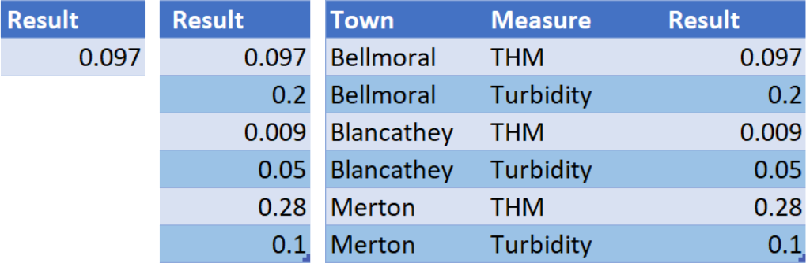
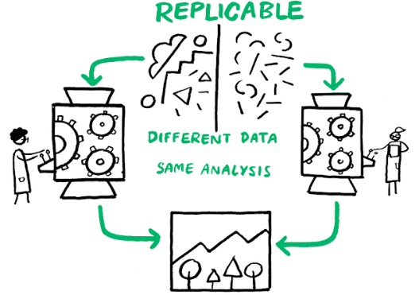

```{r setup, include=FALSE}
knitr::opts_chunk$set(echo = FALSE, message=FALSE, warning=FALSE, dpi=300)
```

# {data-background="images/r4h2o-banner.jpg"}
# Data Science for Water Professionals {data-background="images/2019-workshop-melbourne.jpg"}

## Learning Objectives Level 1
- Apply the principles of strategic data science to solve water problems
- Write R code to load, analyse, and visualise data
- Diagnose water quality data with descriptive statistics
- Develop presentations, reports, and applications to share results
     
## Course Book
[lucidmanager.org/r4h2o](https://lucidmanager.org/r4h2o)


## Program Level 1
1. Principles of Data Science
2. Basics of the R Language
3. Case Study 0: Open channel flows
4. Case Study 1: Water quality data
    - Reading CSV and Spreadsheet data
    - Descriptive Statistics

5. Visualise data with ggplot2
6. Data science workflow
7. Creating data products

# Introductions


# Principles of Data Science


## What is Data Science?
{height=400}

> Many data scientists have published modifications of this model. Can you think of some other competencies specific to analysing data?

<small>Conway Venn Diagram ([drewconway.com](http://drewconway.com/zia/2013/3/26/the-data-science-venn-diagram)).</small>

## Don't Believe the Hype


<small>Source: _Harvard Business Review_.</small>

## What is Good Data Science?
{height=400}

<small>Vitrivian triangle (_venustas_, _firmitas_, _utilitas_)</small>

## What is Useful Data Science?


## What is Sound Data Science?


## GiGo
Garbage In --- Garbage Out

## Spreadsheets are Chaos


## Code is Poetry
```{r, eval=FALSE, echo=TRUE}
library(readxl)
reservoirs <- read_excel("reservoirs.xlsx", sheet = 1)

reservoirs %>%
    select(Date, River_Flow, Natural_Flow) %>%
    muate(ERV = ifelse(Natural_Flow <= 8, 4, Natural_Flow / 2),
          Date = as.Date(Date, format = "%d/%m/%Y")) %>%
    pivot_longer(-Date,
                 values_to = "Flow",
                 names_to = "Source")  %>%
    ggplot(aes(Date, Flow, col = Source)) +
    geom_line()
```

# Basics of the R Language


## Desktop version
1. Download and install _R_ and _RStudio_
2. On Windows, install _RTools_
2. Download course materials
   - [github.com/pprevos/r4h2o](https://github.com/pprevos/r4h2o)
3. Unzip folder
4. In RStudio: _File_ > _Open Project_
5. Open `r4h2o.Rproj`

## Cloud Version
1. Register at [cloud.rstudio.com](https://cloud.rstudio.com)
2. _New Project_ > _New Project From Github Repo_
    - `https://github.com/pprevos/r4h2o/`
4. RStudio will download the project files

## Principles of R
- Console (REPL: Read-Eval-Print Loop)
- Mathematical operators (`+ - * ^ %% %/%`)
- Variable assignment
- Assignment operator (`<-` versus `=`)
- Functions: `sum()`, `prod()`, `abs()`, `log(a, base = b)`
  - Parameters
  - Use `=` sign
  - Auto-completion
  
## BODMAS


```{r, echo=TRUE}
3 - 3 * 6 + 2
```

## Arithmetic
```{r, echo=TRUE}
diameter <- 150
pipe_area <- (pi / 4) * (diameter / 1000)^2
pipe_area
sqrt(pipe_area / (pi / 4)) * 1000
```

## Vectors
```{r, echo=TRUE, results='hide'}
complaints <- c(12, 13, 23, 45, 22, 99, 31)

sum(complaints)
prod(complaints)
abs(complaints)
exp(complaints)
factorial(complaints)
log(complaints, base = 3)
log10(complaints)
```

## Basic Plotting 1
```{r}
par(mar = c(4, 4, 2, 1))
```

```{r, echo=TRUE, fig.width=6, fig.height=2.5}
diameter <- 50:350
pipe_area <- (pi / 4) * (diameter / 1000)^2
plot(diameter, pipe_area, type = "l", col = "blue", main = "Pipe Section Area")
abline(v = 150, col = "grey", lty = 2)
abline(h = (pi / 4) * (150 / 1000)^2, col = "grey", lty = 2)
points(150, (pi / 4) * (150 / 1000)^2, col = "red")
```


## Coding Principles
{width="100%"}

<small>First computer bug (1947)</small>

## Using the Editor
<div class="column" style="float:left; width: 33%">
### Natural Language
- Nouns (variables - meaningful
    - <small>`_` or `.` or `camelCase`</small>
- Verbs (functions)
- Phrases (code)
- Context
</div>

<div class="column" style="float:left; width: 33%">
### Bugs
- Typos (lintr)
- Error messes (copy and paste into search engine)
- Help files
</div>

<div class="column" style="float:left; width: 33%">
### Scripts and Projects
- Working Directory
- Open Script
- Commenting
- Indentation
</div>

# Case Study 0: Channel Flow {data-background="images/weirplate.jpg"}

## Discharge formula
$$Q = \frac{2}{3} C_d \sqrt{2g} \; lh^\frac{3}{2}$$

- $Q$: Discharge in m^3^/s
- $C_d$: Discharge coefficient
- $g$: Acceleration of gravity (9.81 m/s^2^)
- $l$: Crest length [m]
- h: Head above crest level [m]

## Coding Practice
<div class="column" style="float:left; width: 50%">
Create an R script and answer:

1. What is the flow in the channel in m^3^/s when the height $h = 100$ mm?
2. What is the average flow for these three heights: 150mm, 136mm, 75mm, in litres per second?
3. Visualise the flow in m^3^/s for all heights between 50mm and 500mm
</div>

<div class="column" style="float:right; width: 50%">
$Q = \frac{2}{3} C_d \sqrt{2g} \; lh^\frac{3}{2}$

- $Q$: Discharge in m^3^/s
- $C_d$: Discharge coefficient ($C_d=0.62$)
- $g$: Acceleration of gravity (9.81 m/s^2^)
- $l$: Crest width ($l=0.5$ m)
- $h$: Head above crest level [m]
</div>

# Exploring Data with Tidyverse


## Base R functions
  - Basic programming functions
  - Arithmetic
  - Statistics
  - Plotting
  - Extendible with functions

## R Packages
- Packages to extend base functionality
  - Distributed mainly through [CRAN](https://cran.r-project.org/)
  - Comprehensive R Archive Network
- Call library to access functions: `library(dplyr)`
- Or, add library name and two colons: `dplyr::filter()`

## Tidyverse
- Collection of R packages
- Easy data manipulation
- 'syntactic sugar'

# Case Study 1: Water Quality
```{r, fig.asp=9/16}
library(tidyverse)
library(lubridate)
gormsey_2070 <- read_csv("casestudy1/gormsey.csv") %>% 
    filter(year(Date) == 2069 & Suburb == "Snake's Canyon")

ggplot(gormsey_2070, aes(Date, Result)) + 
    geom_line(alpha = 0.9, col = "dodgerblue") + 
    facet_wrap(~Measure, scales = "free_y") + 
    theme_minimal() + 
    labs(title = "Water Quality Data Gormsey",
         subtitle = unique(gormsey_2070$Suburb),
         caption = "R4H2O")
```

## Obtaining Data
- Database (SQL, Oracle)
- Desktop files (spreadsheets, CSV)
- Web (HTML, XML, JSON)
  - API
  - Scraping

## CSV files
- Use only the top row as a header
- Don’t use colours to indicate values
- Prevent using spaces in column names
- Don’t add any spreadsheet calculations
- Every cell should be a data point or remain empty

## Reading CSV files
- `readr` package for CSV files (part of Tidyverse)
    - `read_csv()` faster alternative for `read.csv()`
    - Look at help text

- File names in R
  - Unix-based (slash instead of backslash)
  - Results in data frame / tibble
  
```{r,echo=TRUE, results='hide'}
library(tidyverse)
gormsey <- read_csv("casestudy1/gormsey.csv")

names(gormsey)
dim(gormsey)
ncol(gormsey)
nrow(gormsey)

head(gormsey)
str(gormsey)
glimpse(gormsey)
```

## Variable classes
- Integer (${\ldots -3, -2, -1, 0, 1, 2, 3, \ldots}$)
- Numeric (Real numbers) ($\mathbb{R}$)
- Complex numbers ($a + bi$)
- Text (`"abcd"`)
- Dates (`"`r Sys.Date()`"`)
- Factors (classifications): (`"Male", "Female", "Other"`)
- Boolean (`TRUE`, `FALSE`)

## Variable Types


Scalar, vector and data frame / tibble (matrix)


## Exploring data frames
- `df[rows, columns]`
- `df$column`
- `glimpse(df)`

```{r, echo=TRUE, results='hide'}
gormsey[12:13, ]
gormsey[, 4:5]
gormsey[1:2, c(2, 4:5, 6)]
gormsey[1:2, c(-1, -3, -7)]
gormsey$Date[1:6]
```

What is the sample number of the last sample in the Gormsey data? 

Hint, use the `nrow()` function.

## Conditionals
Compare variables

```{r, echo = TRUE, results='hide'}
a <- 1:2
a == 1
a != 1
a >= 2

a <- c(TRUE, FALSE)
a * 2

"small" > "large" 

gormsey$Measure == "Turbidity" & gormsey$Result > 5
```

## Filtering


```{r, echo=TRUE, results='hide'}
# Three methods

gormsey[gormsey$Measure == "Turbidity", ]

subset(gormsey, Measure == "Turbidity")

library(dplyr)
filter(gormsey, Measure == "Turbidity")

turb5 <- filter(gormsey, Measure == "Turbidity" & Result > 5)
```

## Counting Results
```{r, echo=TRUE}
length(gormsey$Measure)

unique(gormsey$Measure)

table(gormsey$Measure)
```

## dplyr counting
```{r, echo=TRUE}
count(gormsey, Measure)
```

# R4H2O Cheat Sheet
[lucidmanager.org/r4h2o/cheat-sheet.pdf](https://lucidmanager.org/r4h2o/cheat-sheet.pdf)

{height=400}

## Coding Practice
Write a script to answer these questions:

1. How many turbidity results in all suburbs, except Strathmore, are lower than 0.1 NTU?
2. Which sample points had a non-zero E. coli count?
3. Create a table that counts the number of THM samples per suburb

# Descriptive Statistics

```{r, fig.asp=9/16}
library(tidyverse)
library(sn)
library(modeest)
set.seed(1)
##x <- rlnorm(1000, meanlog = .6, sdlog = .1) * 100
x <- rsn(n=1000, xi=0, omega=1, alpha=100, tau=.1, dp=NULL)
s <- tibble(s = c(mean(x),
                  median(x),
                  mlv(x, method = "asselin")),
            t = c("Mean", "Median", "Mode"))
ggplot(tibble(x), aes(x)) +
    geom_density(fill = "dodgerblue", alpha = 0.1, col = "dodgerblue") +
    geom_vline(data = s, aes(xintercept = s, col = t), size = 1) +
    scale_color_brewer(type = "qual", palette = 2, name = NULL) + 
    theme_void(base_size = 20) +
    theme(legend.direction="horizontal",
          legend.position = "bottom")
```

## Central Tendency
```{r, echo=TRUE, results='hide'}
turbidity <- filter(gormsey, Measure == "Turbidity")

mean(turbidity$Result)
sum(turbidity$Result) / length(turbidity$Result)

median(turbidity$Result)
```

Calculating the mode of continuous data is complex and requires a specialised package.

## Dispersion
```{r, echo=TRUE, results='hide'}
min(turbidity$Result)
max(turbidity$Result)
range(turbidity$Result)
diff(range(turbidity$Result))

var(turbidity$Result)
sd(turbidity$Result)

sqrt(sum((turbidity$Result - mean(turbidity$Result))^2) / 
       (length(turbidity$Result) - 1))
```

## Quantiles
<div class="column" style="float:left; width: 50%"><small>

1. Place the observations in ascending order: $y_1, y_2, \ldots y_n$.
2. Calculate the rank ($r$) of the required percentile
3. Interpolate between adjacent numbers: $$y_r = y_{\lfloor r \rfloor}+ (y_{r_{\lceil r \rceil}} - y_{\lfloor r \rfloor})(r - \lfloor r \rfloor)$$
    - $y$: Observation
    - $r$: Ranking number
    - $\lfloor r \rfloor$: Floor or $r$
    - $\lceil r \rceil$: Ceiling of $r$

</small></div>
<div class="column" style="float:left; width: 50%">
```{r, fig.asp=9/16}
x <- c(1, 2, 3.5, 4, 5)
y <- 2 * x

plot(x, y, pch = 19, 
     xlab = "Rank", 
     ylab = "Observation", 
     xaxt = "n",
     yaxt = "n", 
     frame.plot = FALSE)

axis(1, at = x,
     labels = c(1, 
                expression(group(lfloor, r, rfloor)), 
                "r", 
                expression(group(lceil, r, rceil)), 
                "n"))

axis(2, at = y,
     labels = c(expression(y[1]),
                expression(y[group(lfloor, r, rfloor)]),
                expression(y[r]),
                expression(y[group(lceil, r, rceil)]),
                expression(y[n])))

lines(x[1:2], y[1:2], lty = 2)
lines(x[2:4], y[2:4], lty = 1)
lines(x[4:5], y[4:5], lty = 2)

abline(h = y[3], col = "red", lwd = .5, lty = 2)
abline(v = x[3], col = "red", lwd = .5, lty = 2)

points(x, y)
```
</div>

```{r, echo=TRUE, results='hide'}
IQR(turbidity$Result)
summary(turbidity$Result)
quantile(turbidity$Result, type = 6, probs = 0.95)
```

## Quantiles (continued)

```{r, fig.asp=9/16}
sample <- c(1:17, 63, 170, 300)

## Set parameters
n <- length(sample)
p <- 0.95

## Visualise
par(mar=c(6, 5, 4, 1))
plot(sample, type = "b",
     xlab = "Rank", ylab = "Result",
     cex.axis = 1,
     cex.lab = 1,
     cex.main = 1,
     cex.sub = 1,
     lwd = 1)

## Calculate rank
r_weibull <- p * (n + 1)
r_excel <- 1 + p * (n - 1)

## Interpolate percentiles
x_weibull <- (1 - (r_weibull - floor(r_weibull))) * sample[floor(r_weibull)] + (r_weibull - floor(r_weibull)) * sample[ceiling(r_weibull)]
x_excel <- (1 - (r_excel - floor(r_excel))) * sample[floor(r_excel)] + (r_excel - floor(r_excel)) * sample[ceiling(r_excel)]

## Visualise
abline(v = r_weibull, col = "red", lwd = 1, lty = 3)
abline(v = r_excel, col = "blue", lwd = 1, lty = 2)

## Legend
legend("topleft", legend = c("Excel", "Weibull"), col = c("blue", "red"), lwd = 1, lty = c(2, 3))
```

## Grouped Analysis


## Grouped Analysis

```{r, echo=TRUE, results='hide'}
measures <- group_by(gormsey, Measure)
summarise(measures, max = max(Result))

measures_town <- group_by(gormsey, Measure, Suburb)
summarise(measures,
          Samples = n(),
          Mean = mean(Result),
          Median = median(Result),
          p95 = quantile(Result, type = 6, probs = 0.95))
```

## Coding Practice
1. What is the average number of samples taken at the sample points in Gormesey?
2. Which sample point has breached the maximum value of 0.25 mg/l for THM most often?
3. What is the highest 95th percentile of the turbidity for each of the towns in Gormsey, using the Weibull method?

# Program
1. Session 1 recapitulation
2. Principles of visualising data 
3. Visualising data with _ggplot2_
4. Data Science Workflow
5. RMarkdown
6. Learning R

## Session 1 recapitulation
[lucidmanager.org/r4h2o/cheat-sheet.pdf](https://lucidmanager.org/r4h2o/cheat-sheet.pdf)

{height=400}

## Case Study 1
1. What is the average number of samples taken at the sample points in Gormesey?
2. Which sample point has breached the maximum value of 0.25 mg/l for THM most often?
3. What is the highest 95th percentile of the turbidity for each of the towns in Gormsey, using the Weibull method?
    - Use the `arrange()` function to sort a data frame

## Coding Challenge
- Go to the Bureau of Meteorology website
    - http://www.bom.gov.au/climate/data/stations/
- Download rainfall data for your favourite weather station
- Determine the top five years with the highest total rainfall
- Tips: 
    - Variable names with spaces need to be between back ticks: \``variable name`\`
    - The data has missing values. Use the `na.rm = TRUE` option in the `sum()` function
    - Use the `top_n()` function to list the top five years

## Solution
```{r, echo=TRUE}
library(tidyverse)
bom <- read_csv("casestudy1/IDCJAC0009_088110_1800_Data.csv")
bom_year <- group_by(filter(bom, Year != 2022), Year)
annual_rain <- summarise(bom_year, 
                         TotalRain = sum(`Rainfall amount (millimetres)`, 
                                         na.rm = TRUE))
top_n(annual_rain, 5)
```

# Principles of visualising data


## Jackson Pollock


<small> Jackson Pollock (1952) Blue Poles number 11. Drip Painting in enamel and aluminium paint with glass on canvas (National Gallery, Canberra).</small>

## r/dataisugly
{height=600}

## Piet Mondrian

<small>Piet Mondrian (1928) Composition with red, yellow and blue. Oil on canvas (Municipal Museum, the Hague).</small>

## Data-Pixel Ratio


## Data Story-Telling


## r/dataisugly
{height=600}

## Solution
[lucidmanager.org/data-science/storytelling-with-data/](https://lucidmanager.org/data-science/storytelling-with-data/)
{height=500}

## {data-background="images/visualisations.jpg"}

## Grammar of Graphics
<div class="column" style="float:left; width: 50%">
1. _Data_: exists at the lowest level, without which there is nothing to visualise.
2. _Aesthetics_: defines which graph variables are visualised and how they look (colour, line shapes and sizes).
3. _Geometries_: shapes that represent the data, such as bars, pies or lines.
4. _Facets_: used to divide a visualisation into subplots.
5. _Statistics_: relate to any specific transformations to summarise the data, such as trend lines.
6. _Coordinates_: define how data is represented on the canvas. Mostly used in mapping.
7. _Themes_: defines the non-data pixels (font sizes, backgrounds and so on)
</div>
<div class="column" style="float:left; width: 50%">

</div>

# Base Plots
- Best for exploratory visualisations
- Plotting functions
    - `plot()`
    - `barplot()`
    - `histogram()`
    - `boxplot()` 
- Annotation functions (add elements to the plot)
    - `abline()`
    - `points()`

## Base plotting parameters
- `pch`: the plotting symbol (default is open circle)
- `lty`: the line type (default is solid line), can be dashed, dotted, etc.
- `lwd`: the line width, specified as an integer multiple
- `col`: the plotting color, specified as a number, string, or hex code
- `xlab`: character string for the x-axis label
- `ylab`: character string for the y-axis label


## Examples

```{r, echo=TRUE}
library(tidyverse)
gormsey <- read_csv("casestudy1/gormsey.csv")
turbidity <- filter(gormsey, Measure == "Turbidity")

plot(turbidity$Date, turbidity$Result, 
     type = "l",
     xlab = "Date",
     ylab = "Result",
     main = "Turbidity measurements")
abline(h = 5, col = "red")

boxplot(log10(Result) ~ Suburb, data = turbidity,
        pch = 19, las = 3, col = "brown",
        main = "Turbidity measurements")
abline(h = log10(5), col = "red")

p95 <- summarise(group_by(turbidity, Suburb), 
                 p95 = quantile(Result, 0.95))

barplot(p95$p95, names.arg = p95$Town)
abline(h = 5, col = "red")
```

# ggplot2 package
{height=600}

## Examples 1
```{r, echo = TRUE, eval=FALSE}
ggplot(gormsey, aes(Town))

ggplot(gormsey, aes(Measure)) + 
    geom_bar()

turbidity <- filter(gormsey, Measure == "Turbidity")

ggplot(turbidity, aes(Date, Result, col = Town)) + 
    geom_line()
```

## Color Palettes


## ColorBrewer
```{r, echo = TRUE, eval=FALSE}
ggplot(gormsey, aes(Town, fill = Measure)) +
    geom_bar() +
    scale_fill_brewer(type = "qual",
                      palette = "Dark2")

library(RColorBrewer)
display.brewer.all() 

ggplot(gormsey, aes(Town, fill = Measure)) +
    geom_bar() +
    scale_fill_manual(values = c("cornflowerblue",
                                 "darkseagreen",
                                 "#ee6611",
                                 "#ccaa44"))
```

## Facets
```{r, echo = TRUE, eval=FALSE}
ggplot(turbidity, aes(Date, Result, col = Town)) + 
    geom_line() + 
    facet_wrap(~Town)
```

## Statistics
```{r, echo = TRUE, eval=FALSE}
thm <- filter(gormsey, Measure == "THM")
thm_grouped <- group_by(thm, Date)
thm_max <- summarise(thm_grouped, thm_max = max(Result))

ggplot(thm_max, aes(Date, thm_max)) + 
    geom_smooth(method = "lm") + 
    geom_line() + 
    geom_hline(yintercept = 0.25, col = "red")
```

Practice Task: Convert this visualisation to a faceted graph to show the trend per system.

## Coordinates
```{r, echo = TRUE, eval=FALSE}
ggplot(turbidity, aes(Town, Result)) + 
    geom_boxplot() + 
    scale_y_log10(name = "Samples (log)",
                  n.breaks = 10) +
    coord_flip()
```

- `scale_x_log10()`: Logarithmic scale.
- `scale_x_discrete()`: Discrete variables (names).
- `scale_x_continuous()`: Continuous variables, such as measurements.
- `scale_x_date()`: For displaying dates and times.


## Themes
```{r, echo = TRUE, eval=FALSE}
ggplot(turbidity, aes(Date, Result)) + 
    geom_area(col = "dodgerblue", fill = "dodgerblue") + 
    facet_wrap(~Town, ncol = 1) + 
    theme_void(base_size = 24)

ggplot(gormsey, aes(Measure)) +
    geom_bar() +
    theme(axis.text.x = element_text(angle = 90))

ggsave("casestudy1/measures.png", width = 15, height = 10, dpi = 300, units = "cm")
```

## Combining data sets
```{r, echo=TRUE, results='hide'}
chlorine <- filter(gormsey, Measure == "Chlorine Total")

chlorine_gr <- group_by(chlorine, Suburb)
  
chlorine_avg <- summarise(chlorine_gr, avg = mean(Result))

ggplot(chlorine, aes(Date, Result)) + 
  geom_line() + 
  facet_wrap(~Suburb) + 
  geom_hline(data = chlorine_avg, aes(yintercept = avg), col = "blue", lty = 2) + 
  theme_minimal() + 
  labs(title = "Average total chlorine leves in Gormsey",
       x = NULL, y = "Total Chlorine")
```

## ggplot2 Cheat Sheet
https://raw.githubusercontent.com/rstudio/cheatsheets/master/data-visualization-2.1.pdf

# Data Science Workflow


## Replicable and Reproducible
[coderefinery.github.io/reproducible-research](https://coderefinery.github.io/reproducible-research)
<div class="column" style="float:left; width: 50%">
{height=300}
</div>
<div class="column" style="float:left; width: 50%">
{height=300}
</div>

## Define
> The regulator for water quality has released a new guideline that lowers the maximum value for trihalomethanes (THMs) at the customer tap to 0.20 mg/l. This report assesses the historical performance of the Gormsey water system to evaluate the risk of non-compliance, assuming no operational changes are implemented.

## Load and Tidy
```{r, echo=TRUE}
library(readr)
library(dplyr)
gormsey <- read_csv("casestudy1/gormsey.csv")
thm <- filter(gormsey, Measure == "THM")
glimpse(thm)
```

## Explore
{height=400}

## Explore THM
```{r, echo = TRUE, fig.height=2.5}
filter(gormsey, Measure == "THM") %>% 
  ggplot(aes(Suburb, Result)) + 
  geom_boxplot() + 
  geom_hline(yintercept = .2, col = "red", linetype = "longdash") + 
  scale_y_log10() + 
  coord_flip() + 
  theme_minimal() + 
  labs(title = "THM Results",
       subtitle = "Gormsey") 
```

## Model
>  “All models of reality are wrong, but some are useful.”

```{r, echo=TRUE}
filter(thm, Result > 0.2)
```

## Reflect
> Further investigation required to determine the cause


## Communicate (RMarkdown)


## Tables
```{r, echo=TRUE}
library(knitr)
thm_fail <- filter(gormsey, Measure == "THM" & Result > .25)
kable(select(thm_fail, Date, Suburb, Result),
      caption = "Example outut of the `kable()` function.", 
      digits = 2)
```

## Rounding Numbers
```{r, echo=TRUE}
a <- sqrt(777)
round(a)
round(a, 2)
round(a, -1)
floor(a)
ceiling(a)
signif(a, 5)
```


# Learning Data Science

1. Understand the basics
2. Code by hand
3. Create simple programs
4. Practice
5. Ask for help
6. Build projects
7. Help others