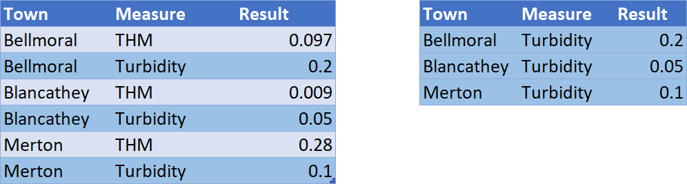
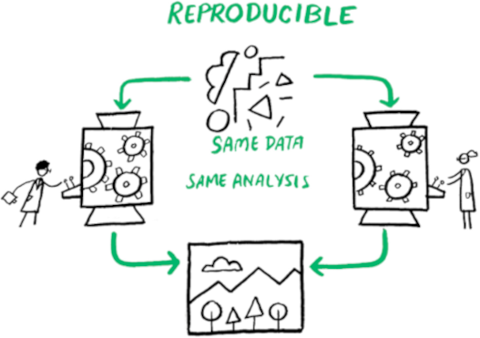

## Explore Data Frame Properties

```{r,echo=TRUE, results='hide'}
names(labdata)
dim(labdata)
ncol(labdata)
nrow(labdata)

head(labdata)
str(labdata)
glimpse(labdata)
```

## Exploring data frames
- `df[rows, columns]`
- `df$column`
- `glimpse(df)`

```{r, echo=TRUE, results='hide'}
labdata[12:13, ]
labdata[, 4:5]
labdata[1:2, c(2, 4:5, 6)]
labdata[1:2, c(-1, -3, -7)]
labdata$Date[1:6]
```

What is the sample number of the last sample in the Gormsey data? 

Hint, use the `nrow()` function.

## Conditionals
Compare variables

```{r, echo = TRUE, results='hide'}
a <- 1:2
a == 1
a != 1
a >= 2

a <- c(TRUE, FALSE)
a * 2

"small" > "large" 

labdata$Measure == "Turbidity" & labdata$Result > 5
```

## Filtering


```{r, echo=TRUE, results='hide'}
# Three methods

labdata[labdata$Measure == "Turbidity", ]

subset(labdata, Measure == "Turbidity")

library(dplyr)
filter(labdata, Measure == "Turbidity")

turb5 <- filter(labdata, Measure == "Turbidity" & Result > 5)
```

## Counting Results
```{r, echo=TRUE}
length(labdata$Measure)

unique(labdata$Measure)

table(labdata$Measure)
```

## dplyr counting
```{r, echo=TRUE}
turbidity <- filter(labdata, Measure == "Turbidity")
turbidity_count <- count(turbidity, Suburb, name = "Samples")
turbidity_count
```

## Coding Practice
Write a script to answer these questions:

1. Create a table of the number of E. coli regulation breaches by suburb (`Result > 0`).
2. Which sample point has the most number of samples taken?
3. On how many days were samples taken?

Solutions in `scripts/case-study-1.R`


## Coding Practice

1. Which suburb recorded the highest level of chlorine?
2. What is the average 95^th percentile of the turbidity for the towns in Gormsey, using the Weibull method?

Answers in `scripts/case-study-1.R`


# Visualising Data
```{r, fig.height=4}
data(anscombe)
library(tidyverse)

  p <- anscombe %>%
    select(1:4) %>%
    pivot_longer(cols = 1:4, names_to = "set", values_to = "x") %>%
    mutate(set = str_remove(set, "x"))

  q <- anscombe %>%
    select(5:8) %>%
    pivot_longer(cols = 1:4, names_to = "set", values_to = "y") %>%
    mutate(set = str_remove(set, "y"))

  tibble(p, y = q$y) %>%
    mutate(set = paste("Set", set))  %>%
    ggplot(aes(x, y)) +
    geom_smooth(method = "lm", se = FALSE, col = "gray") +
    geom_point(size = 2.5, colour = "black", fill = "gray", shape = 21) +
    facet_wrap(~set) + 
    theme_bw(base_size = 12) +
    labs(x = NULL, y = NULL, title = "Anscombe's Quartet")
```

## Datasaurus Dozen
```{r}
  library(datasauRus)

  ggplot(datasaurus_dozen, aes(x = x, y = y)) +
      geom_point(size = 1) +
      theme_void(base_size = 20) +
      theme(legend.position = "none") +
      facet_wrap(~dataset, ncol = 4)
```

## Basic Plotting
- Best for exploratory visualisations
- Plotting functions
    - `plot()`
    - `barplot()`
    - `histogram()`
    - `boxplot()` 

- Annotation functions (add elements to the plot)
    - `abline()`
    - `points()`

## Base plotting parameters
- `pch`: the plotting symbol (default is open circle)
- `lty`: the line type (default is solid line), can be dashed, dotted, etc..
- `lwd`: the line width, specified as an integer multiple
- `col`: the plotting colour, specified as a number, string, or hex code
- `xlab`: character string for the x-axis label
- `ylab`: character string for the y-axis label

## Plotting Example

`scripts/04-statistics.R` end of script

```{r, fig.height=3, fig.width=6}
library(tidyverse)
labdata <- read_csv("data/water_quality.csv")
turbidity <- filter(labdata, Measure == "Turbidity")

par(mfrow = c(1, 3))
plot(turbidity$Date, turbidity$Result, 
     type = "l", xlab = "Date", ylab = "Result",
     main = "Turbidity measurements")
abline(h = 5, col = "red")

boxplot(log10(Result) ~ Suburb, data = turbidity,
        pch = 19, las = 3, col = "brown",
        main = "Turbidity measurements", xlab = NULL)
abline(h = log10(5), col = "red")

p95 <- summarise(group_by(turbidity, Suburb), 
                 p95 = quantile(Result, 0.95))

barplot(p95$p95, names.arg = p95$Suburb,
        main = "95th percentile turbidity", las = 3)
abline(h = 5, col = "red")
```


## r/dataisugly
{height=600}

## r/dataisbeautiful
{height=600}

## Solution
[lucidmanager.org/data-science/storytelling-with-data/](https://lucidmanager.org/data-science/storytelling-with-data/)
{height=500}

## Jackson Pollock


<small> Jackson Pollock (1952) Blue Poles number 11. Drip Painting in enamel and aluminium paint with glass on canvas (National Gallery, Canberra).</small>

## Piet Mondrian

<small>Piet Mondrian (1928) Composition with red, yellow and blue. Oil on canvas (Municipal Museum, the Hague).</small>

## Data-Pixel Ratio


## {data-background="../images/visualisations.jpg"}

# ggplot2 package
{height=500}

`scripts/05-visualise.R`

## Grammar of Graphics
<div class="column" style="float:left; width: 50%">
1. _Data_: base material
2. _Aesthetics_: graph variables to be visualised
3. _Geometries_: shapes that represent the data
4. _Facets_: divide a visualisation into sub-plots.
5. _Statistics_: data summaries, such as trend lines.
6. _Coordinates_: how data is represented on the canvas
7. _Themes_: non-data pixels
</div>
<div class="column" style="float:left; width: 50%">

</div>

## Examples 1
```{r, echo = TRUE, eval=FALSE}
ggplot(labdata, aes(Town))

ggplot(labdata, aes(Measure)) + 
    geom_bar()

turbidity <- filter(labdata, Measure == "Turbidity")

ggplot(turbidity, aes(Date, Result, col = Town)) + 
    geom_line()
```

## Color Palettes
{height=400}

## ColorBrewer
```{r, echo = TRUE, eval=FALSE}
ggplot(labdata, aes(Town, fill = Measure)) +
    geom_bar() +
    scale_fill_brewer(type = "qual",
                      palette = "Dark2")

library(RColorBrewer)
display.brewer.all() 

ggplot(labdata, aes(Town, fill = Measure)) +
    geom_bar() +
    scale_fill_manual(values = c("cornflowerblue",
                                 "darkseagreen",
                                 "#ee6611",
                                 "#ccaa44"))
```

## Facets
```{r, echo = TRUE, eval=FALSE}
ggplot(turbidity, aes(Date, Result, col = Town)) + 
    geom_line() + 
    facet_wrap(~Town)
```

## Statistics
```{r, echo = TRUE, eval=FALSE}
thm <- filter(labdata, Measure == "THM")
thm_grouped <- group_by(thm, Date)
thm_max <- summarise(thm_grouped, thm_max = max(Result))

ggplot(thm_max, aes(Date, thm_max)) + 
    geom_smooth(method = "lm") + 
    geom_line() + 
    geom_hline(yintercept = 0.25, col = "red")
```

## Coordinates
```{r, echo = TRUE, eval=FALSE}
ggplot(turbidity, aes(Town, Result)) + 
    geom_boxplot() + 
    scale_y_log10(name = "Samples (log)",
                  n.breaks = 10) +
    coord_flip()
```

- `scale_x_log10()`: Logarithmic scale.
- `scale_x_discrete()`: Discrete variables (names).
- `scale_x_continuous()`: Continuous variables, such as measurements.
- `scale_x_date()`: For displaying dates and times.


## Themes
```{r, fig.height=2.5, fig.width=5}
  library(gridExtra)

  p <- ggplot(labdata, aes(Measure)) + geom_bar()
  a <- p + theme_classic(base_size = 8) + ggtitle("theme_clasic()")
  b <- a + theme_bw(base_size = 8) + ggtitle("theme_bw()")
  c <- a + theme_minimal(base_size = 8) + ggtitle("theme_minimal()")
  d <- a + theme_void(base_size = 8) + ggtitle("theme_void()")
  grid.arrange(a, b, c, d)
```

## Combining data sets
```{r, echo=TRUE, results='hide'}
chlorine <- filter(labdata, Measure == "Chlorine Total")

chlorine_gr <- group_by(chlorine, Suburb)
  
chlorine_avg <- summarise(chlorine_gr, avg = mean(Result))

ggplot(chlorine, aes(Date, Result)) + 
  geom_line() + 
  facet_wrap(~Suburb) + 
  geom_hline(data = chlorine_avg, aes(yintercept = avg), col = "blue", lty = 2) + 
  theme_minimal() + 
  labs(title = "Average total chlorine leves in labdata",
       x = NULL, y = "Total Chlorine")
```

## ggplot2 Cheat Sheet
{height=600}

# 


# Data Science Workflow


## Replicable and Reproducible
[coderefinery.github.io/reproducible-research](https://coderefinery.github.io/reproducible-research)
<div class="column" style="float:left; width: 50%">
{height=300}
</div>
<div class="column" style="float:left; width: 50%">
{height=300}
</div>

## Define
> The regulator for water quality has released a new guideline that lowers the maximum value for trihalomethanes (THMs) at the customer tap to 0.20 mg/l. This report assesses the historical performance of the Gormsey water system to evaluate the risk of non-compliance, assuming no operational changes are implemented.

## Load and Tidy
```{r, echo=TRUE}
library(readr)
library(dplyr)
labdata <- read_csv("../../data/water_quality.csv")
thm <- filter(labdata, Measure == "THM")
glimpse(thm)
```

## Explore
```{r}
  library(tidyverse)
  library(datasauRus)

  filter(datasaurus_dozen,
         dataset %in% c("dino", "x_shape", "star", "bullseye")) %>%
      ggplot(aes(x = x, y = y)) +
      geom_point() +
      theme_void(base_size = 20) +
      theme(legend.position = "none") +
      facet_wrap(~dataset, ncol = 6)
```

## Explore THM
```{r, echo = TRUE, fig.height=2.5}
filter(labdata, Measure == "THM") %>% 
  ggplot(aes(Suburb, Result)) + 
  geom_boxplot() + 
  geom_hline(yintercept = .2, col = "red", linetype = "longdash") + 
  scale_y_log10() + 
  coord_flip() + 
  theme_minimal() + 
  labs(title = "THM Results",
       subtitle = "Gormsey") 
```

## Model
>  “All models of reality are wrong, but some are useful.”

```{r, echo=TRUE}
filter(thm, Result > 0.2)
```

## Reflect
> Further investigation required to determine the cause


## Communicate (RMarkdown)


## Tables
```{r, echo=TRUE}
library(knitr)
thm_fail <- filter(labdata, Measure == "THM" & Result > .25)
kable(select(thm_fail, Date, Suburb, Result),
      caption = "Example outut of the `kable()` function.", 
      digits = 2)
```

## Rounding Numbers
```{r, echo=TRUE}
a <- sqrt(777)
round(a)
round(a, 2)
round(a, -1)
floor(a)
ceiling(a)
signif(a, 5)
```

# Learning Data Science

1. Understand the basics
2. Code by hand
3. Create simple programs
4. Practice
5. Ask for help
6. Build projects
7. Help others