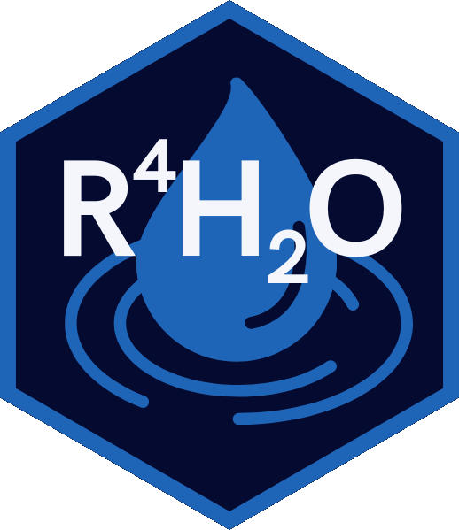
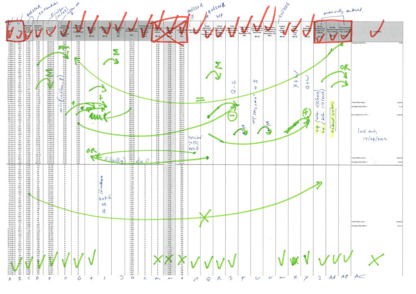
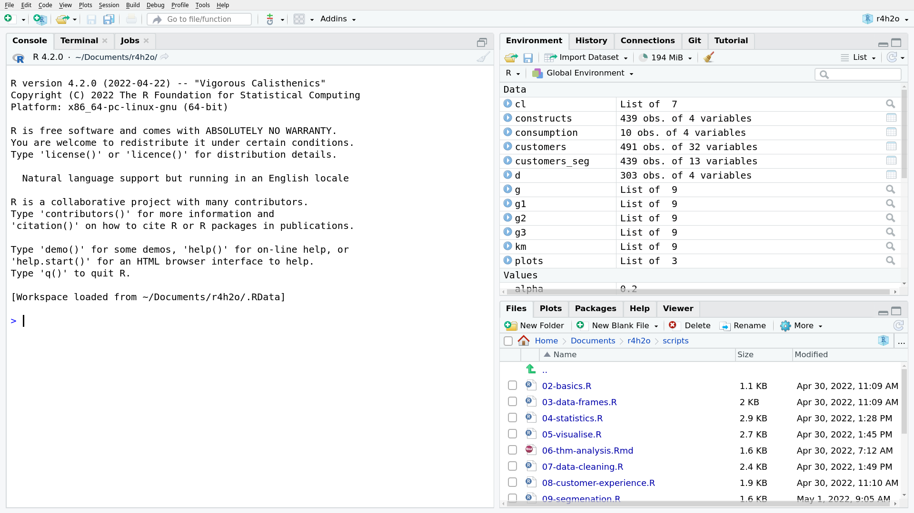
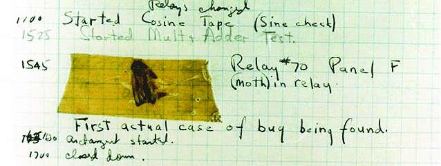
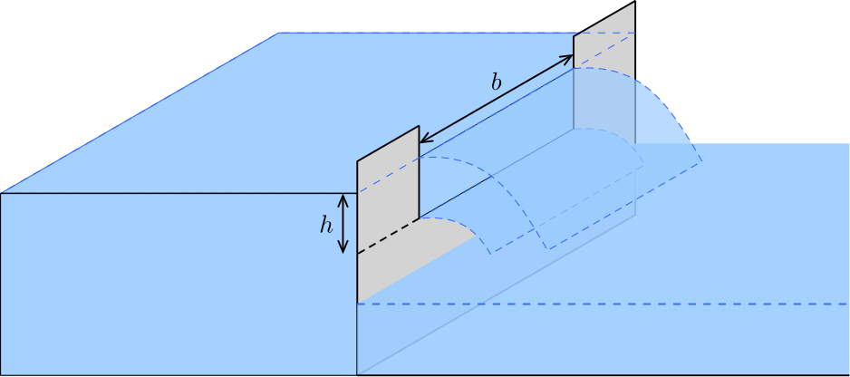
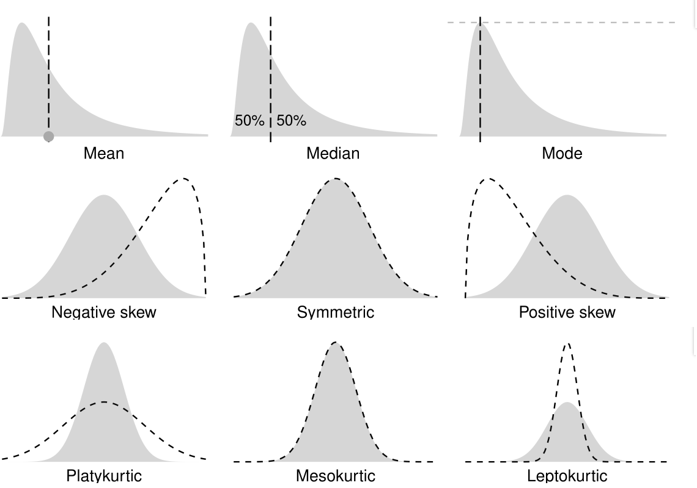
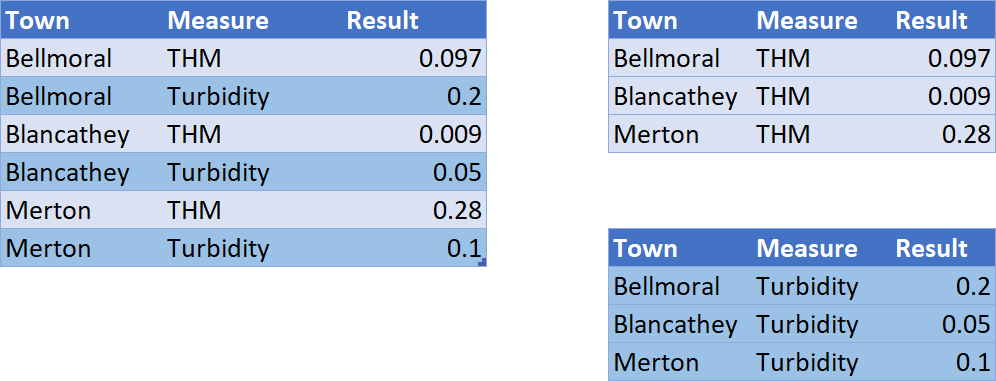

```{r setup, include=FALSE}
knitr::opts_chunk$set(echo = FALSE, message=FALSE, warning=FALSE, dpi=300)
library(JuliaCall)
```

# {data-background="../images/r4h2o-banner.jpg"}

# Introductions


## Learning Objectives Level 1
<div class="cols">
- Apply the principles of strategic data science to solve water problems
- Write R code to load, analyse, and visualise data
- Diagnose water quality data with descriptive statistics
- Develop presentations, reports, and applications to share results
</div>
<div class="cols">
{height=400}
</div>

## Course Structure
<div class="cols">
- Case study approach using realistic synthetic data
- Hands-on sessions
- Based on generic principles
</div>
<div class="cols">
{height=500}
</div>

## Program Level 1
<div class="cols">
1. Principles of Data Science
2. Basics of the R Language
3. Case Study: Channel flows
4. Case Study: Water quality
    - Reading CSV and Spreadsheet data
    - Descriptive Statistics

5. Visualise data with _ggplot2_
6. Data science workflow
7. Creating data products
</div>
<div class="cols">

</div>

## Data Science Learning Curve
{height=500}

# What is Data Science?
<div class="cols">
{height=400}

<small>Conway Venn Diagram ([drewconway.com](http://drewconway.com/zia/2013/3/26/the-data-science-venn-diagram)).</small>
</div>
<div class="cols">
Many data scientists have published modifications of this model. Can you think of some other competencies essential for data scientists?
</div>

## What is Useful Data Science?


## Smart Water Networks and Data Science

<small>Source: Smart Water Networks Forum.</small>

## Spreadsheets are Chaos


## Code is Poetry: R
```{r echo=TRUE}
library(readr)
library(dplyr)
labdata <- readr::read_csv("data/water_quality.csv")
group_by(labdata, Measure) %>% 
    summarise(min = min(Result),
              mean = mean(Result),
              sd = sd(Result))
```

## Code is Poetry: Python
```{python echo=TRUE}
import pandas as pd
import numpy as np
labdata = pd.read_csv("data/water_quality.csv")
 
labdata.groupby("Measure")["Result"].agg([np.min, np.mean, np.std])
```

## Code is Poetry: Julia
```{julia, echo=TRUE}
using DataFrames, CSV, StatsBase
labdata = DataFrame(CSV.File("data/water_quality.csv"));

combine(groupby(labdata, :Measure),
        :Result => minimum,
        :Result => mean,
        :Result => std)
```

# Basics of the R Language
<div class="cols">

<small>R Studio screenshot</small>
</div>
<div class="cols">
1. Register at [posit.cloud](https://posit.cloud/)
2. _New Project From Github Repo_
3. Enter: <small>`https://github.com/pprevos/r4h2o/`</small>
4. RStudio will download the project files
</div>

## Arithmetic
<div class="cols">
- Console (REPL: Read-Eval-Print Loop)
- Enter lines below

```{r, echo=TRUE}
diameter <- 150
pipe_area <- (pi / 4) * (diameter / 1000)^2
pipe_area
sqrt(pipe_area / (pi / 4)) * 1000
```
</div>
<div class="cols">
{width=300}
```{r, echo=TRUE}
3 - 3 * 6 + 2
```
</div>

## Vectors
```{r, echo=TRUE, results='hide'}
complaints <- c(12, 13, 23, 45, 22, 99, 31)

sum(complaints)
prod(complaints)
abs(complaints)
exp(complaints)
factorial(complaints)
log(complaints, base = 3)
log10(complaints)
```

## Basic Plotting 1
```{r}
par(mar = c(4, 4, 2, 1))
```

```{r, echo=TRUE, fig.width=6, fig.height=2.0}
diameter <- 50:350
pipe_area <- (pi / 4) * (diameter / 1000)^2
par(mar = c(4, 4, 1, 1))
plot(diameter, pipe_area, type = "l", col = "blue")
abline(v = 150, col = "grey", lty = 2)
abline(h = (pi / 4) * (150 / 1000)^2, col = "grey", lty = 2)
points(150, (pi / 4) * (150 / 1000)^2, col = "red")
```

## Coding Principles
{width="100%"}
<small>First computer bug (1947)</small>

Open: `scripts/02-basics.R`

## Variable Names
Use meaningful variable names and use a consistent naming convention

- `flowdaily`: All lowercase
- `flow.daily`: Period-separated
- `flow_daily`: Snake case
- `flowDaily`: Camel case
- `FlowDaily`: Upper camel case

## Bugs
- Debugging (step through code)
- Typos (lintr)
- Look at indentation
- Error messages (copy and paste into search engine)
- Help files

## Scripts and Projects
- Working Directory
- Open Script
- Commenting
- Indentation
- Follow a [style guide](https://style.tidyverse.org/)

## Improve this piece of code
<div class="cols">
```{r, echo=TRUE, eval=FALSE}
# Sedimentation Tank
D<-8
d1<-3
d2<-1
v=((pi/4)*d^2*(d1+(d2/3))
q<-4

(t<-v/q)
```
</div>
<div class="cols">

</div>

## Improved version
```{r, echo=TRUE}
# Sedimentation Tank
diameter <- 8
depth_1 <- 3
depth_2 <- 1
volume <- ((pi / 4) * diameter^2) * (depth_1 + (depth_2 / 3))
flow_rate <- 4

(detention_time <- volume / flow_rate)
```

## R4H2O Cheat Sheet
{height=500}

# Case Study 0: Channel Flow {data-background="../images/open-channel.jpg"}

## Discharge formula
<div class="cols">
$$Q = \frac{2}{3} C_d \sqrt{2g} \; lh^\frac{3}{2}$$

- $Q$: Discharge in m^3^/s
- $C_d$: Discharge coefficient
- $g$: Acceleration of gravity
- $l$: Crest length [m]
- h: Head above crest [m]
</div>

<div class="cols">

</div>

## Coding Practice
<div class="column" style="float:left; width: 50%">
Create an R script and answer:

1. What is the flow ($Q$) in the channel in m^3^/s when the height $h = 100$ mm?
2. What is the average flow for these three heights: 150mm, 136mm, 75mm, in litres per second?
3. Plot the flow in m^3^/s for all heights between 50mm and 500mm.
</div>

<div class="column" style="float:right; width: 50%">
$Q = \frac{2}{3} C_d \sqrt{2g} \; lh^\frac{3}{2}$

- $C_d C_d=0.62$
- $g = 9.81 m/s^2$
- $l = 0.5 m$

<small>`scripts/02-irrigation.R`</small>
</div>

# 


# Case Study 1: Water Quality
```{r, fig.asp=9/16}
library(tidyverse)
library(lubridate)
labdata_2069 <- read_csv("data/water_quality.csv") %>% 
    filter(year(Date) == 2069 & Suburb == "Hallburgh")

ggplot(labdata_2069, aes(Date, Result)) + 
    geom_line(alpha = 0.9, col = "dodgerblue") + 
    facet_wrap(~Measure, scales = "free_y") + 
    theme_minimal() + 
    labs(title = "Water Quality Data Gormsey",
         subtitle = unique(labdata_2069$Suburb),
         caption = "R4H2O")
```

## Base R functions
  - Basic programming functions
  - Arithmetic
  - Statistics
  - Plotting
  - Extensible with functions (packages)

## R Packages
- Packages to extend base functionality
  - Distributed mainly through [CRAN](https://cran.r-project.org/)
  - Comprehensive R Archive Network
- Install with `install.packages("dplyr")`
- Call new functions with package prefix: `dplyr::filter()`
- Call library to access functions directly: `library(dplyr)`

## Tidyverse
<div class="cols">
- Collection of R packages
- Easy data manipulation
- 'syntactic sugar'
- Activate with `library(tidyverse)` or individual packages

_Install the Tidyverse packages on your (cloud) computer_
</div>
<div class="cols">

</div>

# Obtaining Data
<div class="cols">
- Database (SQL, Oracle)
- Desktop files (spreadsheets, CSV)
- Web (HTML, XML, JSON)
  - API
  - Scraping
</div>
<div class="cols">

</div>

## Reading CSV files
- `readr` package for CSV files (part of Tidyverse)
    - `read_csv()` faster alternative for `read.csv()`
    - Look at help text

- File names in R:
  - Unix-based (slash instead of backslash)
  
```{r, echo = TRUE, eval=FALSE}
# CSV Files
library(readr)
labdata <- read_csv("data/water_quality.csv")

# Reading Excel spreadsheets
labdata <- readxl::read_excel("data/water_quality.xlsx", 
                              skip = 2, sheet = "data")
```
Open `scripts/03-data-frames.R`

## Variable Classes
- Numeric (Real numbers) ($\mathbb{R}$)
- Text (`"abcd"`)
- Dates (`"`r Sys.Date()`"`)
- Factors (classifications): (`"Male", "Female", "Other"`)
- Boolean (`TRUE`, `FALSE`)
- Integer (${\ldots -3, -2, -1, 0, 1, 2, 3, \ldots}$)
- Complex numbers ($a + bi$)

Conversion: `as.numeric()`, `as.character`, `as.Date()`.

## Variable Types


Scalar, vector and data frame / tibble (matrix)

## Filtering


```{r, echo=TRUE, results='hide'}
# Three methods

labdata[labdata$Measure == "Turbidity", ]

subset(labdata, Measure == "Turbidity")

library(dplyr)
filter(labdata, Measure == "Turbidity")

turbidity <- filter(labdata, Measure == "Turbidity" & Result > 5)
```

# Descriptive Statistics
<div class="cols">
Measures of:

1. Frequency (counting)
2. Central tendency (mean, median, mode)
3. Dispersion (range, variance)
4. Position (percentiles)
5. Shape (skew and kurtosis)
</div>
<div class="cols">

</div>
Open `scripts/04-statistics.R`

## Measures of Dispersion (Standard Deviation)

$$s=\sqrt{\frac{\sum_{i=1}^n (x_i-\bar{x})^2}{n-1}}$$

```{r, echo=TRUE}
sqrt(sum((turbidity$Result - mean(turbidity$Result))^2) / 
       (length(turbidity$Result) - 1))

sd(turbidity$Result)
```

## Measure of Position (Quantiles and Percentiles)
<div class="cols"><small>

1. Place the observations in ascending order: $y_1, y_2, \ldots y_n$.
2. Calculate the rank ($r$) of the required percentile
3. Interpolate between adjacent numbers: $$y_r = y_{\lfloor r \rfloor}+ (y_{r_{\lceil r \rceil}} - y_{\lfloor r \rfloor})(r - \lfloor r \rfloor)$$
    - $y$: Observation
    - $r$: Ranking number
    - $\lfloor r \rfloor$: Floor or $r$
    - $\lceil r \rceil$: Ceiling of $r$
    
</small></div>
<div class="cols">
```{r, fig.asp=9/16}
x <- c(1, 2, 3.5, 4, 5)
y <- 2 * x
c <- c(1, 1, 2, 1, 1)

plot(x, y, pch = 19 + c, cex = 1.5, 
     xlab = "Rank", 
     ylab = "Observation", 
     xaxt = "n",
     yaxt = "n", 
     frame.plot = FALSE)

axis(1, at = x,
     labels = c(1, 
                expression(group(lfloor, r, rfloor)), "r", 
                expression(group(lceil, r, rceil)), "n"))

axis(2, at = y,
     labels = c(expression(y[1]),
                expression(y[group(lfloor, r, rfloor)]),
                expression(y[r]),
                expression(y[group(lceil, r, rceil)]),
                expression(y[n])))

lines(x[1:2], y[1:2], lty = 2)
lines(x[2:4], y[2:4], lty = 1)
lines(x[4:5], y[4:5], lty = 2)

abline(h = y[3], col = "red", lwd = .5, lty = 2)
abline(v = x[3], col = "red", lwd = .5, lty = 2)
```

<small>Hyndman and Fan (1996) Sample Quantiles in Statistical Packages, _The American Statistician_.</small>
</div>

## Measures of Position (continued)

```{r, fig.asp=9/16}
sample <- c(1:17, 63, 170, 300)

## Set parameters
n <- length(sample)
p <- 0.95

## Visualise
par(mar=c(6, 5, 4, 1))
plot(sample, type = "b",
     xlab = "Rank", ylab = "Result",
     cex.axis = 1,
     cex.lab = 1,
     cex.main = 1,
     cex.sub = 1,
     lwd = 1)

## Calculate rank
r_weibull <- p * (n + 1)
r_excel <- 1 + p * (n - 1)

## Interpolate percentiles
x_weibull <- (1 - (r_weibull - floor(r_weibull))) * sample[floor(r_weibull)] + (r_weibull - floor(r_weibull)) * sample[ceiling(r_weibull)]
x_excel <- (1 - (r_excel - floor(r_excel))) * sample[floor(r_excel)] + (r_excel - floor(r_excel)) * sample[ceiling(r_excel)]

## Visualise
abline(v = r_weibull, col = "red", lwd = 1, lty = 3)
abline(v = r_excel, col = "blue", lwd = 1, lty = 2)

## Legend
legend("topleft", legend = c("Excel", "Weibull"), col = c("blue", "red"), lwd = 1, lty = c(2, 3))
```

## Grouped Analysis

## Coding Challenge
- Go to the Bureau of Meteorology website
    - [bom.gov.au/climate/data](http://www.bom.gov.au/climate/data/)
- Download daily rainfall data for your favourite weather station
- Determine the top five years with the highest total rainfall
- Tips: 
    - Variable names with spaces need to be between back ticks: \``variable name`\`
    - The data has missing values. Use the `na.rm = TRUE` option in the `sum()` function
    - Use the `slice_max()` function to list the top five years
