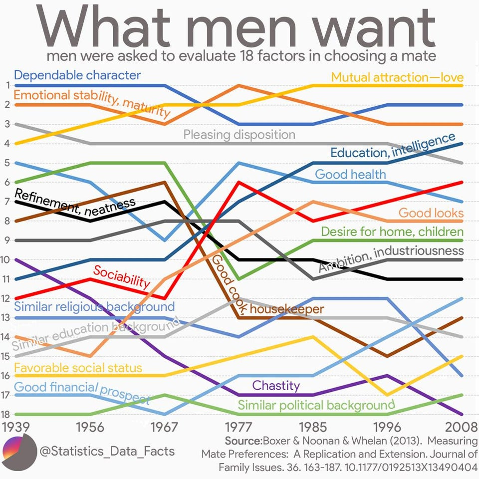
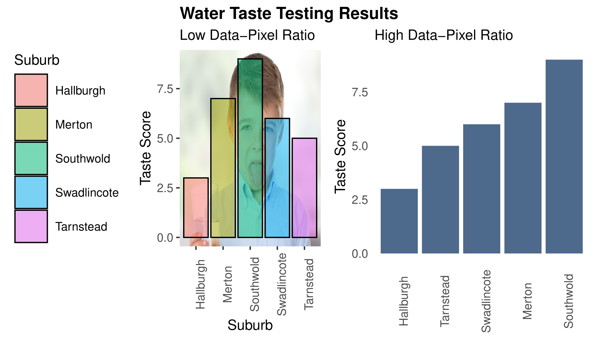

```{r setup, include=FALSE}
knitr::opts_chunk$set(echo = FALSE, message=FALSE, warning=FALSE, dpi=300)
```

# {data-background="../images/r4h2o-banner.jpg"}

# Program Session 2
1. Session 1 recapitulation
2. Principles of visualising data 
3. Visualising data with _ggplot2_
4. Data Science Workflow
5. RMarkdown
6. Learning R

# Session 1 recapitulation
{height=500}

# Coding Challenge
<div class="cols">
- Go to the Bureau of Meteorology website
- Download daily rainfall data for your favourite weather station
- Determine the top five years with the highest total rainfall
</div>
<div class="cols">

<small>DALL·E: A photo of a dog eating a 3.5 inch floppy disk.</small>
</div>

## Solution
```{r, echo=TRUE}
library(tidyverse)
# Bendigo weather station
bom <- read_csv("data/IDCJAC0009_081123_1800_Data.csv")
bom_grouped <- group_by(bom, Year)
bom_annual <- summarise(bom_grouped, 
                        Rainfall = sum(`Rainfall amount (millimetres)`, 
                                       na.rm = TRUE))
slice_max(bom_annual, order_by = Rainfall, n = 5)
```

# Data Story-Telling


## Ugly Data
Source: [reddit.com/r/dataisugly/](https://www.reddit.com/r/dataisugly/)
<div class="cols">
{height=400}
<small>Confusing graphics.</small>
</div>
<div class="cols">
{height=400}
<small>How to lie with statistics.</small>
</div>

## Data-Pixel Ratio


## Grammar-of-Graphics


