```{r setup, include=FALSE}
knitr::opts_chunk$set(echo = FALSE, message=FALSE, warning=FALSE, dpi=300)
```

# {data-background="images/r4h2o-banner.jpg"}

# Program Session 2
1. Session 1 recapitulation
2. Principles of visualising data 
3. Visualising data with _ggplot2_
4. Data Science Workflow
5. RMarkdown
6. Learning R

# Session 1 recapitulation
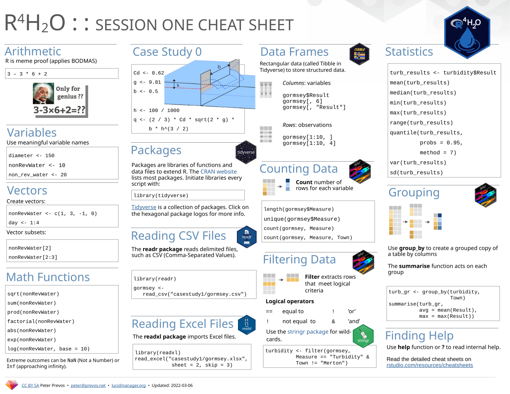{height=500}

## Coding Challenge
<div class="cols">
- Go to the Bureau of Meteorology website
- Download daily rainfall data for your favourite weather station
- Determine the top five years with the highest total rainfall
</div>
<div class="cols">

<small>DALL·E: A photo of a dog eating a 3.5 inch floppy disk.</small>
</div>

## Grouped Analysis
- Creates a grouped data frame
- Loop evaluation over groups
- `vignette("dplyr")`

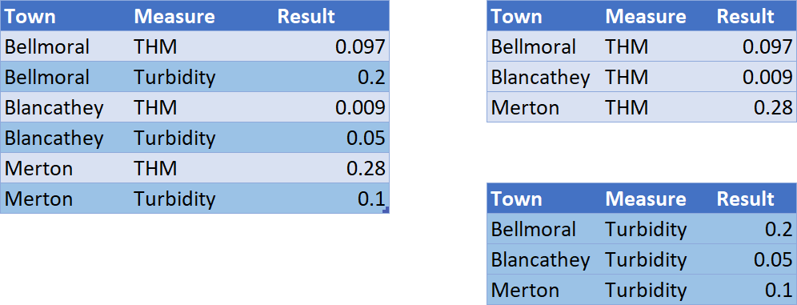

## Solution
```{r, echo=TRUE}
library(tidyverse)
# Bendigo weather station
bom <- read_csv("data/IDCJAC0009_081123_1800_Data.csv")
bom_grouped <- group_by(bom, Year)
bom_annual <- summarise(bom_grouped, 
                        Rainfall = sum(`Rainfall amount (millimetres)`, 
                                       na.rm = TRUE))
slice_max(bom_annual, order_by = Rainfall, n = 5)
```

# Data Story-Telling
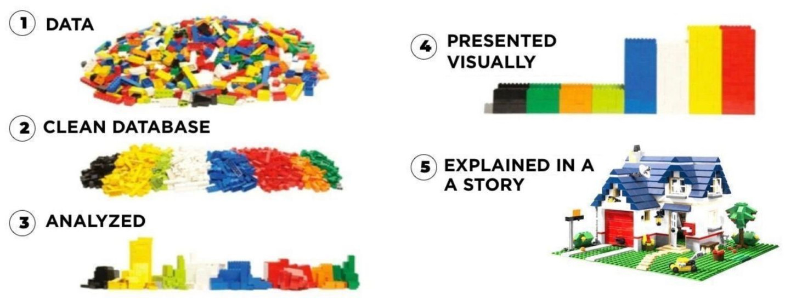

## Ugly Data
Source: [reddit.com/r/dataisugly/](https://www.reddit.com/r/dataisugly/)
<div class="cols">
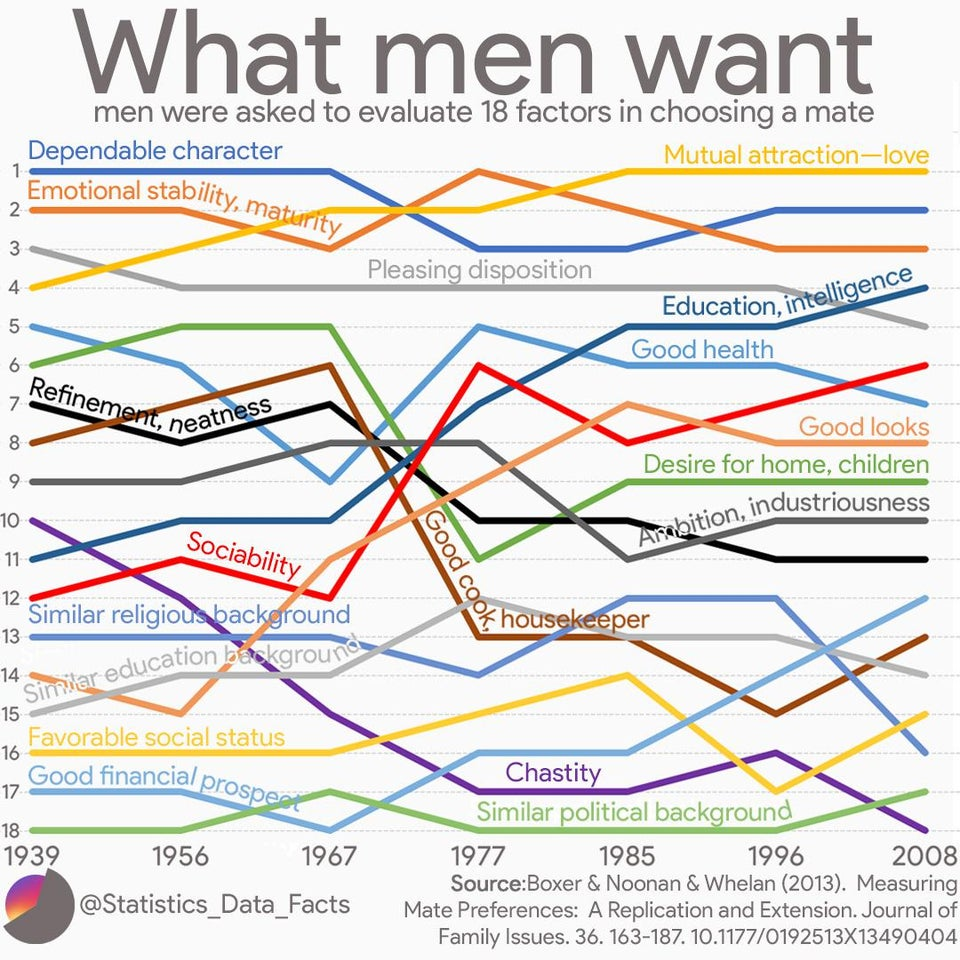{height=400}
<small>Confusing graphics.</small>
</div>
<div class="cols">
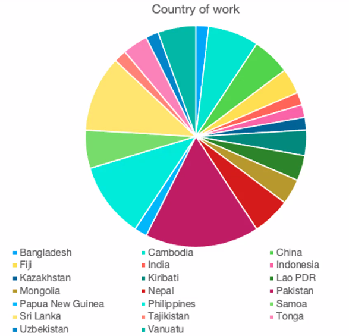{height=400}
<small>Which one is Cambodia?</small>
</div>

## Tell a Story With Data
<div class="cols">
- Keep it simple
- Add a point of interest (comparison, limits, trend etc.)
- One story per graph
</div>
<div class="cols">
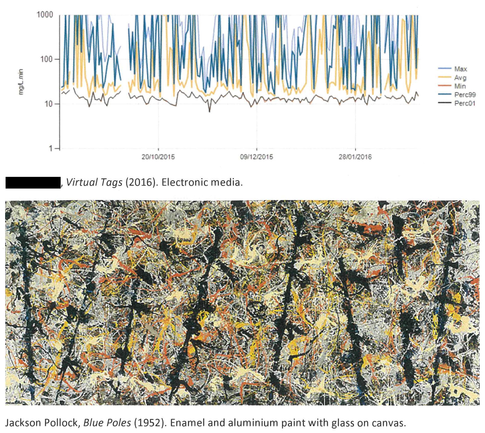
</div>

## Data-Pixel Ratio
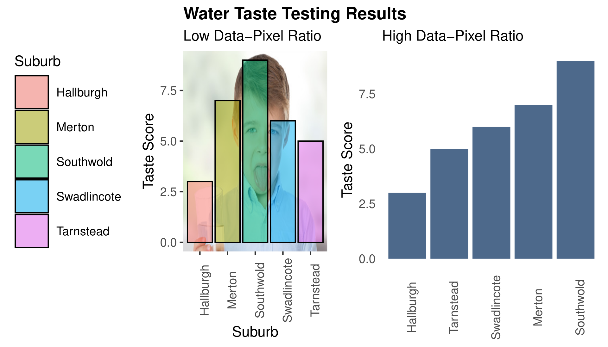

## {data-background="images/visualisations.jpg"}

## Visualising data with ggplot2
<div class="cols">

- Part of the tidyverse
- `ggplot2.tidyverse.org/`
- Implements _Grammar of Graphics_

</div>
<div class="cols">
{width=300}
</div>

## Grammar-of-Graphics
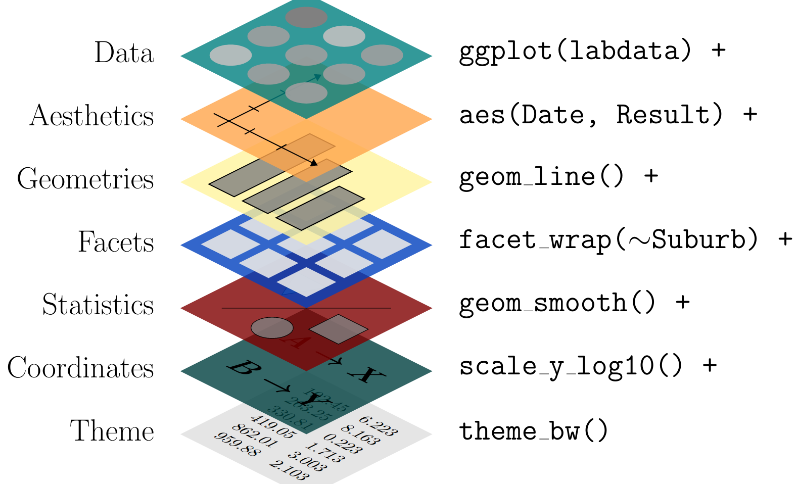{height=500}

Open the `05-visualise.R` script

## Using Colours in Graphics
<div class="cols">
- Two reasons to use colour:
  - Corporate or publisher house style
  - Communicate a value

- Reasons not to use colour:
  - Aesthetics
  - Prettyfication

</div>
<div class="cols">
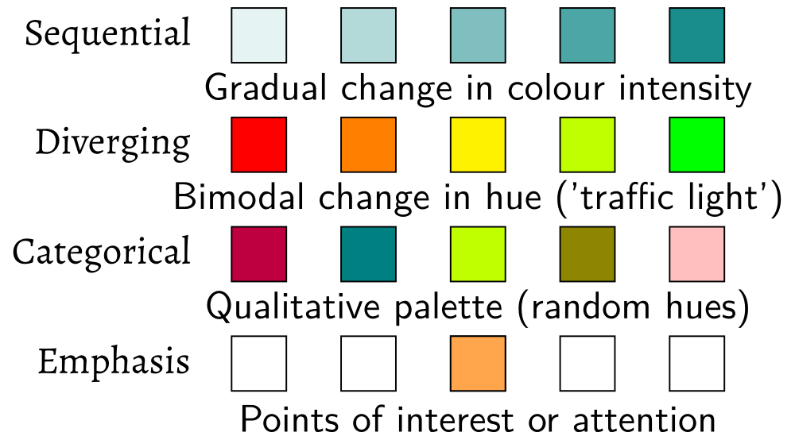
</div>

## Coding Practice
- Filter the laboratory data for THM in Merton and Southwold
- Draw boxplot to visualise the distribution of results
- Visualise limit:
    - `geom_hline(yintercept = 0.25, col = "red"`
- Logarithmic scale
    - `scale_y_log10()`

## Coding Practice
```{r, echo=TRUE, fig.height=2.5}
library(tidyverse)
labdata <- read_csv("data/water_quality.csv") 
thm_merton_southwold <- filter(labdata, Measure == "THM" & 
                                 (Suburb == "Merton" | 
                                    Suburb == "Southwold"))
ggplot(thm_merton_southwold, aes(Suburb, Result)) + 
  geom_boxplot() + 
  scale_y_log10() + 
  geom_hline(yintercept = 0.25, col = "red")
```

# Data Science Workflow
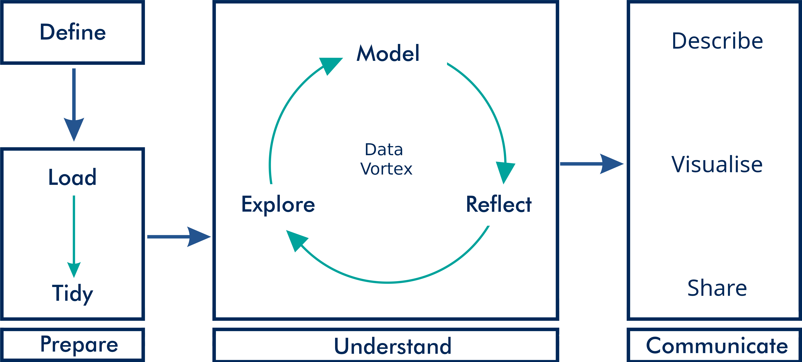

## Reproducible and Replicable Analysis
<div class="cols">
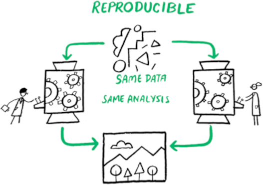
</div>
<div class="cols">
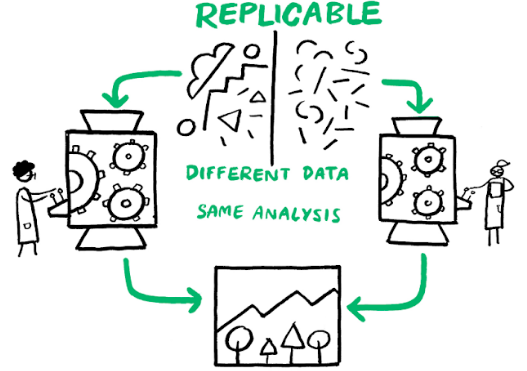
</div>

## Literate Programming
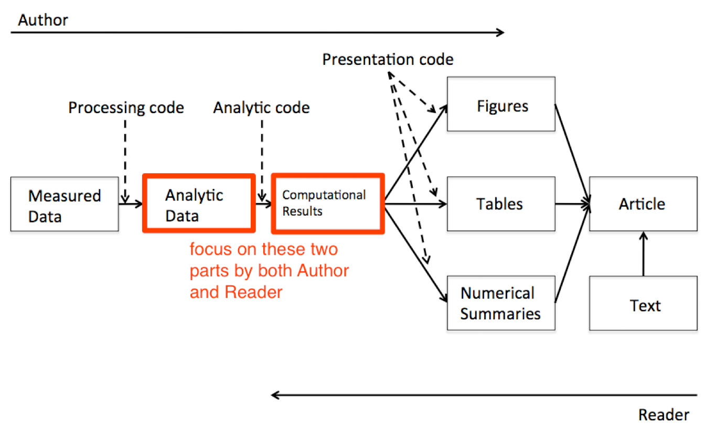

## What You See is What You Mean
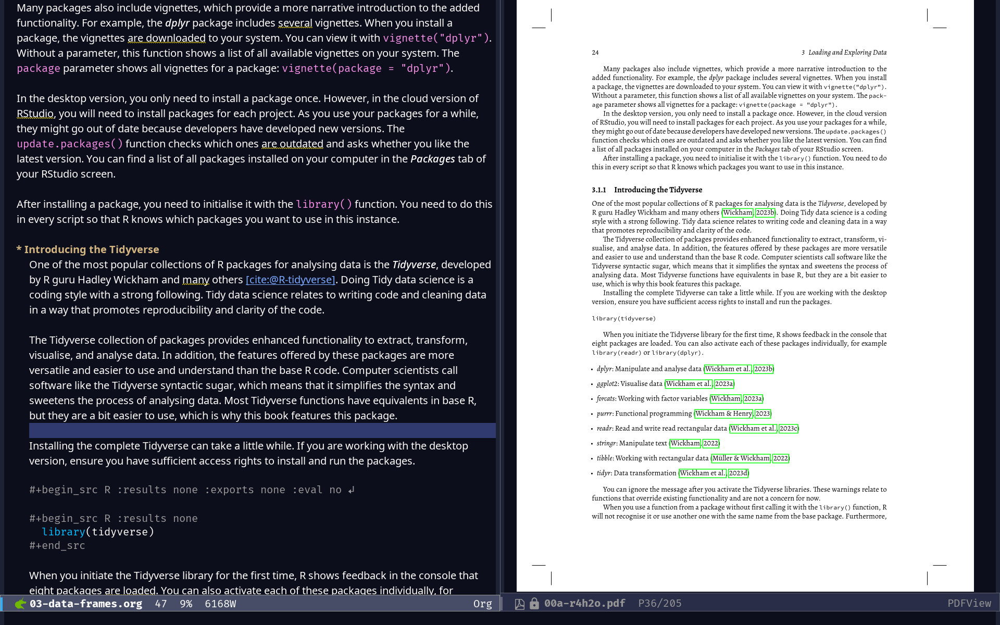

## R Markdown
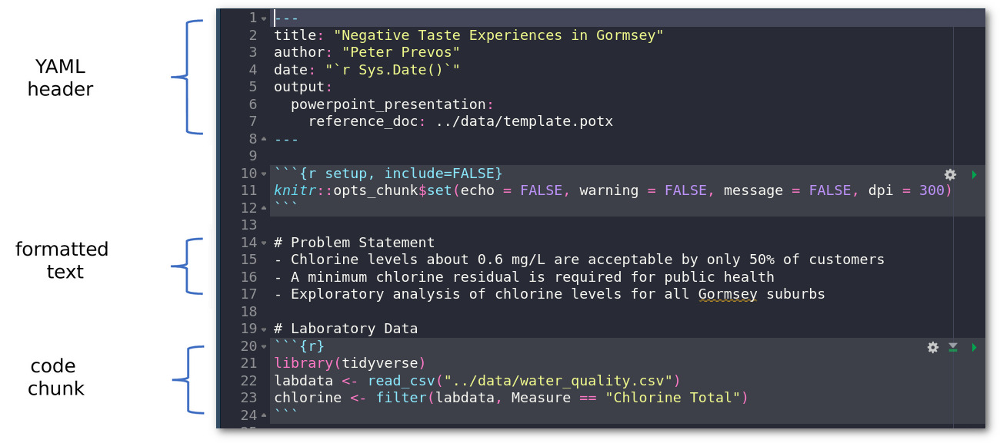

Open `06-chlorine-taste.Rmd`.

# Start Your Journey to Data Science
<div class="cols">
1. Understand the basics
2. Create simple programs
3. Practice
4. Ask for help (StackExchange, Reddit, #Rstats)
    - Minimal Working Example
5. Build projects
6. Help others
</div>
<div class="cols">
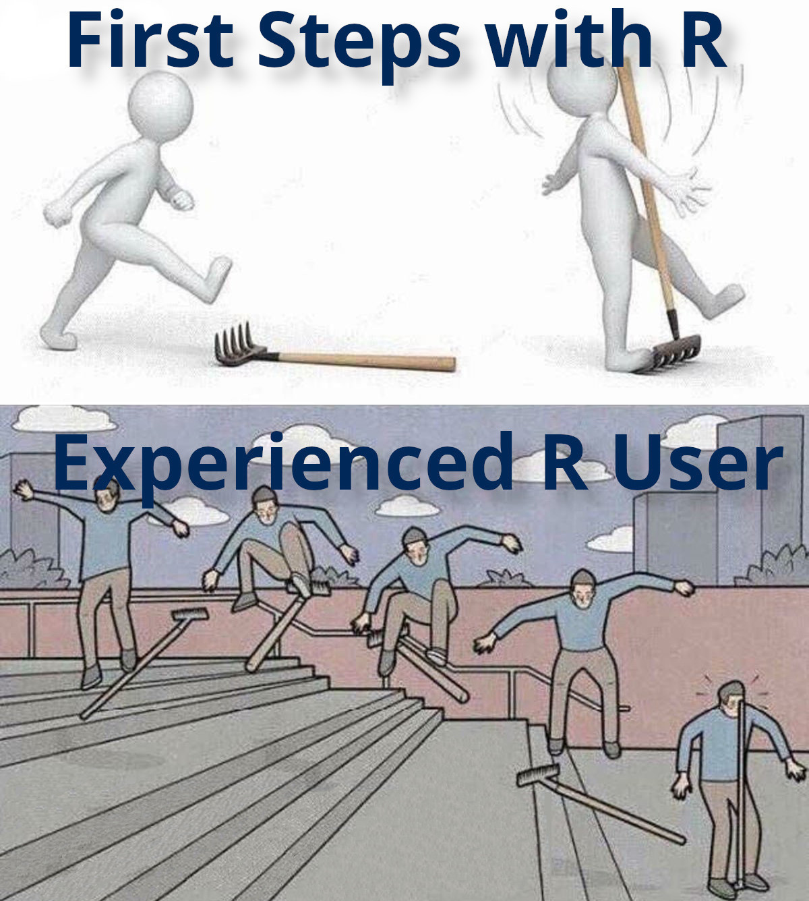
</div>


