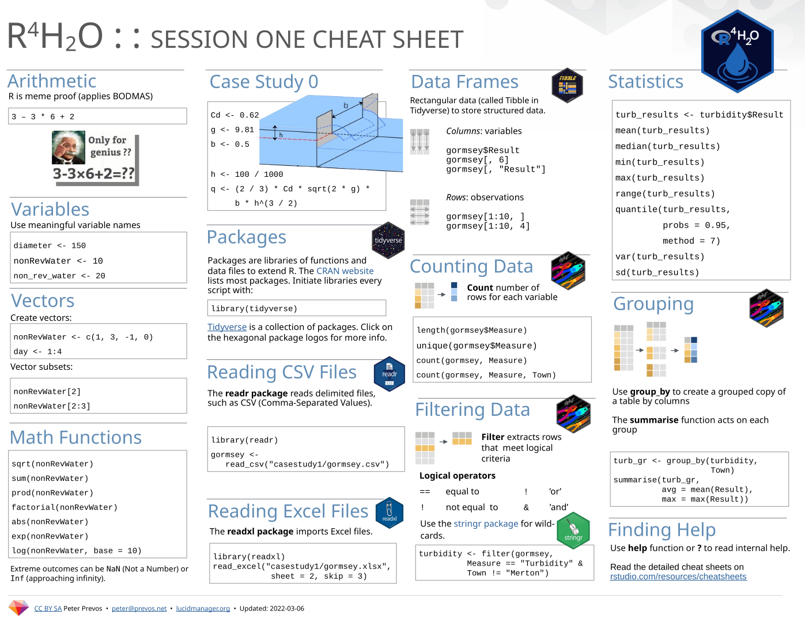
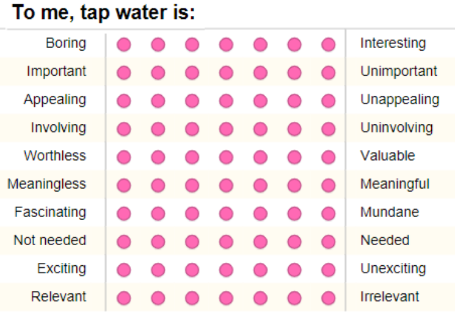

```{r setup, include=FALSE}
knitr::opts_chunk$set(echo = FALSE, message=FALSE, warning=FALSE, dpi=300)
```

# {data-background="images/r4h2o-banner.jpg"}

# Introductions


## R4H2O Cheat Sheet
{height=500}

[PDF version](https://github.com/pprevos/r4h2o/blob/master/r4h2o-cheat-sheet.pdf)

## Program
<div class="column" style="float:left; width: 50%">
Day 1:

1. Data cleaning
2. Case Study 2: Customer Experience
3. Survey reliability
4. Survey validity
</div>
<div class="column" style="float:left; width: 50%">
Day 2:

1. Customer segmentation
2. Cluster analysis
3. Linear regression
</div>

## Course book
[{height=500}](https://www.routledge.com/Data-Science-for-Water-Utilities-Data-as-a-Source-of-Value/Prevos/p/book/9781032354545)

## Course Project
[github.com/pprevos/r4h2o](https://github.com/pprevos/r4h2o)

- _RStudio Cloud_: New project from GitHub repository
- _RStudio Desktop_: Download or clone project files

{height=400}

# Case Study 2: Cleaning Data
{height=400}

<small>Garbage in is ... (Generated by DALL-E).</small>

## Cleaning Case Study 2
1. Open Rstudio in the `R4H2O` project
2. Load and explore the data:
    - `data/customer_survey.csv`
3. What is wrong with this data?

## Case Study 2
Open: `scripts/07-data-cleaning.R`

## Data Structures: Star-Schema
{height=500}

## Joining Tables


## Coding challenge
- Load the laboratory data from the first case study: `data/water_quality.csv`
- Join the data with the sample point register: `data/sample_points.csv`
- Visualise the maximum turbidity spatially: use `scale_color_gradient()`


## Coding challenge solution
```{r, echo=TRUE, eval=FALSE}
library(tidyverse)

lab_results <- read_csv("data/water_quality.csv")
sample_points <- read_csv("data/sample_points.csv")

turbidity_p95 <- lab_results %>% 
    filter(Measure == "Turbidity") %>% 
    left_join(sample_points) %>% 
    group_by(Sample_Point, x, y) %>% 
    summarise(max = max(Result))

ggplot(turbidity_p95, aes(x, y, col = max), size = 1.5) + 
    geom_point() + 
    scale_color_gradient(low = "darkgreen", high = "red") + 
    theme_light()
```

## Refactoring Code
Sequential code
```{r, echo=TRUE}
library(tidyverse)
labdata <- read_csv("data/water_quality.csv")
measures <- count(labdata, Measure)
```

Nested Code
```{r, echo=TRUE}
measures <- count(read_csv("data/water_quality.csv"), Measure)
```

Piped Code (tidyverse version)
```{r, echo=TRUE}
measures <- read_csv("data/water_quality.csv") %>% 
  count(Measure)
```

## R Analysis Automation
1. Console
2. Scripting: `source(scripts/07-customer-clean.R)`
3. Function: `function()`
4. Package (Local or CRAN)

```{r, echo=TRUE}
channel_flow <- function(h, b, cd = 0.62, g = 9.81) {
    q <- (2/3) * cd * sqrt(2 * g) * b * h^(3/2)
    return(q)
}

channel_flow(.1, .5, .7)
channel_flow(b = 0.5, cd = 0.7, h = .1)
```

Task: Write a function that adds two numbers.

## Function example
```{r, echo=TRUE}
add_two_numbers <- function(a, b) {
  return(a + b)
}

add_two_numbers(10, 23)
```

# Case Study 2: Customer Experience
```{r}
vembedr::embed_url("https://www.youtube.com/watch?v=Cg9YH4bm2Sk")
```
_Gruen Transfer_ (2009), Season 2, Episode 3.

## From STEM to STEAM
<div class="column" style="float:left; width: 50%">


Water management applies the physical sciences.
</div>
<div class="column" style="float:left; width: 50%">
{height=266}

Marketing applies the social sciences.
</div>

## Customer Surveys
- Psychometrics
    - Measuring mental states
    - Latent variable / constructs
    - Retro-causality from survey to mental state


## Case Study 2 survey
1. Consent and screening
2. Consumer Involvement (Ten-item semantic differential scale): `p01-p10`
4. Contact frequency (1-item Likert scale)
4. Perceived hardship (1-item Likert scale)
5. Service Quality (18-item Likert Scale)
    - Technical quality: `t01-t05`
    - Functional quality: `f01-f13`
6. Trap question (1-item Likert scale)


<small>Likert scale for taste testing.</small>

## Technical Quality


## Missing Data
<div class="cols">
- Missing (completely) at Random (MCAR)
    - Unrelated to variables of interest (telemetry)
    - Related to variables of interest (willingness to answer questions)
- Missing Not at Random (MNAR)
    - Relationship between missing data and variables of interest
</div>
<div class="cols">

</div>

## Treatment of missing data
- Ignore (can cause errors)
- Remove observations
    - In calculation: `na.rm = TRUE`
    - Case-wise: `complete.cases()`
- Impute (fill with statistical guess)
   - Statistical issues
   - Ethical issue (putting words in the mouths of the respondents)

## Tidy Data
<div class="cols">
1. Each variable forms a column.
2. Each observation forms a row.
3. Each type of observational unit forms a table.

</div>
<div class="cols">

<small>Wickham (2013). [Tidy Data](file:///home/peter/Downloads/v59i10.pdf). _Journal of Statistical Software_.</small>
</div>

## Pivoting Data


Read: `vignette("pivot")`

## Excercice
- Open `data/labdata_wide.csv`
- Is this data Tidy?
    1. Each variable forms a column.
    2. Each observation forms a row.
    3. Each type of observational unit forms a table.

```{r}
select(labdata, -Sample_No, -Units) %>% 
  pivot_wider(names_from = Measure, values_from = Result) %>%
  select(Date, Sample_Point, Suburb, 4:7) %>%
  write_csv("data/laboratory_form.csv")
read_csv("data/laboratory_form.csv")
```
- Convert this to a tidy dataset using `pivot-longer`

## Cleaning Lab Data

```{r, echo=TRUE}
read_csv("data/laboratory_form.csv") %>% 
  pivot_longer(4:7, names_to = "Measure", values_to = "Result")
```

# Reliability and Validity

Load: `scripts/08-customer-experience.R`

## Consumer Involvement
<div class="column" style="float:left; width: 50%">
- Importance of the product to a consumer
    - Cognitive (rational)
    - Affective (emotional)
    - Can you identify which is which?
    - What do you notice about the order of the words?
</div>
<div class="column" style="float:left; width: 50%">

<small>Zaichkowsky, J. L. (1994). The personal involvement inventory: revision, and application to advertising. _Journal of Advertising_, 23(4), 59.</small>
</div>

## Consumer Involvement Measurement Model
{height=500}

## Reliability Testing
<div class="column" style="float:left; width: 50%">
- Correlation
- Cronbach's Alpha
</div>
<div class="column" style="float:left; width: 50%">
$$cov(x, y) = \frac{\sum(x_i - \bar{x})(y_i - \bar{y})}{n-1}$$

$$cor(x, y) = \frac{cov(x, y)}{s_x s_y}$$
$$\alpha = \frac{k \bar{c}}{\bar{v} + (k-1) \bar{c}}$$

- $k$: Number of survey items (columns)
- $\bar{c}$: Average covariance
- $\bar{v}$: Average variance
</div>

## Survey Validity
- _Face validity_: Do the survey questions at face-value relate to the mental state?
- _Content validity_: Does the survey instrument capture all relevant components of the latent variable?
- _Construct validity_: How much variance does the model describe?
- _Discriminant validity_: How different is the scale from other scales?

## Example: Trust Scale
<div class="column" style="float:left; width: 50%">
_Questions_

- How much can you count on … ?
- How much do you trust … ?
- How dependable is … ?

_Answer Model_

7-point Likert scale
</div>
<div class="column" style="float:left; width: 50%">
_Source_

<small>Bruner, G. (2012). _Marketing Scales Handbook. A Compilation of Multi-item Measures for Consumer Behavior & Advertising Research_. GCBII Productions.</small>

_Reliability_

- Alpha = 0.92

_Validity_

Factor analysis supports single-dimensionality and discriminant validity.
</div>

## Factor Analysis
- $F_i = b_1 x_{1i} + b_2 x_{2i} +…+ b_n x_{ni} + \varepsilon_i$
- $b_s$ is factor loading
- Variance
    - Communality: Shared with other variables
	- Uniqueness: 1 - communality
	- Error
-  Uniqueness (0--1)
    - Proportion of variability, which can not be explained by a linear combination of the factors (noise)
- Loadings
    - Contribution of each original variable to the factor (0--1)
    - Sum of squared loadings = 1 - uniqueness

## Exploratory Factor Analysis Example
```{r}
source("scripts/07-customer-clean.R")
pii <- select(customers, customer_id, p01:p10) %>% 
  mutate_at(c("p01", "p02", "p07", "p08", "p09", "p10"),
            function(p) 8 - p)
pii <- pii[complete.cases(pii), ]
library(psych, quietly = TRUE)
library(GPArotation)
pii_fa <- fa(pii[, -1], nfactors = 2, rotate = "oblimin")
pii_fa <- fa(pii[, -1], nfactors = 2, rotate = "oblimin", fm = "ml")
fa.diagram(pii_fa, main = NULL)
```

# Next week
- Cluster Analysis
- Regression
- Intro to machine learning
- Next steps?
