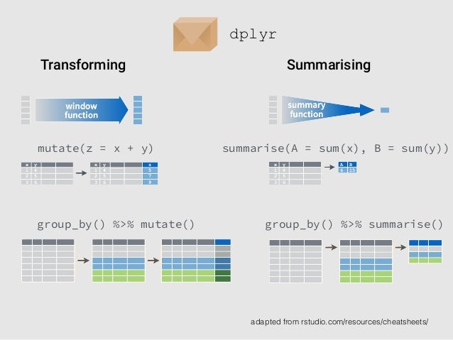

```{r setup, include=FALSE}
knitr::opts_chunk$set(echo = FALSE, message=FALSE, warning=FALSE, dpi=300)
```

# {data-background="images/r4h2o-banner.jpg"}

# Analysinging Time Series
```{r, fig.height=5}
set.seed(123)
seq <- seq(from = 1, to = 100, by = 1) + 10
ts1 <- seq + rnorm(100, sd = 5)
ts2 <- seq + rnorm(100, sd = 12)
ts3 <- seq^2 + rnorm(100, sd = 300)
tsm <- cbind(ts1, ts2, ts3)
tsm <- ts(tsm, start=c(2000, 1), frequency = 4)
plot(tsm, main = NA)
```

## Dates and Times
- System time
    - `Sys.time()`
    - Unix Epoch:
    - Seconds since 00:00:00 UTC 1 January 1970
- Dates
    - `Sys.Date()`
- ISO 8601-1:2019. _Data and Time --- Representations for information interchange_
    - `as.Date("2023-03-23")`
    - `as.POSIXct("2023-03-23 09:09:43")` 

## Converting Variable Classes
Functions starting with `as.`

```{r, echo=TRUE, eval=FALSE}
a <- "12"

12 * a

12 * as.numeric(a)

as.character(12 * as.numeric(a))

# Multiplying character value
rep(a, 12)
```


## Formatting Dates
- `format(Sys.Date(), "%m/%d/%Y")`
- `as.Date("1 July 2022", format = "%d %b %Y")`
- To see date parts: `help(strptime)`
    - `%Y-%m-%d %H:%M:%S`
- Task 
    - Format the current date as `Year: 2023, Month: March, Date: 23`
    - `format(sys.Date(), "...")`
- Open `11-date-time.R`

```{r, eval=FALSE}
format(Sys.Date(), "Year: %Y, Month: %B, Day: %e.")
```

## Time Zones
<div class="cols">
- The time zone is an attribute of the date/time variable
- Difference between attribute and display variable
- Converting a time to a date converts it to UTC!
</div>
<div class="cols">

</div>

## Lubridate (a Tidyverse Package)
<div class="cols">
- Lubricating working with dates and times
- Syntactic sugar
- Task
    - Install lubridate package
    - Go to the Lubridate website and view the cheat sheet
    - Use a function to determine the current week of the year
    - Answer: `r lubridate::week(Sys.Date())`

</div>
<div class="cols">


<small>`lubridate.tidyverse.org`</small>

</div>

# Digital Metering
{height=500}

## dplyr: The Grammar of Data Manipulation
<div class="cols">
- `vignette("dplyr")`
- dplyr Cheat Sheet
- `dplyr.tidyverse.org`
</div>
<div class="cols">

</div>

## Digital Metering Data
<div class="cols">
- Load Data (`data/meter_reads.csv`)
- Explore variables
    - `device_id`: Unique logger id
    - `date_time`: Timestamp (UTC)
    - `count`: Impeller revolutions (5l each). 
</div>
<div class="cols">
```{r}
library(tidyverse)
meter_reads <- read_csv("data/meter_reads.csv")
library(lubridate)
filter(meter_reads, 
       device_id == sample(unique(meter_reads$device_id), 1) &
         as.Date(timestamp) == as.Date(sample(meter_reads$timestamp, 1))) %>% 
  ggplot(aes(timestamp, count)) + 
  geom_line() + 
  labs(title = "Random day for random device") +
  theme_linedraw(base_size = 12)
```

- Why is there a flat line in the graph?
- How can you detect a potential leak from this graph?
</div>

## Coding practice
<div class="cols">
- Summarise the data
- Determine the total consumption for each device
</div>
<div class="cols">
- Arrange from high to low (`arrange()` function)

```{r}
library(tidyverse)
meter_reads <- read_csv("data/meter_reads.csv")
group_by(meter_reads, device_id) %>% 
  summarise(volume = 5 * (max(count) - min(count))) %>% 
  arrange(desc(volume))
```
</div>

## Analysing Water Consumption
- Lag and lead functions
    - `diff(1:4)`
    - `r diff(1:4)`
- Dplyr functions
    - `lag(1:4, 1)`: `r lag(1:4, 1)`
    - `lead(1:4, 2)`: `r lead(1:4, 2)`
    - `lead(1:4, 2, default = 0)`: `r lead(1:4, 2, default = 0)`
- Review `11-date-time.R`

## Linear Interpolation

```{r, fig.height=4.5}
x <- today() + c(0, 7, 10, 15)
y <- c(0, 30, 135, 200)
linear <- approx(x, y)
constant <- approx(x, y, method = "constant", n = 9)
point <- approx(x, y, xout = today() + 8.5)
plot(as.Date(linear$x, origin = "1970-01-01"),
     linear$y, col = "gray", cex = .5,
     xlab = NA, ylab = NA, main = "approx function example")
points(constant$x, constant$y, col = "gray", pch = 20, type = "b")
points(x, y, col = "red", pch = 16)
legend("topleft", legend = c("Linear", "Constant"), fill = c("red", "grey"))
```

# Detecting Outliers and Anomalies

{height=500}

## Anomaly-Detection
- Visual
- Decision rules (regulation, rules-of-thumb)
- Standard deviation (z-score)
- Median Absolute Deviation from the Median (MAD)
- Grubb's Test
- Time Series Anomalies
- Multivariate anomalies

## Visual Anomaly Detection
- Boxplot whiskers: $Q_{1/3} \pm 1.5 \times IQR$
- $IQR$: Inter-Quartile Range ($Q_3 - Q_1$)

```{r}
library(tidyverse)
read_csv("data/water_quality.csv") %>% 
  filter(Measure == "Chlorine Total") %>% 
  ggplot(aes(Suburb, Result)) + 
  geom_boxplot(fill = "#EAAA00") + 
  labs(title = "Gormsey Total Chlorine") + 
  theme_linedraw()
```


## Decision Rules
- Regulator (Chapter 3)
    - Maximum value
    - Percentiles
    - Descriptive statistics
- Operational
    - Individual filter turbidity ≤ 0.3 NTU for 95% of month and not > 0.5 NTU for ≥ 15 consecutive minutes (WSAA, [Health-Based Targets Manual](https://www.wsaa.asn.au/publication/health-based-targets-manual)).
    - Run-length
    
## Statistics
<div class="cols">
Z-Score

- $z = \frac{x - \bar{x}}{\sigma^2}$
- Only works for normally-distributed data
</div>
<div class="cols">
MAD

- ${{MAD} = 1.4826 \times {med} (|x_{i}-{\tilde{x}}|)}$
- 1.4826 = one divided by the third quartile of the distribution
- `mad()` function
</div>

## Multivariate anomalies
```{r}
set.seed(12345)
x <- c(rnorm(100, 10, 3), rnorm(100, 20, 1))
y <- c(rnorm(100, 10, 3), rnorm(100, 20, 1))
xy <- data.frame(x, y)

library(FNN)
xy_knn <- get.knn(xy, k = 5)
xy$`k-Nearest Neighbours` <- rowMeans(xy_knn$nn.dist)

library(dbscan)
xy$`Local Outlier Factor` <- lof(xy, minPts = 5)

library(tidyverse)
tibble(xy) %>%
  pivot_longer(-1:-2, names_to = "Method") %>%
  ggplot(aes(x, y, size = value, col = value > 2.5)) +
  geom_point() +
  scale_color_manual(values = c("black", "red")) +
  facet_wrap(~Method, strip.position = "bottom") +
  theme_void() +
  theme(legend.position = "none",
        strip.text.x = element_text(margin = margin(10, 0, 2 ,0, "mm"),
                                    size = 11))
```

# Linear Regression
<div class="column" style="float:left; width: 60%">
```{r ols}
library(tidyverse)
set.seed(123)
d <- tibble(x = c(sample(22:38, 8), 20, 40),
            y = round(runif(1), 2) * x + sample(5:10 , 1) + rnorm(10) * 2)
d$y[d$x %in% c(20, 40)] <- NA
ab <- lm(y ~ x, d)
a <- coef(ab)[2]
b <- coef(ab)[1]
d$yhat <- a * d$x + b
a1 <- -a / 2
b1 <- mean(d$y, na.rm = TRUE) - a1 * mean(d$x, na.rm = TRUE)
a2 <- a / 2
b2 <- mean(d$y, na.rm = TRUE) - a2 * mean(d$x, na.rm = TRUE)
d1 <- d %>%
    mutate(Mean = mean(y, na.rm = TRUE),
           `Rotate 1`= a1 * x + b1,
           `Rotate 2`= a2 * x + b2) %>%
    select(x, y, Mean, `Rotate 1`, `Rotate 2`, `Best Fit` = yhat) %>%
    pivot_longer(-1:-2) %>%
    mutate(name = fct_relevel(name, c("Mean", "Rotate 1", "Rotate 2", "Best Fit")))
ss <- d1 %>%
    group_by(name) %>%
    summarise(meanx = mean(x),
              meany = mean(y, na.rm = TRUE),
              SS = sum(abs(value - y)^2, na.rm = TRUE),
              SSt = paste("SS =", round(SS, 2))) 
ggplot(d1) +
    geom_segment(aes(x = x, xend = x, y = y, yend = value), col = "red", linetype = 2) + 
    geom_point(aes(x, y), size = 2) +
    geom_line(aes(x, value), col = "blue") +
    geom_point(data = ss, aes(meanx, meany), col = "blue", size = 2) +
    geom_text(data = ss, aes(x = mean(d1$x), y = (min(d1$value) + 5), label = SSt)) + 
    facet_wrap(~name, ncol = 2) +
    coord_equal() +
    theme_minimal(base_size = 16) +
    theme(panel.spacing = unit(2, "lines"))
```

</div>
<div class="column" style="float:left; width: 40%">
$$\hat{y} = \beta_0 + \beta_1 x$$


$$SS = \sum_{i=1}^n (y_i - \hat{y})^2$$


$$\beta_1 = cor(y,x) \frac{s_y}{s_x}$$
$$\beta_0 = \bar{y} - \beta_1  \bar{x}$$
</div>

## Anscombe's Quartet
```{r anscombe, fig.asp=9/16}
op <- par(mfrow = c(2, 2), mar = 0.1+c(4,4,1,1), oma =  c(0, 0, 2, 0))
ff <- y ~ x
mods <- setNames(as.list(1:4), paste0("lm", 1:4))
for(i in 1:4) {
  ff[2:3] <- lapply(paste0(c("y","x"), i), as.name)
  mods[[i]] <- lmi <- lm(ff, data = anscombe)
}
for(i in 1:4) {
  ff[2:3] <- lapply(paste0(c("y", "x"), i),  as.name)
  plot(ff, data = anscombe, col = "red", pch = 21, bg = "orange", cex = 1.2,
       xlim = c(3, 19), ylim = c(3, 13))
  abline(mods[[i]], col = "blue")
}
par(mfrow = c(1, 1))
```

## Datasaurus
```{r, fig.height=3}
library(datasauRus)

filter(datasaurus_dozen,
       dataset %in% c("dino", "x_shape", "star", "bullseye")) %>%
    ggplot(aes(x = x, y = y)) +
    geom_point() +
    theme_void(base_size = 20) +
    theme(legend.position = "none") +
    facet_wrap(~dataset, ncol = 6)

```

<small>[dl.acm.org/doi/10.1145/3025453.3025912](https://dl.acm.org/doi/10.1145/3025453.3025912)</small>

## Case Study
Open `chapter-11.R` script

# What's Next?
<div class="cols">
1. Understand the basics
2. Create simple programs
3. Practice
4. Ask for help (StackExchange, Reddit, #Rstats)
    - Minimal Working Example
5. Build projects
6. Help others
7. Write a book ...
</div>
<div class="cols">

</div>

## Spatial Analysis and Visualisation
<div class="cols">
- Claudia Angel, [Using Spatial Data with R](https://cengel.github.io/R-spatial/intro.html)
- `ggmap`: Adding maps as backgrounds to ggplot
    - Geocoding: Transforming text searches to coordinates
- `leaflet`: Interactive HTML maps
    - [R Graph Gallery](https://r-graph-gallery.com/19-map-leafletr.html)

</div>
<div class="cols">

<small>Heatmap of Bendigo chlorine residuals.</small>
</div>

## Leaflet Example
```{r, fig.height=2, fig.width=3, eval=FALSE}
#Leaflet example

library(readr)
library(leaflet)

castlemaine <- read_csv("data/castlemaine.csv")

mean_lon <- mean(castlemaine$Longitude, na.rm = TRUE)
mean_lat <- mean(castlemaine$Latitude, na.rm = TRUE)
castlemaine$log_consumption <- log(castlemaine$`Sum of Consumption (kL)`)

leaflet(castlemaine) %>%
    addTiles() %>%
    setView(lng = mean_lon, lat = mean_lat, zoom = 12) %>% 
    addCircleMarkers(~Longitude, ~Latitude, radius = ~log_consumption,
                     fillColor = ~CurrentLocationType, 
                     fillOpacity = 0.7, fill="dodgerblue")
```


## Time Series Forecasting
<div class="cols">
- Built-in time series analysis
- `forecast` package
    - Rob J Hyndman and George Athanasopoulos, _Forecasting: Principles and Practice_: [otexts.com/fpp2](https://otexts.com/fpp2/)
</div>
<div class="cols">
</div>


