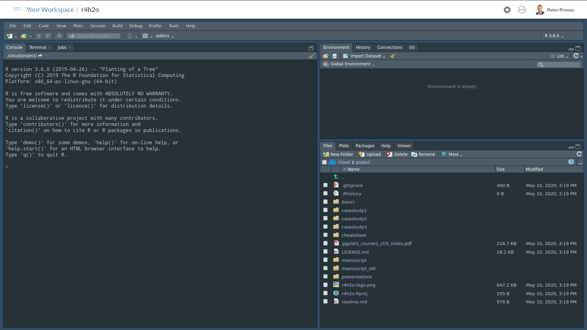
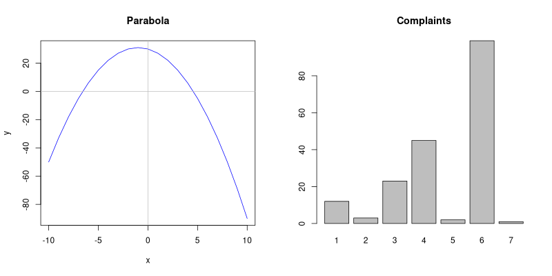

# 3. Introduction to the R Language {#basics}

This chapter introduces the principles of the R language and using RStudio to write code. This chapter finishes with an assignment to convert level measurements in an open channel into flows. The learning objectives are:

* Identify the different parts of the RStudio screen.
* Understand the principles of writing code to analyse data.
* Apply R code to a basic water problem.

The code for this session is available in the `chapter_03.R` file in the `casestudy0` folder of your RStudio project.

## The R Language
R is a programming language developed for statistical computing and visualising data. This language is developed initially at the University of Auckland and currently maintained through the [R Foundation for Statistical Computing](https://www.r-project.org/foundation/). 

The R software is licensed as open-source, which means that anyone can freely download, use, modify and share the software. The open-source model relies on communities of developers that continuously improve the software. Open-source software is free. Not free as in free beer, but free as in [freedom](https://www.gnu.org/philosophy/free-sw.html). After all, the people who develop open-source software also need to be buy groceries. Most projects are not-for-profit organisations funded by companies and individuals that use the software commercially. If your organisation uses R, then I highly recommend supporting the R Foundation.

The R language is one of the most popular tools for analysing data. This language includes advanced mathematical capabilities, missing from most general-purpose languages. The R language also has extensive built-in visualisation capabilities. Furthermore, R can integrate with many other data science and visualisation software systems, such as *Power BI*, *Tableau*, *Mathematica*, *MATLAB* and do so on.

The official name of R is *Project for Statistical Computing*. The name statistical computing is deceptive. The R language can accomplish almost every type of analysis. From basic mathematics to text analysis, spatial pattern recognition, and everything else you might need to create value from data. R is the Swiss army chainsaw of data tools.

This second session introduces the R language and the associated RStudio software. To get the most value out of this session, you should spend some time playing with the examples to ensure you have a good grasp of the basics.

The fastest way to learn to code is by doing it. Follow the examples in this chapter, but also change the code so you can explore how the software works.

## Basic principles of a programming
Movies often portray programmers as smart geeks with minimal social skills. This archetype of the computer geek does not do justice to reality. It causes people to hold the incorrect belief that writing computer code is beyond their skill level.

In simple terms, a computer program is a set of instructions to transforms an input into an output. This description might sound complicated and abstract, but that is what you do in a spreadsheet. Analysing data with a spreadsheet also involves writing code. 

The main issue with spreadsheets is that the data, the code and the output are merged. The code does not run sequentially and can be hard to reverse-engineer. When writing computer code, the data, the code and the output are separate and processed in a linear form. 

A computer language like a human language and consists of vocabulary, grammar and context. In computing terms, this is the syntax. Computer language syntax consists of three levels:
* Words: The functions of a language.
* Phrases: The grammar of computer code.
* Context: Do the instructions make sense?

Just like learning a human language, studying a computer language means that you need to memorise vocabulary and grammar (syntax). While mastering the syntax of R might seem daunting, the RStudio development environment helps you with writing code.

The biggest problem with writing code is that the computer executes your instructions exactly as they are written. Any ambiguity in the code will lead to unexpected outcomes. These are the famous bugs, which can be frustrating and time-consuming to eradicate. When the results of your analysis don't make sense, or the code doesn't work at all, blame yourself and not the computer. Even a tiny mistake, such as a misplaced bracket, causes the program to fail. The best way to prevent bugs is to be systematic and write 'elegant', easy to understand, code.

Another critical aspect in writing code is that there are many ways to solves one problem, just like there are many ways to say the same thing in natural language. Although there is no right or wrong method to solve a problem, some ways are better than others. The solutions provided in this course are as such 'opinionated' in that they are just one way to solve the problem. 

You need to optimise your to run fast. Some of the methods are slower than other methods, or they require a lot more memory. The code in this course is generally simple enough to avoid these issues.

Lastly, computer code also needs to be elegant. It needs to be easy to read and to follow by another person who might want to reuse your fantastic solution. Computer science guru Donald Knuth said in this respect that computer code is like poetry. The session about [data products](#dataproducts) delves a bit deeper into writing elegant code.

### Understanding computer code
Not all code examples in this course are explained in detail. To understand how the code functions, you need to reverse-engineer it. Modifying existing code to figure out how it works is a productive method to learn any programming language. The best way to learn how to write code is to play with it.

The best way to reverse-engineer code is to execute each line separately and inspect the intermediate results. Another simple technique is to run parts of complex statements or change the options in a statement and analyse differences in the output.

When you search the internet, you find many examples of code shared by others. Copying this code is a great way to learn. If you like to learn from these online snippets, make sure you reverse engineer them so you can learn new techniques and replicate them in future problems.

## Debugging Code
Writing code can be a rewarding, but sometimes also frustrating, experience. Syntactic errors are common and easily caught. RStudio will help you find simple semantic errors, indicated with red text on your code. Even though your code might be syntactically and semantically correct, you might not achieve the expected outcome. Either the program crashes or runs forever in an infinite loop. If R produces an error message:

* Check for typos! A parenthesis in the wrong place can make a big difference.
* Read the error message and make sure you understand it
* Google the error message, exactly as written

More problematic is when your code provdies the wrong answer. To prevent these types of errors, it is wise to test your code with known data where you can anticipate the outcomes. Always apply a common-sense review on your results.

## Using R and RStudio
The best way is to use R in combination with an *Integrated Development Environment* (IDE). This software helps you to write and manage code. An IDE typically consists of a source code editor, automation tools, and functionality to simplify writing and running code.

The most popular IDE for the R language is [RStudio](https://rstudio.com/). This software is also an open-source project, with free and paid versions for companies that want to use advanced features. RStudio is also capable of working with other languages such as Python.

To install the required software, follow these steps:
* Go to the [R Project](https://cran.r-project.org/) website.
* Download the *base* version for your operating system and install the software.
* Go to the [RStudio download page](https://www.rstudio.com/products/rstudio/download/).
* Download the installer for the free version for your operating system and install the software.

If you are not using your computer, check with the administrator to obtain relevant access to the system.

Alternatively, you can sign-up for a free account to access the [cloud version](https://rstudio.cloud/) of R Studio. This account gives you full access to R Studio and R in your browser without the need to install any software. The cloud version has the same functionality as the desktop version.

The free version of the cloud version provides for 15 hours of computing. If you need more time, you’ll have to pay for a subscription or install the desktop version.

I> Before you continue, make sure you have access to R and RStudio.

Next step is to download the course materials and associate them with RStudio. All resources for this workshop (text, slides, images, code and data) are available on the [GitHub](https://github.com/pprevos/r4h2o/) website. GitHub is a repository for computer code and associated information for developers to share and collaborate.

If you use the desktop version of RStudio, then you can download the documents by clicking on the 'clone or download' button and extract the files to your computer. Remember to unzip the folder. 

You can open the RStudio project file (`r4h2o.Rproj`) to start playing with the data and code. If you use Git, then fork or clone the repository. Feel free to create an issue or pull request if you find errors or like to provide additional content.

{width: 60%, align=center}


For those using the cloud version of RStudio, click on the arrow next to the 'New Project' button and select 'New Project from GitHub Repo'. Copy the URL ([`https://github.com/pprevos/r4h2o/`](https://github.com/pprevos/r4h2o/)) to the text field and hit enter. RStudio copies the files from GitHub, which takes a minute.

{width: 60%, align=center}


When you open RStudio for the first time, the window consists of three panes, each with various tabs. The left panel is the console. The top-right pane shows the system environment and the one below that shows a list of files and folders (Figure 3.1).

You can change the default fonts and colours in the *Tools > Global Options > Appearance* menu. Most users prefer a dark theme with light text because it is more gentle on the eyes than the stark white default background. You can also set default font size and magnification to your liking.

X> Open the appearance menu and change the settings to your personal preferences.

Now we are ready to write some code.

{width: 100%, align=center}


## Basics of the R language
Move your cursor to the console and type the code examples listed below. Don't copy and paste them because typing the code develops your muscle memory for the R syntax and you some of the experience the features of the text editor.

The `>` sign at the start of each line in the console is the prompt. This symbol tells you where the cursor is. The examples in this text do not show the prompt.

X> Type the following code, or variations thereof, into the console and review the results.

{format: r, line-numbers: false}
```r
3 - 3 * (6 + 2)

diameter <- 150
pipe_area <- (pi / 4) * (diameter / 1000)^2
pipe_area

complaints <- c(12, 3, 23, 45, 2, 99, 1)
mean(complaints)

x <- -10:10
y <- -x^2 -2 * x + 30
plot(x, y, type = "l", col = "blue")
abline(h = 0, col = "grey")
abline(v = 0, col = "grey")

barplot(complaints, main = "Complaints", names.arg = 1:7)
```

You should notice a few things when you start typing:

* When you hit enter, the result of any expressions without the assignment symbol (`<-`) is shown in the console.
* When you type `plot()`, `mean()`, or other functions, RStudio gives you suggestions on how to continue after you type the first characters.
* When typing brackets or quotation marks, RStudio includes the closing bracket or quotation mark.
* The variables you declared (`diameter`, `pipe-area` and so on) and their values are shown in the Environment window.
* The plots appear in a tab of the bottom-right window.

X> Create some variations of this code to understand the principles. 

{width: 60%, align: center}


### Arithmetic
In its most basic form, the R console is a calculator that uses arithmetic operators as listed in the table below. R is 'meme-proof' because it knows the correct answer to the many arithmetic memes distributed on social media (Figure 3.2).

{title="R basic arithmitic functions."}
| Operator | Function         |
|:--------:|:-----------------|
| `+`      | Addition         |
| `-`      | Subtraction      |
| `*`      | Multiplication   |
| `/`      | Division         |
| `^`      | Exponentiation   |
| `%%`     | Modulo           |
| `%/%`    | Integer division |

{width=20%, align="middle"}

	
### Variables
Variables are the basic building blocks of computational analysis. A variable can store numbers, text, image, matrix or any other kind of information that needs to be analysed. In a spreadsheet, a variable is a cell or a group of cells.

You can give variables almost any name you like, as long as they only contain letters, numbers, dots and underscores. When you name a variable, try to use a meaningful name that describes its content. Don't call a flow measurement `f`, but something like `flow_daily` or similar. 

You don't need to type the full name for any defined variable. As soon as you type a few characters, R shows every possible variable name or function that starts with the letter you type. Use the arrow keys to pick the one you need and the tab key to complete.

R uses the `<-` operator to assign values to a variable, for example `a <- 6` assigns the number 6 to the variable `a`, `a <- "R"` assigns the letter R to the variable `a`. This notation effectively means the value 6 is assigned to the variable. You can use the `=` symbol, but doing so can lead to confusion when writing more advanced code.

### Vectors
Vectors are the most essential principle in R. A vector is a sequence of values, which can be defined with the `c()` function, as shown in the example. The colon is a shortcut to creating a vector of integers. The two expressions `1:3` and `c(1, 2, 3)` have the same result. Vectors can contain millions of values, and later we find out how R deals with external data sets.

Functions are the powerhouse of R. A function converts the input to an output. Simple function parameters undertake mathematical operations such as mean, median, square root, and so on. Functions can also perform complex tasks such as visualising and analysing data. A function call a word and empty brackets, such as `sqrt()` to determine the square root of a number or variable, e.g. `sqrt(25)`.

Functions or mathematical operators can be applied to single numbers and vectors. This method makes it easy to apply a mathematical operation to a large set of numbers with one line of code. You can, for example, run `sqrt(c(1, 4, 9, 16, 25))` to obtain a new vector with the square roots of these five numbers. The table below shows some of the basic mathematical operators available in R.

{title="Basic mathematical functions."}
| Function           | Operation               |
|--------------------|-------------------------|
| `sum(x)`           | Sum of all elements     |
| `prod(x)`          | Product of all elements |
| `abs(x)`           | Absolute value          |
| `exp(x)`           | e^x^                    |
| `factorial(x)`     | Factorial               |
| `log(x, base = b)` | Logarithm               |
| `sqrt(x)`          | Square root`            |

The `sum()` function adds all the members of the `x` vector. The `length()` function determines the number of elements in a vector.

X> Apply the functions in the previous two tables to the following vector of flow measurements and inspect the result: `c(12, 3, -23, 45, 2, 99, 1, 0)`.

Solution:
{format: r, line-numbers: false}
```R
flow <- c(12, 3, 23, 45, 2, 99, 1, 0)

sum(flow)
prod(flow)
abs(flow)
exp(flow)
factorial(flow)
log(flow, base = 10)
sqrt(flow)
```

### Basic plots
R has extensive capability for visualising data and the results of analysis. The last section shows some examples of simple graphs.

The first few lines defines the variables `x` and `y` and plots them as a line (`type = "l"`), showing the parabola in the plot window. The `abline()` function draws a straight line on top of the current plot. The barplot function creates a bar chart with the complaints vector (Figure 3.3).



X> Try the same plot without the `type` parameter, or with `type = "b"` and review the difference. Change the parameters in the `abline()` function and review the results.

Now retype the plot command, but only type the first two letters and then hit the TAB key. R now gives you suggested functions that start with `pl`. You can use the cursor keys to select the plot function. You can continue this way, and R guides you through the function. This functionality is helpful when you forget the specific syntax when writing code.

Another useful function of the console is to use the arrow keys to repeat or modify previous commands.

X> Use the arrow keys to recalculate the area of a pipe with a radius of 225mm.

## RStudio scripts and projects
The console provides a running record of the expressions that R evaluates. While this is great, using the console makes it hard to reconstruct what steps you have taken to get to your result. To create reproducible code, you need to write your code in a file. 

Create a new R script by going to *File > New File > R Script* or by hitting Control-Shift N. You can also open an existing file from the same menu.

When you hit enter within a script, the editor adds a new line. To execute a line of code in the editor, you need to type Control-Enter. When you hit the Source button, all code in the script is evaluated. You can also select a section and only run those lines.

An RStudio project is a set of files that relate to each other. RStudio projects divide your work into multiple contexts, each with their working directory, workspace, history, and source documents. Every time you open a project file, it is in the same state where you left it when you last closed the program. There are several ways to open a project:

* Open Project command (File menu or Projects toolbar) to browse for and select an existing project file (e.g. `r4h2o.Rproj`).
* Selecting a project from the list of most recently opened projects (also available from both the File menu and toolbar).
* Double-clicking on the project file within Windows Explorer, OSX Finder, or another file manager.

In the cloud version of RStudio, your workspace lists all available projects.

After you open a project, you see the relevant files in the bottom-left window. When you close the project after a session, RStudio stores all variables, the history of your commands and open files for use in a later session.

### Finding help
The R language has a built-in help function for every function. For example, type `help(mean)` to learn everything about the mean function. One of the weaknesses of R is that the help files can be quite cryptic to beginning users.

The first section describes the function in words. The second section shows how to use the function. The third section lists the arguments of the function.

The following sections in the help function provide background information and links to other similar functions. Most help entries also show examples that help you to reverse-engineer the functionality.

X> Open the help file for the `plot()` function. How do you plot a function with both points and lines?

## Quiz 1: Calculating channel flows
Now it is your turn to play with R and functionality of RStudio. You need to measure the flow in a rural channel with a rectangular weir (figure 3.4). Measuring flows in open channels is usually achieved by measuring the depth of the water at through section with a standard profile. A mathematical relationship determines the volume of water the passes through the channel.

The width of the weir is 300mm, and you measure a height of 100mm. To calculate the flow, you can use a simplified version of the Kindsvater-Carter rectangular weir equation ([ISO 1438: 2017](https://www.iso.org/standard/66463.html)):

```$
q = \frac{2}{3} C_d \sqrt{(2g)}\; bh^{(3/2)}
```

- `q`$: Flow rate (m^3^/s).
- `C_d`$: Discharge constant (assume 0.6).
- `g`$: Gravitation (9.81 m/s^2^).
- `b`$: Width of the weir [m].
- `h`$: Measured head at the weir [m].

The value for `C_d`$ is an estimate because it depends on the dimensions of the weir and the flow conditions. Follow [this link](https://www.engineeringexcelspreadsheets.com/tag/kindsvater-carter-formula/) for a detailed discussion on using this formula. The photo below shows what such a weir looks like in practice.

{width: 60%, align: center}


Some tips for answering the quiz questions:

T> Start with opening a new script and define your constants, so you can reuse them.

{format: r, line-numbers: false}
```
cd <- 0.6
g <- 9.81
b <- 0.75
```

T> To evaluate the Kindsvater-Carter formula, use the `sqrt()` function for a square root. The key to getting the formula right is to use parenthesis where appropriate.

T> The dimensions in the formula are in metres, while the measurements in reality are in mm. You need to use `h / 1000` in all your formulas. The output of the formulas is in m^3^/s.

With this information, open the first quiz and answer three questions.

{quiz, id: q1, attempts: 10}
# Quiz 1: Channel Flow Measurements

You are processing measurements from a channel operator and need to calculate various flow rates. You can use the Kindsvater-Carter formula: 

```$
q = \frac{2}{3} C_d \sqrt{(2g)}\; bh^{(3/2)}
```

* The discharge factor `C_d = 0.6`$. 
* The gravity constant `g = 9.81 m/s^2`$.
* The width of the weir `b = 0.6m`$.


T> Start by defining the constants and variables, then enter the formula into R. Convert all height measurements to meters before entering them into the equation. The formula gives m^3^/s.

{format: r, line-numbers: false}
```
Cd <- 0.6
g <- 9.81
b <- 0.6
```

T> To evaluate the Kindsvater-Carter formula, use the `sqrt()` function for a square root. The key to getting the formula right is to use brackets where appropriate.

? What is the flow in the channel in m^3^/s when the height `h = 100mm`$?

A) 0.042 m^3^/s.
b) 42.02 m^3^/s.
c) 0.273 m^3^/s.

? What is the average flow for these three heights: 150mm, 136mm, 75mm, in litres per second? Tip: create a vector of height measurements with `c()` to use the formula only once. Don't forget to convert the units (1 m^3^/s = 1000 L/s). You can use the `mean()` function to average the results in a vector.

a) 0.0456
b) 311.12
C) 57.05

? Which of these expressions calculates the flow in cubic meters per second for all heights (`h`$) between 50mm and 500mm? Type the proposed solutions into the console and inspect the output. Run the parts that are different separately to diagnose any issues.

a) `(2/3) * Cd * sqrt(2 * 9.81) * b * (0.05:0.50)^(3/2)`
B) `(2/3) * Cd * sqrt(2 * 9.81) * b * ((50:500)/1000)^(3/2)`
c) Repeat for each value of `h`$: `(2/3) * Cd * sqrt(2 * 9.81) * b * h^(3/2)`

If you are stuck, you can find the answers in the `channel_flow.R` file in the `casestudy0` folder of your R project. You can also watch the video below to see the solutions.

{width: 60%, align: middle}

{/quiz}

## Further Study
The [next chapter](#tidyverse) introduces the first case study and how to explore data using the Tidyverse libraries of R.

The [Base R Cheat Sheet](https://raw.githubusercontent.com/rstudio/cheatsheets/master/base-r.pdf) provides a comprehensive list of basic functionality in the R language.
