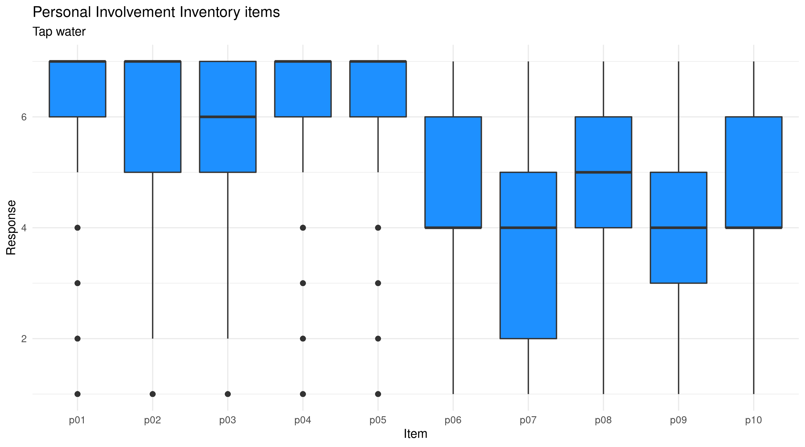

# 9. Exploring the Customer Experience {#customers}
The services that water utilities provide to their communities rely heavily on technology---most of the data that water utility professionals analyse is derived from measurement instruments and laboratory tests. The technological data does, however, only tell part of the story of urban water supply. We can physically measure the process from catchment to tap, but what happens downstream of the connection is a matter of psychology instead of chemistry and physics.

Water utilities are becoming ever more aware of their role in the community. Water professionals now also need to analyse the information they collect from customers. Data collected from living human beings instead of from scientific instruments requires a different approach to technical data. Measurement in the social sciences follows a different approach to measuring physical processes. 

This chapter introduces some principles of collecting and analysing data from customers and further techniques to manipulate data. The learning objectives for this chapter are:

* Understand the principles of measuring the customer experience with latent variables.
* Evaluate data with missing observations.
* Apply the principles of tidy data.

The data and code for this session are available in the `chapter_09.R` file in the `casestudy2` folder of your RStudio project.

## Consumer Involvement
Technical professionals often lament that customer data is merely subjective and that it, therefore, is unable to provide real insights. The following three chapters show some of the techniques that social scientists use to construct and analyse surveys. While each individual answer is a subjective assessment, a well-designed and appropriately investigated customer survey can provide actionable insights into how a utility can improve its services perceived by the customer.

Consumer involvement is an essential marketing metric that describes the relevance of a product or service has in somebody's life. People who own a car will most likely be highly involved with purchasing and owning the vehicle due to a large amount of money involved and the social role it plays in developing their public self. Consumers will most likely have a much lower level of involvement with the instant coffee they drink than with the clothes they wear. More formally, consumer involvement can be defined as a person's perceived relevance of the object based on inherent needs, values, and interests.

Consumer involvement is a vital metric to understand because it is causally related to willingness to pay and perceptions of quality. Consumers with a higher level of involvement are generally willing to pay more for a service and have a more favourable impression of quality.

Understanding involvement in the context of urban water supply is also essential because sustainably managing water as a common pool resource requires the active involvement of all users. The level of consumer involvement depends on a complex array of factors, which are related to psychology, situational factors and the marketing mix of the service provider. The lowest level of involvement is considered a state of inertia, which occurs when people habitually purchase a product without comparing alternatives.

Cult products have the highest possible level of involvement because customers are devoted to the product or brand. Commercial organisations use this knowledge to their advantage by maximising the level of consumer involvement through branding and advertising. This strategy is used effectively by the bottled water industry. Manufacturers focus on enhancing the emotional aspects of their product rather than emphasising the cognitive elements. Water utilities tend to use a reversed strategy and highlight the cognitive elements of tap water, the pipes, plants and pumps, rather than trying to create an emotional relationship with their consumers.

Water is more often than not positioned as a service that is essential for life. Most of the water that customer use is, however, used for a non-essential purpose. Water is available in the background of everyday life, which would suggest a low level of involvement. The essential nature of water would indicate a high level of involvement. This survey measure the involvement construct to gain a better insight into how involved consumers are with their water service.

### Methodology
Measuring a state of mind is a complex task that goes beyond asking direct questions. Simply asking: "How involved are you with tap water?" would not yield valid and reliable results. Firstly, this question assumes that respondents have the same understanding of involvement as the researcher. Secondly, with only one question, there is nothing to test the reliability of the responses, and we have to take the answer at face value. 

Physical measurements can be calibrated by comparing it with a known value. Psychological states of mind cannot be calibrated as we have no direct insight into the software of the brain. In the social sciences, mental states are called latent variables because we can only measure them indirectly. Researchers use banks of questions that ask for a response to similar questions. The basic idea is that people with a particular disposition will all respond in the same way to these stimuli (the questions). We use the answers to multiple questions to test the responses for internal and external consistency.

The customer survey of the second case study includes ten questions to measure the level of consumer involvement. These questions form the Personal Involvement Inventory (PII), developed by Judith Zaichkowsky ([1994](https://www.sfu.ca/~zaichkow/JA%252094.pdf)). The Personal Involvement Inventory consists of two dimensions: 

1. Cognitive involvement (importance, relevance, meaning, value and need) 
2. Affective involvement (involvement, fascination, appeal, excitement and interest).

The involvement question bank uses a semantic differential scale. This method requires respondents to choose on a scale between two antonyms (figure 9.1). This type of survey measures the meaning that people attach to a concept, such as a product or service. The items were presented in a random order to each respondent. In principle, the words on the right indicate a high level of involvement. Five questions have a reversed polarity, which means that the left side shows a high level of involvement. This technique prevents respondents forces respondents to consider their response instead of providing the same answer to all questions.

{width: 60%, align: middle}


The customer survey data we cleaned in the previous chapter contains the ten items of the PII scale (`p01`, `p02`... `p10`). Table 1 shows the relationship between the items and the scale. The items with an asterisk are in reversed polarity. The next section explains how to analyse this information.

{title="Table 1: Personal Involvement Inventory variables."}
| Variable | Item                     |
|----------|--------------------------|
| p01      | Important – Unimportant* |
| p02      | Relevant – Irrelevant*   |
| p03      | Meaningless – Meaningful |
| p04      | Worthless – Valuable     |
| p05      | Not needed – Needed      |
| p06      | Boring – Interesting     |
| p07      | Exciting – Unexciting*   |
| p08      | Appealing – Unappealing* |
| p09      | Fascinating – Mundane*   |
| p10      | Involving–  Uninvolving* |

## Preparing the Involvement Data
The first step in writing an R script is, as always, to initialise the appropriate libraries and read the data. In this case, we do not start with the usual `library(tidyverse)` but call the specific libraries as we need them. This approach saves computing resources. We begin with the [readr](https://readr.tidyverse.org/) package, which provides the functionality that reads CSV files and similar types. We also load the [tibble](https://tibble.tidyverse.org/index.html) package to access improved functionality for data frames.

{format: r, line-numbers: false}
```
library(readr)
library(tibble)
customers <- read_csv("casestudy2/customer_survey_clean.csv")
glimpse(customers)
```

The [Tidyverse website](https://tidyverse.org/) hosts extensive documentation on each of the packages and functionality. 

{width:60%, align: middle}


X> Go to the web page of the [readr](https://readr.tidyverse.org/) package and read the documentation. Each Tidyverse package has a cheat sheet you can use to help you write code.

To analyse the level of involvement, we only need the `survey_id` as a unique identifier and the ten PII items. The `select()` function we saw in the previous chapter has some helper functions that simplify selecting the columns we need.  The `starts_with()` helper function lets you choose columns based on a prefix. We can now select the eleven variables of interest, but before we can analyse them, we need to correct the reversed polarity of five of the items. 

The scale measured from 1 to 7, so we can reverse the five items by subtracting the response from 8. The dplyr `mutate()` function changes variables or creates new ones in a tibble.

{format: r, line-numbers: false}
```
library(dplyr) # Part of the Tidyverse
pii <- select(customers, survey_id, starts_with("p")) %>%
    mutate(p01 = 8 - p01,
           p02 = 8 - p02,
           p07 = 8 - p07,
           p08 = 8 - p08,
           p09 = 8 - p09,
           p10 = 8 - p10)
```

X> Read the documentation of the [select function](https://dplyr.tidyverse.org/reference/select.html) on the Tidyverse website for a complete overview. How would you select the PII columns with the `:` operator?

## Missing Data
Data collected from reality is never perfect. Besides issues with the reliability and validity of measurements, completeness is another problem that analysis needs to manage. The customers that submitted the survey did not respond to each item. We thus have to deal with missing data points.

To review the completeness of the data, we can use the `summary()` function we saw in a previous session. The next line of code summarises all columns, except for the index.

{format: r, line-numbers: false}
```
summary(pii[ ,-1])
```

When you study the output, you see that for all ten variables, the minimum is 1 and the maximum is 7. At the bottom of the output for each variable, you will also note that there are 52 missing responses (`NA`).

Data can be missing at random or through an underlying pattern. We deal with each type of missing data differently. Data completely missing at random is part of the sampling error. You can, in some cases, impute this data with estimated values. A better approach is to collect a sample that is large enough to allow dropping respondents with insufficient answers. Data that is not missing at random indicates an underlying pattern. These observations are, in most cases, omitted from the analysis.

The fact that the same number of data points are missing for each variable is an intriguing clue. The data in this survey seems to be missing not at random.

Using missing data requires special considerations during analysis. Almost all functions will return an `NA` value when one or more of the observations are not available, as shown in the example below. Most functions accept the `na.rnm = TRUE`option to instruct R how to deal with missing values. The second line of code tells R to remove any `NA` values from the vector. The default setting for this option is to keep the missing observations.

{format: r, line-numbers: false}
```
x <- c(1, 2, 3, NA, 4, 5)
mean(x)
mean(x, na.rm = TRUE)
sum(x)
sum(x, na.rm = TRUE)
```

X> Evaluate these expressions to note the difference in output.

When data is missing at random, we can possibly replace missing values with a best guess, called imputation. The most common method is to replace the missing value with the median or mean of the sample. 

Imputation needs to be used with great care because you can bias the results. The second principle of ethical data science is that we do justice to the participants. Imputing missing values is like putting words in the mouth of the respondent. Imputation can only be used when the primary method of analysis cannot process missing values, and when the number of missing values is only a few percent of the total number of observations. 

When data is missing not at random, as in this case, we usually need to remove these observations, which we will do in the next step.

## Tidy Data
In the previous session, we cleaned the survey data by removing unwanted columns and respondents. Although the data is clean, it is not yet in its ideal `tidy` state. [Tidy data](https://www.jstatsoft.org/article/view/v059i10) is a standard way of mapping the meaning of a data set to its structure. Data that is structured in a tidy way is more natural to analyse and visualise.

A dataset is a collection of values, mostly numbers or strings. Every value belongs to a variable (column) and to an observation (rows). A variable contains all values that measure the same underlying attribute (like height, temperature, duration) across units. An observation provides all values measured on the same unit (like a person, a day, or a location), across attributes. 

A dataset is messy or tidy depending on how rows, columns and tables are matched up with observations, variables and types. In tidy data:

* Each variable forms a column.
* Each observation forms a row.
* Each type of observational unit forms a table.

The laboratory results sets used in the first [case study](#casestudy1) are tidy because all measurements are in the same result column, as shown in the table below.

{title="Table 2: Tidy laboratory data."}
| Date       | Sample | Analyte   | Result | Unit       |
|------------|--------|-----------|-------:|------------|
| 2017-12-13 | S1234  | Turbidity |   0.05 | mg/l       |
| 2017-12-13 | S1234  | THM       |   0.12 | mg/l       |
| 2017-12-13 | S1234  | E. coli   |      0 | orgs/100ml |
| 2017-12-14 | S1235  | Turbidity |    0.1 | mg/l       |
| 2017-12-14 | S1235  | THM       |   0.07 | mg/l       |
| 2017-12-15 | S1236  | Turbidity |   0.23 | mg/l       |
| 2017-12-15 | S1236  | THM       |   0.21 | mg/l       |
| 2017-12-15 | S1236  | E. coli   |      0 | orgs/100ml |

The involvement data is, however, untidy because the results are spread across ten columns. The untidy or wide version of the laboratory data would look like table 3. This data structure is more challenging to use because it cannot be grouped by the analyte.

{title="Table 3: Wide version of laboratory data."}
| Sample | Date       | Turbidity |  THM | E. coli |
|--------|------------|----------:|-----:|--------:|
| S1234  | 2017-12-13 |      0.05 | 0.12 |       0 |
| S1235  | 2017-12-14 |       0.1 | 0.07 |         |
| S1236  | 2017-12-15 |      0.23 | 0.21 |       0 |

To tidy the involvement data we need to, speaking in Excel terms, unpivot the data. The `pivot_longer()` function in the [tidyr package](https://tidyr.tidyverse.org/index.html) helps to create tidy data. This function takes multiple columns and collapses them into key-value pairs.

The example below defines the laboratory data as in the previous table and transforms it into the tidy long version. The first option in the `pivot_longer()` function is the name of the data frame. The next option defines which columns need to pivot, which are the ones that contain the data. The remainder of the columns will be used as the keys. 

The last two options provide the names of the new columns. The `names_to` option defines the name of the column that will store the names of the pivoted variables. The `values_to` option specifies the name of the column that will hold the values in the pivoted columns.

The new data frame will contain one `NA` value, which is removed in the second line.

{format: r, line-numbers: false}
```
lab_wide <- tibble(Sample = c("S1234", "S1235", "S1236"),
                   Date = as.Date(c("2017-12-13", "2017-12-14", "2017-12-15")),
                   Turbidity = c(0.05, 0.1, 0.23),
                   THM = c(0.12, 0.07, 0.21),
                   E.coli = c(0, NA, 0))
pivot_longer(lab_wide, cols = -1:-2, names_to = "Analyte", values_to = "Result") %>%
    filter(!is.na(Result))
```

X> Reverse-engineer this example. How would you apply this function to the PII data?

For the involvement data, we include all columns, except the `survey_id`. The first new columns will be called `Item`, which contains the name of the ten items `p01` to `p10`. The `Response` variable will provide the results.

When we inspect the resulting data frame, you will notice quite 520 missing responses. These represent the 52 respondents who did not complete this part of the survey. Because this data is not missing at random, we exclude them from further analysis.

{format: r, line-numbers: false}
```
pii_long <- pivot_longer(pii, -survey_id, 
                         names_to = "Item", 
						 values_to = "Response") %>%
    filter(!is.na(response))
```

### Explore the results
The best way to explore the results of this transformed data is to visualise the distribution of each response. The best way to do so, in this case, is with a boxplot for each item.

{format: r, line-numbers: false}
```
library(ggplot2)
ggplot(pii_long, aes(item, response)) +
    geom_boxplot(fill = "dodgerblue") +
    labs(title = "Personal Involvement Inventory items",
         subtitle = "Tap water") +
    theme_minimal(base_size = 20)
```

{width: 100%, align: middle}


D> What pattern do you observe in these results?

## Quiz 5: Transforming data
The next quiz consists of five multiple-choice questions about working with missing data and transforming data into a tidy format.

The [next chapter](#survey) analyses the consumer involvement data using correlations and cluster analysis.

{quiz, id:q5, attempts:10}
# Quiz 5: Transforming data
The following five questions test your comprehension of some of the functionality explained in this chapter. Test your answer by executing the code in the console. Any files, including the solutions, are available in the `casestudy2` folder.

? The table below shows the first few rows of laboratory data. Is this data tidy?

| Date       | Sample_Point | Chlorine | Turbidity |
|------------|--------------|---------:|----------:|
| 2022-12-01 | S2365        |     0.62 |      0.12 |
| 2022-12-08 | S2365        |     0.34 |      0.10 |
| 2022-12-15 | S2365        |     1.20 |      .0.8 |

a) Yes. There are no missing data points.
B) No. The observations are spread over multiple columns.

? How would you transform the data shown in the first question, named `lab`?

a) `pivot_longer(df, names_to = "Analyte", values_to = "Result")`
b) The data is already tidy.
c) `pivot_longer(df, cols = 1:2, names_to = "Analyte", values_to = "Result")`
D) `pivot_longer(lab, Chlorine:Turbidity, names_to = "Measure", values_to = "Result")`

? You have a vector of channel level measurements, but one observation is missing. What is the average of the numbers in this vector: `c(100, 50, 25, NA, 25)`?

A) 50
b) `NA`
c) 40
d) 200

? Load the raw data from the customer survey. Select the `hardship` and `contact` variables and pivot the data. What is the total number of missing variables in the raw data?

a) 59
B) 112
c) 0
d) 67

? Which one of these is _not_ a property of tidy data?

a) Each variable forms a column.
b) Each observation forms a row.
C) Each observation is complete (no missing data)
d) Each type of observational unit forms a table.

That's it for the fifth quiz. If you get stuck, you can find the answers in the `quiz_05.R` file in the `casestudy2` folder. You can also watch the video to see the solutions.


You are now ready to proceed to the [next chapter](#latent) where we delve deeper into analysing customer responses.
{/quiz}
