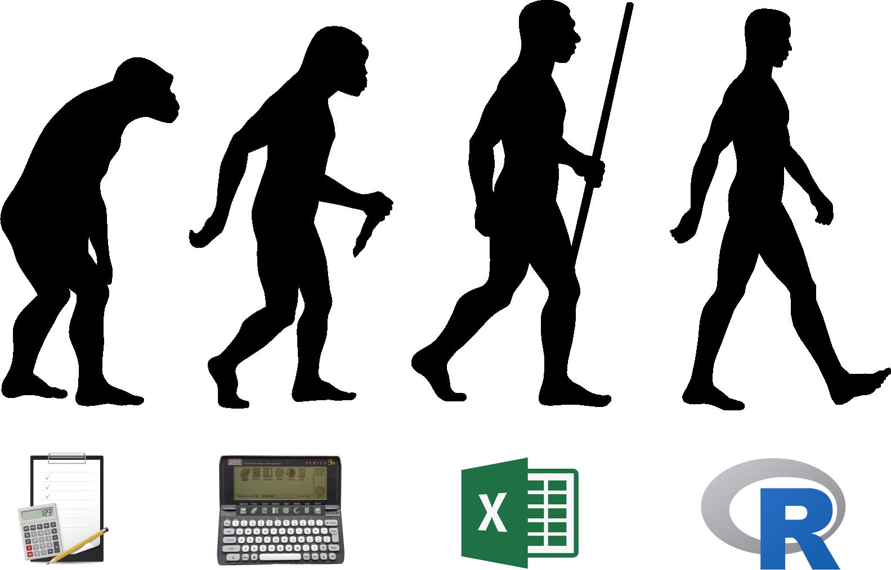
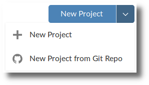
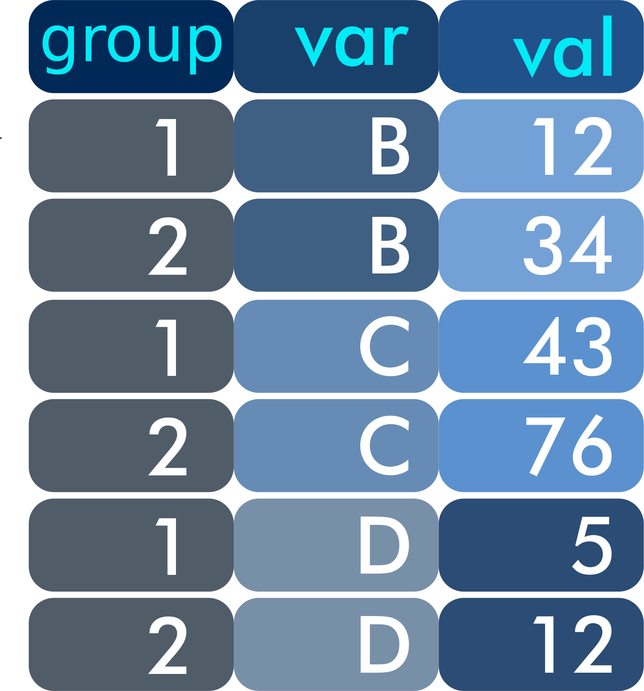

```{r setup, include=FALSE}
library(knitr)
opts_chunk$set(tidy.opts=list(width.cutoff=40), echo=TRUE)

event <- paste0("https://leanpub.com/c/R4H2O/c/", params$coupon)
```

# My Data Science Evolution


# Day 1 Program
:::::: {.columns}
::: {.column}
* Data science principles
* Basics of R and Tidyverse
* Water quality case study
* Lunch
* Data visualisation
* Data products
:::
::: {.column}

:::
::::::

# Resources


# Principles of Data Science


# What is Data Science?
).](../manuscript/resources/session1/conway.png)

# What is good data science?


# What is useful data science?
.](../manuscript/resources/session1/feedback-loop.png)

# What is sound data science?


# What is sound data science? 


# What is sound data science?
Reproducible code:
```{r example, eval=FALSE}
reserve %>%
    select(Date, River_Flow, Natural_Flow, ERV) %>%
    mutate(Date = as.Date(Date, format = "%d %m %Y")) %>%
    gather(Source, Value, -Date) %>%
    mutate(type = factor(Source == "ERV"),
           type = fct_recode(type, Flow = "FALSE", 
                             Volume = "TRUE")) %>%
    ggplot(aes(Date, Value, col = Source)) + 
    geom_line() + 
    facet_grid(type~., scales = "free_y")
```

# What is aesthetic data science?


# Configure R Studio
:::::: {.columns}
::: {.column}
**Desktop**

* Install R and RStudio
* Download and unzip materials from [https://github.com/pprevos/r4h2o](https://github.com/pprevos/r4h2o)
* *File* > *Open Project*
* Open the `r4h2o.Rproj` file in the downloaded folder
:::
::: {.column}
**Cloud**

* Sign-up at: [rstudio.cloud](https://rstudio.cloud/)
* *New Project* > *New Project from Git Repo*

* Enter GitHub URL:
[https://github.com/pprevos/r4h2o](https://github.com/pprevos/r4h2o)
:::
::::::
    
    
# Console exercise
::::::{.columns}
:::{.column}
1. Enter sample code into the console (see syllabus for examples)
2. Observe the output in the console
3. Observe the environment
4. Use ↑↓ to scroll history
5. Use TAB for completion
6. Play with variations
:::
:::{.column}
```{r}
x <- -10:10
y <- -x^2 -2 * x + 30

plot(x, y, type = "l", 
     col = "blue")
abline(h = 0, col = "grey")
abline(v = 0, col = "grey")
```
:::
::::::

# R is Meme-Proof


# Finding Help
:::::: {.columns}
::: {.column width="50%"}
* Built-in *help()* function
* Cheat sheets (RStudio and Tidyverse websites)
* Twitter #rstats
* Reddit rstats, rlanguage
* [stackoverflow.com](https://stackoverflow.com)
* Google the problem
:::
::: {.column width="50%"}

:::
::::::


# Exercise: Calculate Channel Flows
:::::: {.columns}
::: {.column width="50%"}
Determine the flow in a channel. Go to exercise 1 and answer the questions.

$$q = \frac{2}{3} C_d \sqrt{2g}bh^{3/2}$$

* $q$: Flow [$m^3/s$].
* $C_d \approx 0.6$: Constant.
* $g = 9.81 m/s^2$
* $b$: Width of the weir [$m$]
* $h$: Water depth over weir [$m$]
:::
::: {.column width="50%"}

:::
::::::
    
    
# Scripts versus Console
* Store all code in a text file with `.R` extension
* Output in console, plots and viewer
* Use comments (start with `#`) to explain the code
* *File* > *New File* > *R Script*
* Open the `channel_flow.R` script in `inroduction` folder.
* Reverse-Engineer the code


# Reproducible Code
::::::{.columns}
:::{.column}
* Give meaningful names
* Use a consistent method, e.g.:
    - Only lower case: `channelflow`
    - Underscore for spaces: `channel_flow`
    - Camel case: `ChannelFlow`
:::
:::{.column}
* Use comments to explain the process
* Add links to documentation
* Automate as much as possible
:::
::::::

# Case Study 1: Water Quality
:::::: {.columns}
::: {.column}
Safe Drinking Water Regulations 2015:

> “the 95th percentile of results for samples in any 12 months must be less than or equal to 5.0 Nephelometric Turbidity Units.”
:::
::: {.column}
Guidance document:

> “The method recommended by the department is described as the Weibull method and is the method adopted by the National Institute of Standards and Technology (NIST).”
:::
::::::

# Percentiles
::::::{.columns}
:::{.column}
1. The data are placed in ascending order: $y_1, y_2, \ldots y_n$.
2. Calculate the rank of the required percentile
    - Weibull: $r = p(n + 1)$
    - Excel: $r = 1 + p(n - 1)$
3. Interpolate between adjacent numbers: 
$X_p=(1-r_{frac})Y_{r_{int}}+r_{frac}Y_{r_{int+1}}$
:::
:::{.column}
```{r, echo = FALSE, fig.cap="Explore the `percentiles.R` script in the `casestudy1` folder."}
## Load and execute
source("../casestudy1/percentiles.R")
```
:::
::::::

# The Tidyverse
:::::: {.columns}
::: {.column  width=60%}
An opinionated collection of R packages optimised for data science. All packages share an underlying design philosophy, grammar, and data structures.

```{r, eval=FALSE}
install.packages("tidyverse")
library(tidyverse)
```

Load the `casestudy1.R` script in the `casestudy1` folder.
:::
::: {.column  width=40%}

:::
::::::

# Data frames or 'tibbles'
:::::: {.columns}
::: {.column width=60%}
* Rectangular data
* Variables in columns
* Observations in rows
* One variable in R environment
* Tidy data
* Read data:

```{r, eval=FALSE}
dataframe <- read_csv(filename)
```
:::
::: {.column width=40%}

:::
::::::

# Filter a data frame
```{r, eval=FALSE}
filter(df, var == "B")
```


# Grouping
```{r, eval=FALSE}
group_by(df, var)
```


# Exercise
* Load the CSV file for the Gormsey system in the `casestudy1` folder.
* Explore the data.
* Answer the questions in Exercise 2 in your syllabus.
* You can cheat by opening the `gormsey_quiz.R` script.

# Data Visualisation
::::::{.columns}
:::{.column}

:::
:::{.column}

:::
::::::

# Data-to-Pixel Ratio


# Chart Chooser


# Use Colours Sparingly


# ggplot2
::::::{.columns}
:::{.column}
* System for  creating graphics, based on *The Grammar of Graphics*.
* Go to [ggplot2.tidyverse.org](https://ggplot2.tidyverse.org/) for documentation.
* Included in the Tidyverse. You can call it separately with:

```{r, eval=FALSE}
library(ggplot2)
```
:::
:::{.column}

:::
::::::

# Grammar of Graphics


# ggplot2 Example
```{r, echo=FALSE, message=FALSE}
library(tidyverse)
turbidity <- read_csv("../casestudy1/turbidity_laanecoorie.csv")
ggplot(turbidity, aes(Date_Sampled, Result)) + 
  geom_line(col = "blue") + 
  geom_hline(yintercept = 1, col ="red") + 
  facet_wrap(~Zone, ncol = 1) + 
  labs(title = "Turbidity time series",
       subtitle = "Laanecoorie System")
```

# Visualisation Exercise
::::::{.columns}
:::{.column}
Use your knowledge of the Gormsey data to create two visual data stories. Use the following four steps:

1. Explore the data and define the story you want to tell. 
2. Decide on the best way to visualise the story.
3. Develop the basic visualisation.
4. Select a theme and annotate the graph.
:::
:::{.column}
```{r echo=FALSE, fig.width=4, fig.height=6, message=FALSE}
read_csv("../casestudy1/gormsey.csv") %>%
    ggplot(aes(Zone)) + 
    geom_bar(fill = "dodgerblue3") + 
    scale_y_continuous(breaks = seq(0, 300, 100)) +
    coord_flip() + 
    facet_wrap(~Measure) + 
    labs(title = "Number of samples per zone",
         subtitle = "Gormsey System",
         y = "Samples")
```
:::
::::::

# Data Science Workflow


# Data Products

::::::{.columns}
:::{.column}
Static

- Word documents
- PowerPoint presentaions
- Web pages

Dynamic

- Shiny application
- Shiny presentation

Share
- RStudio Connect
- Your own server
:::
:::{.column}

:::
::::::

# RMarkdown
::::::{.columns}
:::{.column}
Literate programming:

* Combine prose with code
* Link the code to dynamic data
* Generate shareable output from code
:::
:::{.column}
Data products:

* Reports
* Web sites
* Presentations
* Applications (dashboards)
:::
::::::

# RMarkdown Syntax


# Mini Hackathon
To close this day, we will do a mini hackathon.

1. Create a script that results in a PowerPoint presentation about the Gormsey data.
2. Pick a story you like to tell about this data.
3. Create a RMarkdown script that results in a Powerpoint presentation.
    - Add an introduction.
    - Explore the data.
    - Share the story.

# Further Study
:::::: {.columns}
::: {.column}

:::
::: {.column}
](images/r4ds.png)
:::
::::::
                    
