```{r setup, include=FALSE}
knitr::opts_chunk$set(echo = FALSE, message=FALSE, warning=FALSE, dpi=300)
```

# {data-background="images/r4h2o-banner.jpg"}

# Program
<div class="column" style="float:left; width: 50%">
Day 1:

1. Analysing customer experience
2. Data cleaning
3. Survey reliability
4. Survey validity
</div>
<div class="column" style="float:left; width: 50%">
Day 2:

1. Customer segmentation
2. Cluster analysis
3. Linear regression
</div>

## Course Book
[lucidmanager.org/r4h2o](https://lucidmanager.org/r4h2o)


## Course Project
[github.com/pprevos/r4h2o](https://github.com/pprevos/r4h2o)

- _RStudio Cloud_: New project from GitHub repository
- _RStudio Desktop_: Download or clone project files

{height=400}

## Introductions


# Customer Experience
{height=500}

## Water Utility marketing
```{r}
vembedr::embed_url("https://www.youtube.com/watch?v=Cg9YH4bm2Sk")
```
_Gruen Transfer_ (2009), Season 2, Episode 3.

## From STEM to STEAM
<div class="column" style="float:left; width: 50%">


Water management applies the physical sciences.
</div>
<div class="column" style="float:left; width: 50%">
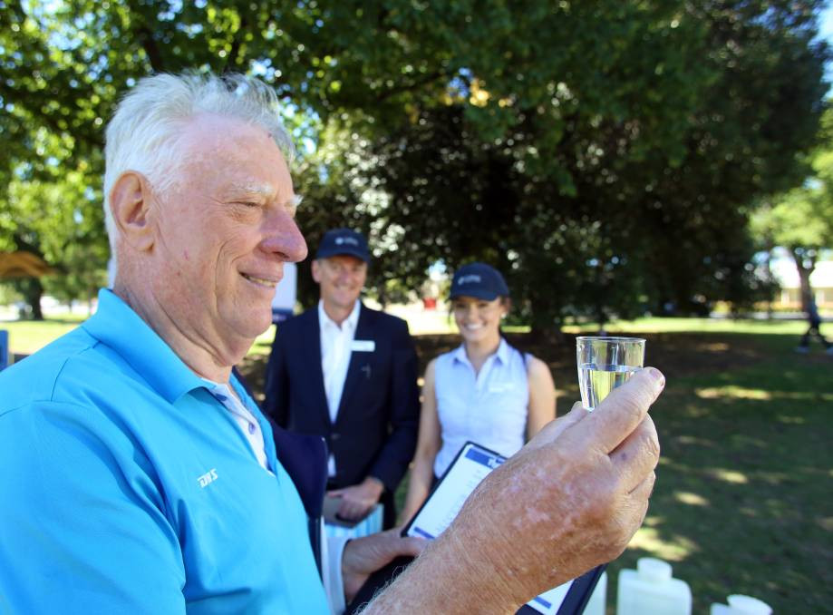

Marketing applies the social sciences.
</div>

## Customer Surveys
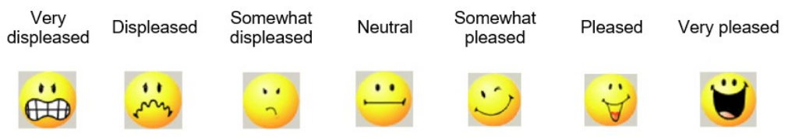

## Case Study 2 survey
1. Consent and screening
2. Consumer Involvement (Ten-item semantic differential scale)
4. Contact frequency (1-item Likert scale)
4. Perceived hardship (1-item Likert scale)
5. Service Quality (18-item Likert Scale)
6. Trap question (1-item Likert scale)

## Consumer Involvement
<div class="column" style="float:left; width: 50%">
- Importance of the product to a consumer
    - Cognitive (rational)
    - Affective (emotional)
</div>
<div class="column" style="float:left; width: 50%">
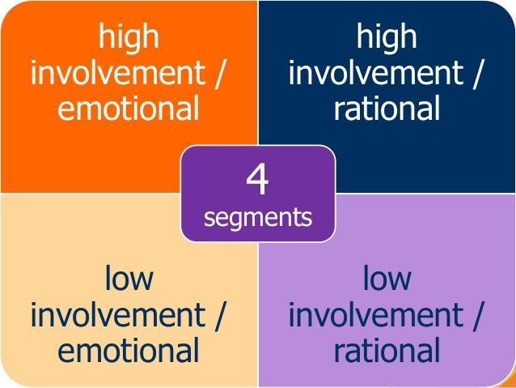
</div>

## Personal Involvement Inventory
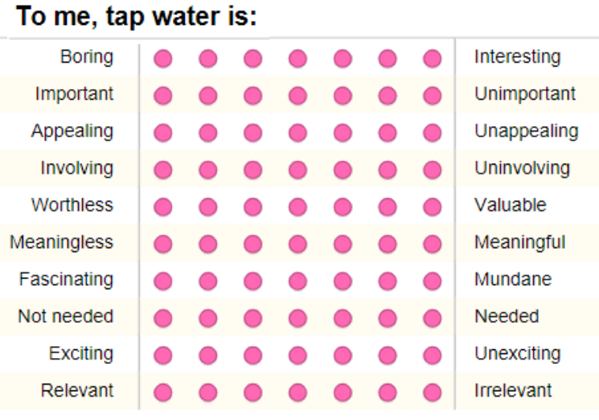

<small>Zaichkowsky, J. L. (1994). The personal involvement inventory: revision, and application to advertising. _Journal of Advertising_, 23(4), 59.</small>

- Which items are reversed polarity?
- Which items are cognitive and which items are affective?

## Service Quality
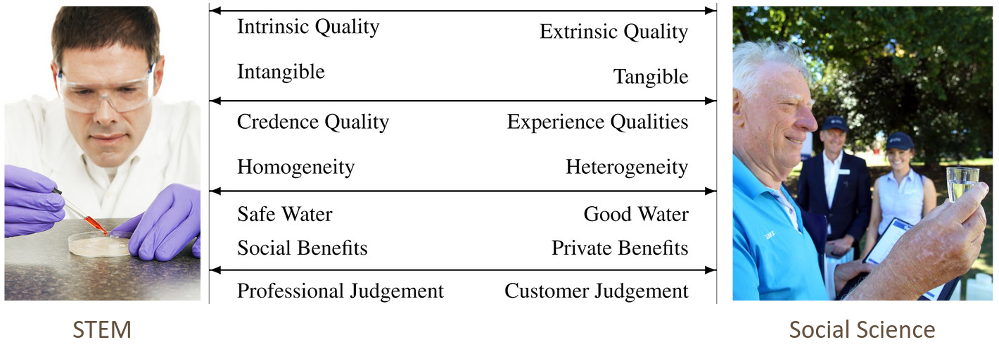

## ServAqua Development
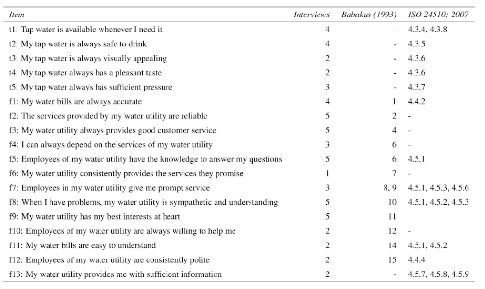

## ServAqua
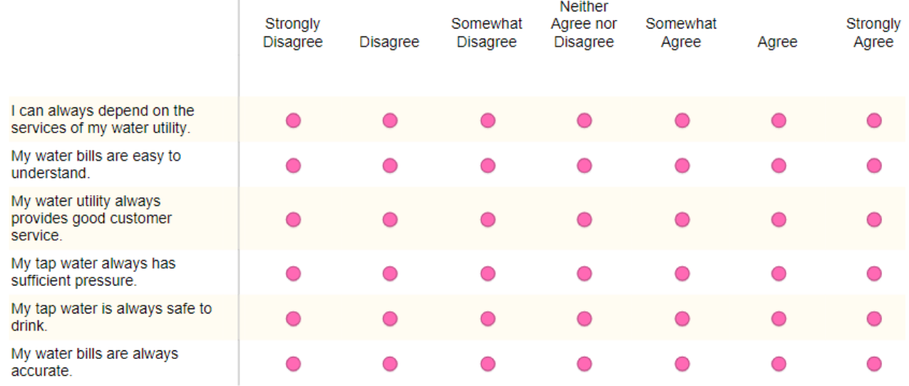

## Case Study 2
1. Open Rstudio in the `R4H2O` project
2. Activate the Tidyverse libraries
3. Load and explore the data:
    - `casestudy2/customer_survey.csv`

# Cleaning Data
Open `chapter-08.R` script

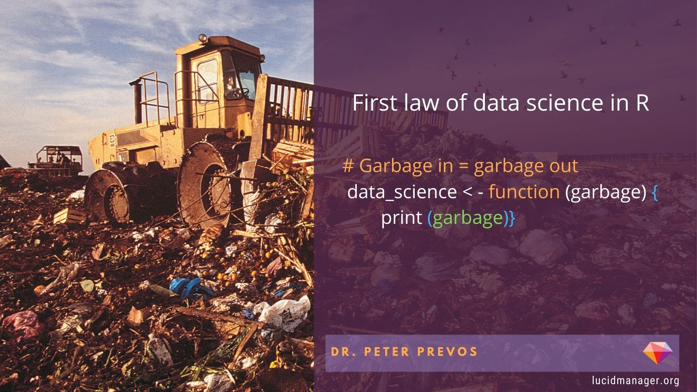{height=400}

## Data Structures
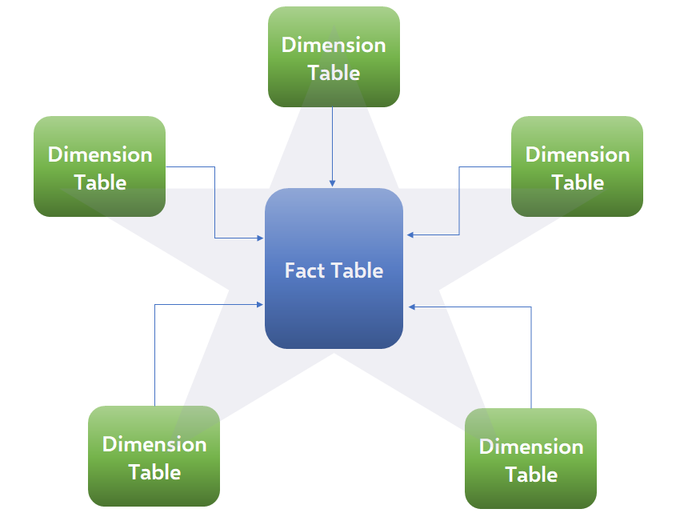{height=500}

## Joining Data
{height=400}

`vignette("two-table")`

## Tidyverse Data Cleaning
<div class="column" style="float:left; width: 50%">

[dplyr.tidyverse.org](https://dplyr.tidyverse.org/)

`vignette("dplyr")`
</div>
<div class="column" style="float:left; width: 50%">

[tidyr.tidyverse.org](https://tidyr.tidyverse.org/)

`vignette("tidy-data")`
</div>

## Tidy Data
<div class="column" style="float:left; width: 50%">
1. Each variable forms a column
2. Each observation forms a row
3. Each type of observational unit forms a table

</div>
<div class="column" style="float:left; width: 50%">

</div>

## Pivoting Data
→ <small>`pivot_longer(data, 2:3, names_to = "year", values_to = "cases")`</small>

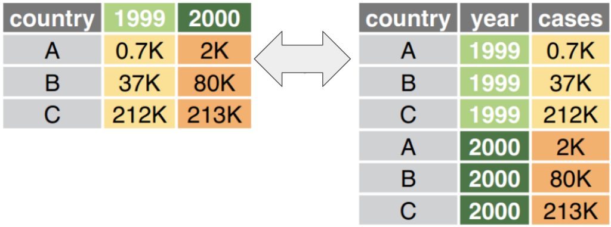

← <small>`pivot_wider(data, names_from = year, values_from = cases)`</small>

`vignette("pivot")`

## Missing Data
- Missing Completely at Random (statistical error)
- Missing Not At Random (remove)

```{r, fig.asp=9/16}
library(readr)
library(dplyr)
suburbs_dim <- tibble(suburb = 1:3,
                      suburb_name = c("Merton", 
                                      "Snake's Canyon", 
                                      "Wakefield"))
customers <- read_csv("casestudy2/customer_survey.csv")[-1, ] %>%
    type_convert() %>%
    filter(is.na(term)) %>% # Remove terminated surveys
    left_join(suburbs_dim) %>% 
    rename(customer_id = V1) %>%
    select(c(1, 52, 21:51, -33))
library(visdat)
vis_miss(customers)
```

# Measuring Mental States
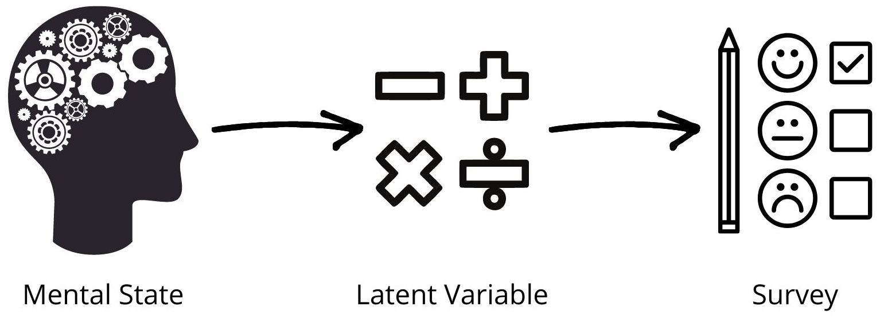

## Personal Involvement Index
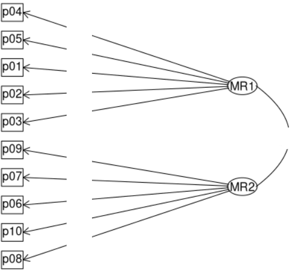

## Reliability and Validity
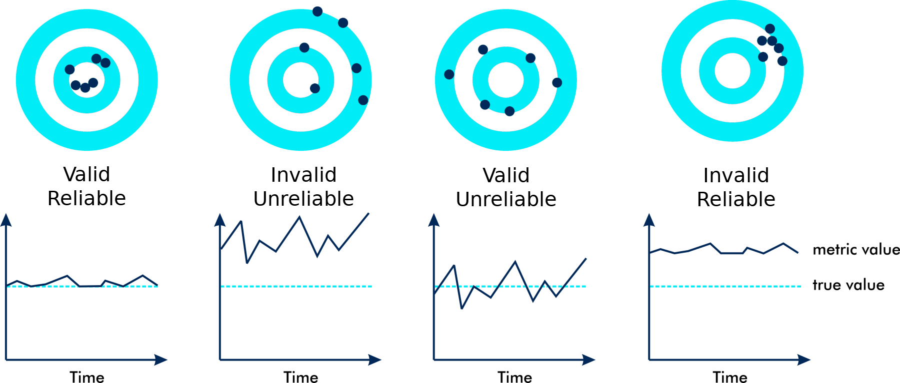

## Survey Reliability
- Correlations
- Cronbach's Alpha

## Covariance and Correlation

$$cov(x, y) = \frac{\sum_{i=1}^n(x_i-\bar{x})(y_i-\bar{y})}{n-1}$$

$$cor(x,y) = \frac{cov(x, y)}{s_x s_x}$$

$$s_x = \sqrt{\frac{\sum_{i=1}^n(x_i-\bar{x})^2}{n-1}}$$

## Survey Validity
- _Face validity_: Do the survey questions at face-value relate to the mental state?
- _Content validity_: Does the survey instrument capture all relevant components of the latent variable?
- _Construct validity_: How much variance does the model describe?
- _Discriminant validity_: How different is the scale from other scales?

## Exploratry Factor Analysis
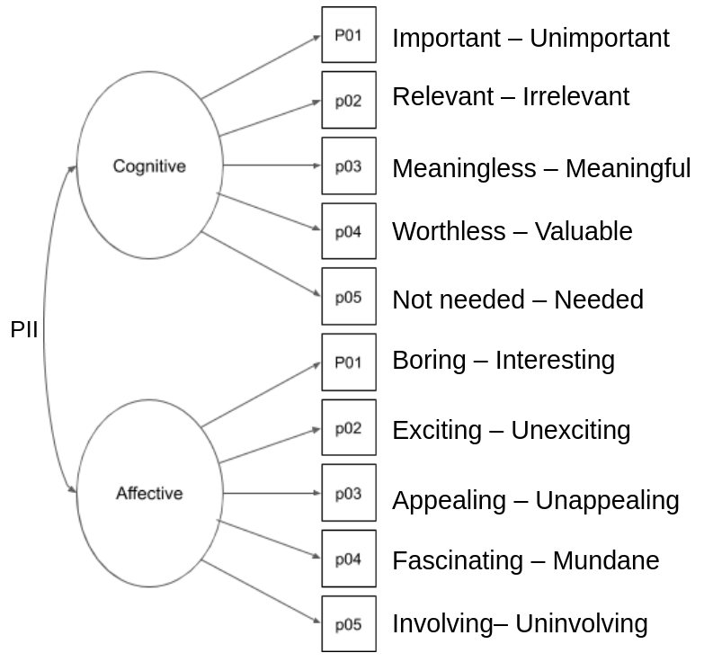{height=600}

## Example: Trust Scale
<div class="column" style="float:left; width: 50%">
_Questions_

- How much can you count on … ?
- How much do you trust … ?
- How dependable is … ?

_Answer Model_

7-point Likert scale
</div>
<div class="column" style="float:left; width: 50%">
_Source_

<small>Bruner, G. (2012). _Marketing Scales Handbook. A Compilation of Multi-item Measures for Consumer Behavior & Advertising Research_. GCBII Productions.</small>

_Reliability_

- Alpha = 0.92

_Validity_

Factor analysis supports single-dimensionality and discriminant validity.
</div>

## Factor Analysis
- $$Factor_i = b_1 Variable_{1i} + b_2 Variable_{2i} +…+ b_n Variable_{ni} + \varepsilon_i$$
- $b_s$ is factor loading
- Variance
    - Communality: Shared with other variables
	- Uniqueness: 1 - communality
	- Error
-  Uniqueness (0--1)
    - Proportion of variability, which can not be explained by a linear combination of the factors (noise)
- Loadings
    - Contribution of each original variable to the factor (0--1)
    - Sum of squared loadings = 1 - uniqueness
# Customer Segmentation

## Hierarchical Cluster Analysis
1. Pre-process the data
2. Scale the data
3. Calculate the distances
4. Cluster the data
5. Review the outcome

## Scaling
<div class="column" style="float:left; width: 50%">
- Wide data frame
- Columns: Features
- Rows: Cluster variable
</div>
<div class="column" style="float:left; width: 50%">
$$x_s = \frac{x_i - \bar{x}}{s_x}$$
</div>

## Distance calculations
<div class="column" style="float:left; width: 50%">
1. Euclidean distance
2. Manhattan (taxi cab) distance
3. Maximum (max $\Delta x, \Delta y \ldots$)
</div>
<div class="column" style="float:left; width: 50%">
```{r dis, fig.cap="Euclidean and Taxi Cab distance", fig.asp=9/16, out.width="80%"}
par(mar = rep(0, 4))
plot(c(3, 7), c(3, 7), pch = 19, axes = FALSE, cex = 2)
lines(c(3, 7, 7), c(3, 3, 7), lty = 3, col = "red", lwd = 2)
lines(c(3, 7), c(3, 7), lty = 2, col = "blue", lwd = 2)
legend("topleft", legend = c("Euclidean", "Taxi cab"), col = c("blue", "red"), 
       lwd = 2, lty = c(2, 3), cex = 2, box.col = NA)
```
</div>

## Agglomerative Clustering
1. Find two closest points
2. Cluster the two points
3. Find next two closets points / clusters
    - Average distance
    - Minimum distance
    - Maximum distance
4. Cluster the two points
5. Continue until all points are in one cluster

## _k_-means Clustering
1. Specify the number of clusters (_k_)
2. Select randomly k objects
3. Assigns each observation to their closest centroid
4. For the _k_ clusters, update the centroid
5. Iteratively minimize the total within sum of square

# Linear Regression
<div class="column" style="float:left; width: 60%">
```{r ols}
library(tidyverse)

set.seed(123)
d <- tibble(x = c(sample(22:38, 8), 20, 40),
            y = round(runif(1), 2) * x + sample(5:10 , 1) + rnorm(10) * 2)

d$y[d$x %in% c(20, 40)] <- NA
ab <- lm(y ~ x, d)
a <- coef(ab)[2]
b <- coef(ab)[1]
d$yhat <- a * d$x + b

a1 <- -a / 2
b1 <- mean(d$y, na.rm = TRUE) - a1 * mean(d$x, na.rm = TRUE)

a2 <- a / 2
b2 <- mean(d$y, na.rm = TRUE) - a2 * mean(d$x, na.rm = TRUE)

d1 <- d %>%
    mutate(Mean = mean(y, na.rm = TRUE),
           `Rotate 1`= a1 * x + b1,
           `Rotate 2`= a2 * x + b2) %>%
    select(x, y, Mean, `Rotate 1`, `Rotate 2`, `Best Fit` = yhat) %>%
    pivot_longer(-1:-2) %>%
    mutate(name = fct_relevel(name, c("Mean", "Rotate 1", "Rotate 2", "Best Fit")))

ss <- d1 %>%
    group_by(name) %>%
    summarise(meanx = mean(x),
              meany = mean(y, na.rm = TRUE),
              SS = sum(abs(value - y)^2, na.rm = TRUE),
              SSt = paste("SS =", round(SS, 2))) 

ggplot(d1) +
    geom_segment(aes(x = x, xend = x, y = y, yend = value), col = "red", linetype = 2) + 
    geom_point(aes(x, y), size = 2) +
    geom_line(aes(x, value), col = "blue") +
    geom_point(data = ss, aes(meanx, meany), col = "blue", size = 2) +
    geom_text(data = ss, aes(x = mean(d1$x), y = (min(d1$value) + 5), label = SSt)) + 
    facet_wrap(~name, ncol = 2) +
    coord_equal() +
    theme_minimal(base_size = 16) +
    theme(panel.spacing = unit(2, "lines"))
```

</div>
<div class="column" style="float:left; width: 40%">
$$\hat{y} = \beta_0 + \beta_1 x$$
$$SS = \sum_{i=1}^n (y_i - \hat{y})^2$$
$$\beta_1 = cor(y,x) \frac{s_y}{s_x}$$
$$\beta_0 = \bar{y} - \beta_1  \bar{x}$$
</div>

## Anscombe's Quartet
```{r anscombe, fig.asp=9/16}
op <- par(mfrow = c(2, 2), mar = 0.1+c(4,4,1,1), oma =  c(0, 0, 2, 0))
ff <- y ~ x
mods <- setNames(as.list(1:4), paste0("lm", 1:4))
for(i in 1:4) {
  ff[2:3] <- lapply(paste0(c("y","x"), i), as.name)
  mods[[i]] <- lmi <- lm(ff, data = anscombe)
}
for(i in 1:4) {
  ff[2:3] <- lapply(paste0(c("y", "x"), i),  as.name)
  plot(ff, data = anscombe, col = "red", pch = 21, bg = "orange", cex = 1.2,
       xlim = c(3, 19), ylim = c(3, 13))
  abline(mods[[i]], col = "blue")
}
par(mfrow = c(1, 1))
```

## Datasaurus

## Case Study
Open `chapter-11.R` script
