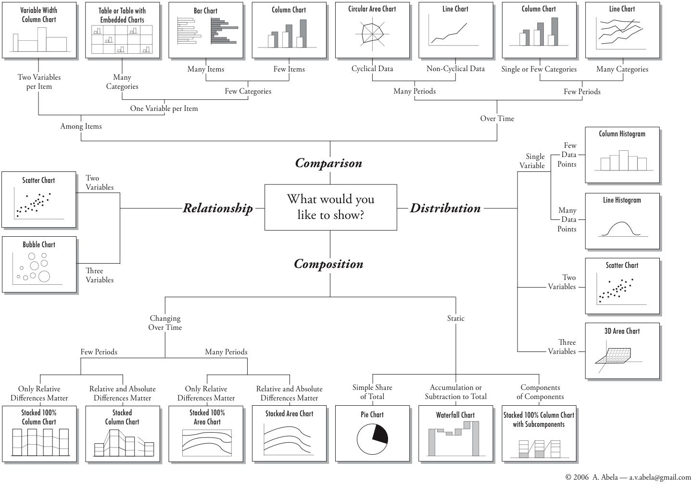
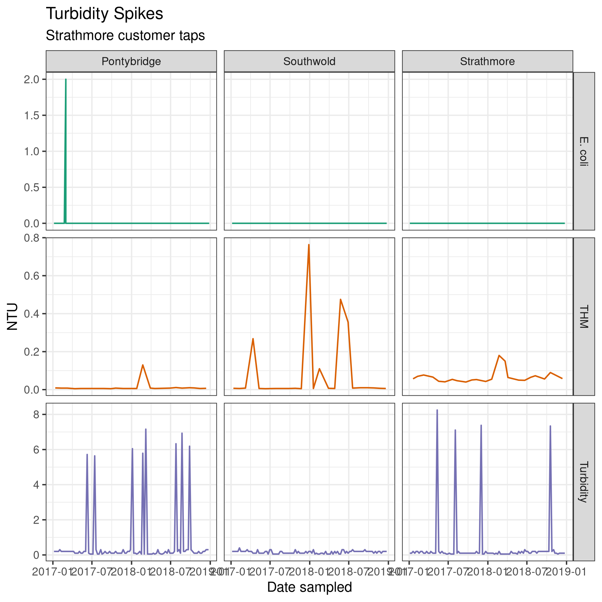
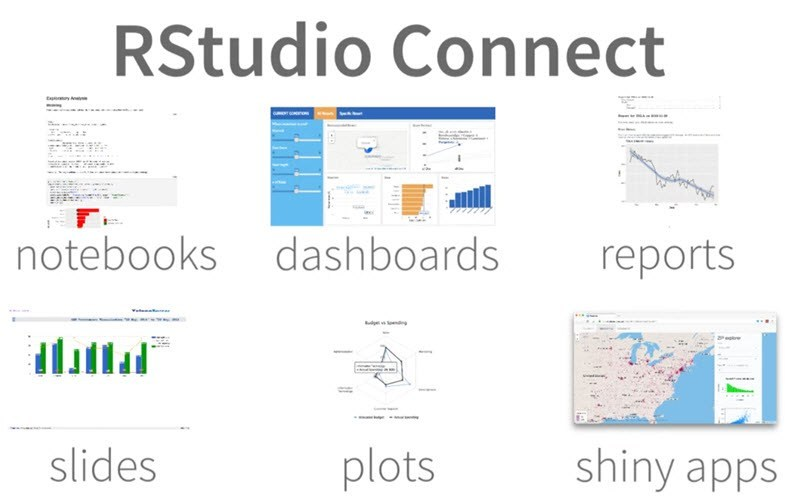
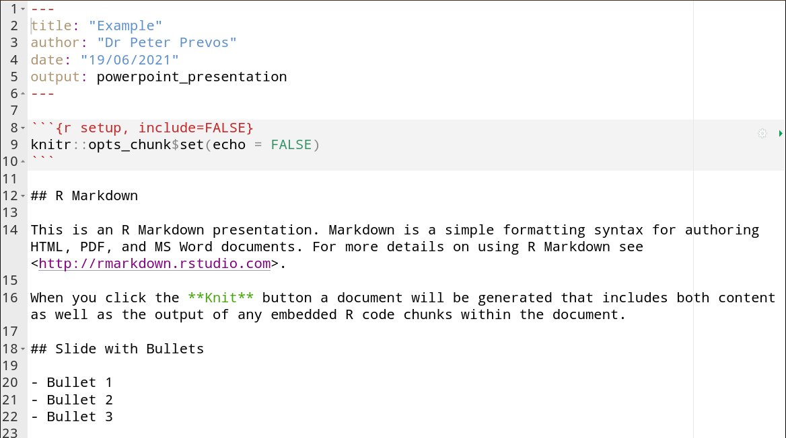
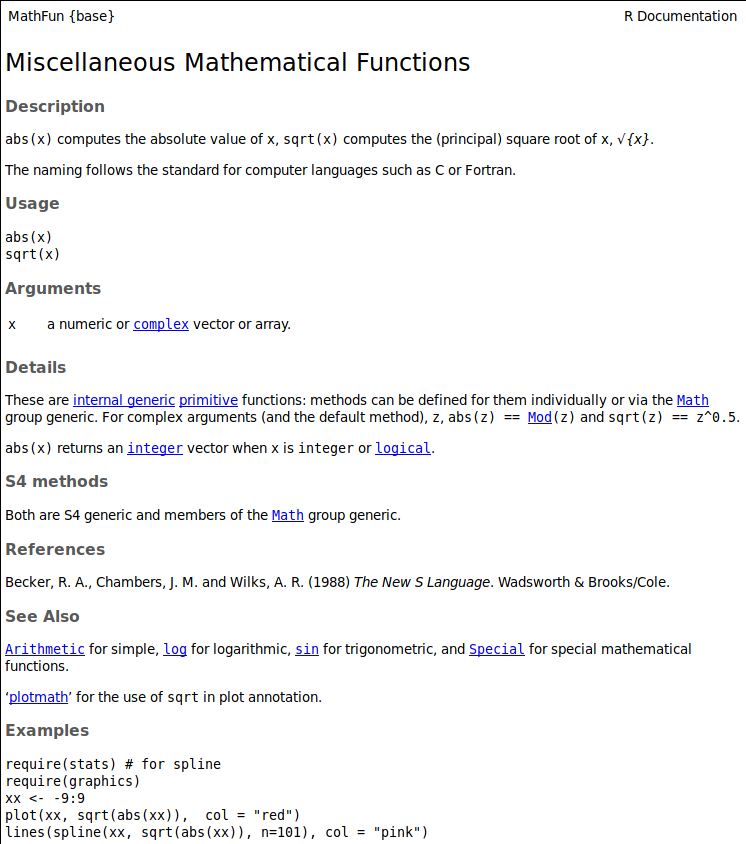

```{r setup, include=FALSE, message=FALSE, warning=FALSE}
library(knitr)
opts_chunk$set(tidy.opts=list(width.cutoff=40), echo=TRUE)
```

# Session 2 Program
:::::: {.columns}
::: {.column}
* Recap
* Data Visualisation
* Creating Data Products
:::
::: {.column}

:::
::::::

# R Basics

Which of these expressions calculates the flow in cubic meters per second for all heights (`h`) between 50mm and 500mm? Type them into the console to try each option and inspect the output.

```{r, results='hide'}
Cd <- 0.6
g <- 9.81
b <- 0.6

(2/3) * Cd * sqrt(2 * 9.81) * b * (0.05:0.50)^(3/2)

(2/3) * Cd * sqrt(2 * 9.81) * b * ((50:500)/1000)^(3/2)
```

Or, repeat the formula for each value of `h`.

```{r}
h <- seq(.05, .5, .01)
```

# Loading and Exploring Data
```{r, eval=FALSE}
library(tidyverse)
gormsey <- read_csv("casestudy1/gormsey.csv")

gormsey_tt <- filter(gormsey, Measure == "Turbidity" | 
                       Measure == "THM")

count(gormsey_tt, Measure)

gormsey_grouped <- group_by(gormsey_tt, Measure, Town)
summarise(gormsey_grouped, p95 = quantile(Result, 0.99))
```


# Data Visualisation
::::::{.columns}
:::{.column}

:::
:::{.column}

:::
::::::

# Data-to-Pixel Ratio


# Chart Chooser


# Use Colours Sparingly


# ggplot2
::::::{.columns}
:::{.column}
* System for  creating graphics, based on *The Grammar of Graphics*.
* Go to [ggplot2.tidyverse.org](https://ggplot2.tidyverse.org/) for documentation.
* Included in the Tidyverse. You can call it separately with:

```{r, eval=FALSE}
library(ggplot2)
```
:::
:::{.column}

:::
::::::

# Grammar of Graphics
::::::{.columns}
:::{.column}

:::
:::{.column}

:::
::::::

# Visualisation Exercise
::::::{.columns}
:::{.column}
Use your knowledge of the Gormsey data to create two visual data stories. Use the following four steps:

1. Explore the data and define the story you want to tell. 
2. Decide on the best way to visualise the story.
3. Develop the basic visualisation.
4. Select a theme and annotate the graph.
:::
:::{.column}

:::
::::::

# Data Science Workflow


# Data Products

::::::{.columns}
:::{.column}
Static

- Word documents
- PowerPoint presentaions
- Web pages

Dynamic

- Shiny application
- Shiny presentation

Share
- RStudio Connect
- Your own server
:::
:::{.column}

:::
::::::

# RMarkdown
::::::{.columns}
:::{.column}
Literate programming:

* Combine prose with code
* Link the code to dynamic data
* Generate shareable output from code
:::
:::{.column}
Data products:

* Reports
* Web sites
* Presentations
* Applications (dashboards)
:::
::::::

# RMarkdown Syntax


# Finding Help
:::::: {.columns}
::: {.column width="50%"}
* Built-in `help()` function
* Cheat sheets (RStudio and Tidyverse websites)
* Use the R4H2O Slack channel
* Twitter #rstats
* Reddit rstats, rlanguage
* stackoverflow.com
* Google the problem
:::
::: {.column width="50%"}

:::
::::::

# Mini Hackathon
To close this day, we will do a mini hackathon.

1. Create a script that results in a PowerPoint presentation about the Gormsey data.
2. Pick a story you like to tell about this data.
3. Create a RMarkdown script that results in a Powerpoint presentation.
    - Add an introduction.
    - Explore the data.
    - Share the story.

