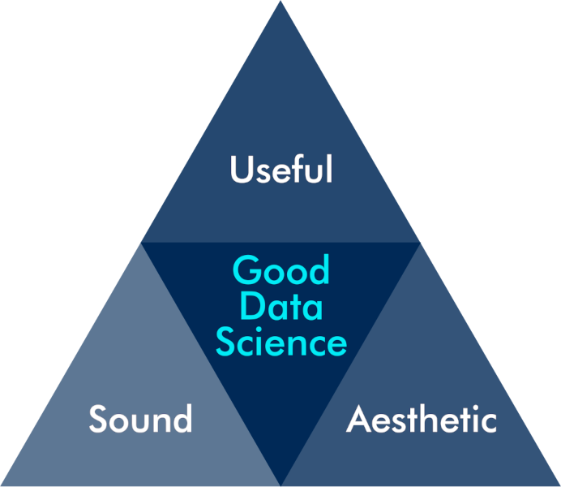
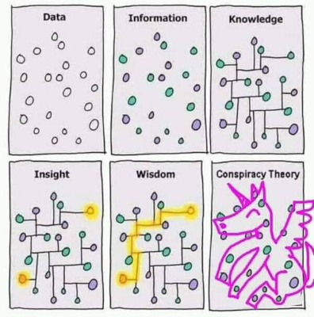
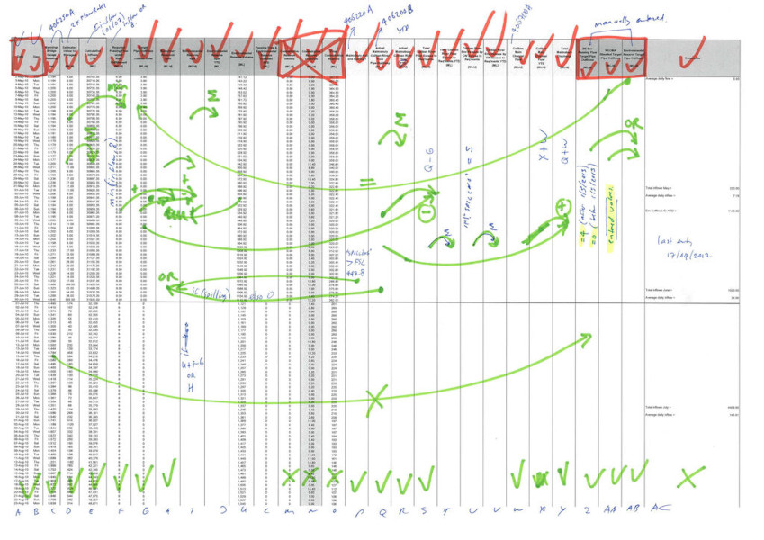
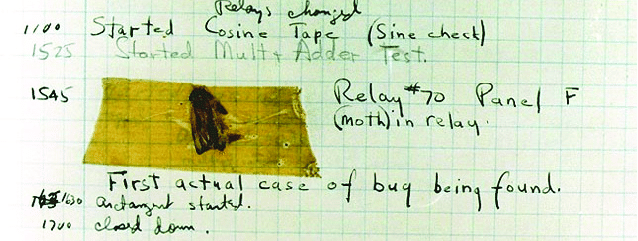
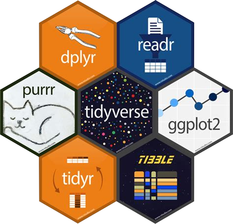

```{r setup, include=FALSE}
knitr::opts_chunk$set(echo = FALSE, message=FALSE, warning=FALSE, dpi=300)
```

# {data-background="images/r4h2o-banner.jpg"}
# Data Science for Water Professionals {data-background="images/2019-workshop-melbourne.jpg"}

## Part 1
  - Introduction to data science
  - Principles of the R language
  - Analyse water quality data

## Part 2
  - Collect and clean and analyse customer data
  - Cluster analysis
  - Linear regression

## Part 3
  - Analysing time series
  - Principles of machine learning

## Learning Objectives Part 1
- Apply the principles of strategic data science to solve water problems
- Write R code to load, analyse, and visualise data
- Diagnose water quality data with descriptive statistics
- Develop presentations, reports, and applications to share results
     
## Course Book
[peterprevos.com/r4h2o](https://peterprevos.com/r4h2o)


## Program Session 1a
1. Principles of Data Science
2. Basics of the R Language
3. Case Study 0: Open channel flows
4. Reading CSV and Spreadsheet data
5. Descriptive Statistics

# Introductions


# Principles of Data Science


## What is Data Science?
{height=400}


<small>Conway Venn Diagram ([drewconway.com](http://drewconway.com/zia/2013/3/26/the-data-science-venn-diagram)).</small>

## Don't Believe the Hype


<small>Source: _Harvard Business Review_.</small>

## What is Good Data Science?
{height=400}

<small>Vitrivian triangle (_venustas_, _firmitas_, _utilitas_)</small>

## What is Useful Data Science?


## Data - Information - Knowledge - Wisdom ... Conspiracy


## What is Sound Data Science?


## Spreadsheets are Chaos


## Code is Poetry
```{r, eval=FALSE, echo=TRUE}
reservoirs %>%
    select(Date, River_Flow, Natural_Flow) %>%
    muate(ERV = ifelse(Natural_Flow <= 8, 4, Natural_Flow / 2),
          Date = as.Date(Date, format = "%d/%m/%Y")) %>%
    pivot_longer(-Date,
                 values_to = "Flow",
                 names_to = "Source")  %>%
    ggplot(aes(Date, Flow, col = Source)) +
    geom_line()
```

# Basics of the R Language


## Desktop version
1. Download and install R and RStudio
2. Download course materials
   - [github.com/pprevos/r4h2o](https://github.com/pprevos/r4h2o)
3. Unzip folder
4. In RStudio: _File_ > _Open Project_
5. Open `r4h2o.Rproj`

## Cloud Version
1. Register at [cloud.rstudio.com](https://cloud.rstudio.com)
2. _New Project_ > _New Project From Github Repo_
    - `https://github.com/pprevos/r4h2o/`
4. RStudio will download the project files

## Principles of R
- Console (REPL: Read-Eval-Print Loop)
- Mathematical operators (`+ - * ^ %% %/%`)
- Variable assignment
- Assignment operator (`<-` versus `=`)
- Functions (`sum()`, `prod()`, `abs()`, `log(a, base = b)`)
  - Parameters
  - Use `=` sign
  - Auto-completion
  
## BODMAS


```{r, echo=TRUE}
3 - 3 * 6 + 2
```

## Arithmetic
```{r, echo=TRUE, results='hide'}
diameter <- 150
pipe_area <- (pi / 4) * (diameter / 1000)^2
pipe_area
sqrt(pipe_area / (pi / 4)) * 1000

complaints <- c(12, 13, 23, 45, 22, 99, 31)

sum(complaints)
prod(complaints)
abs(complaints)
exp(complaints)
factorial(complaints)
log(complaints, base = 10)
```

## Basic Plotting 1
```{r, echo=TRUE, fig.width=6, fig.height=2.5}
x <- -10:10
y <- -x^2 -2 * x + 30
plot(x, y, type = "l", col = "blue", main = "Parabola")
abline(h = 0, col = "grey", lty = 2)
abline(v = 0, col = "grey", lty = 2)
```

## Basic Plotting 2
```{r, echo=TRUE, fig.width=6, fig.height=2.5}
names(complaints) <- month.name[1:7]
barplot(complaints,
        col = "lavender",
        main = "Complaints")
```

## Coding Principles
{width="100%"}

<small>First computer bug (1947)</small>

## Using the Editor
<div class="column" style="float:left; width: 33%">
### Natural Language
- Words
  - Nouns (variables - meaningful
      - <small>`_` or `.` or `camelCase`</small>
  - Verbs (functions)
- Phrases (code)
- Context
</div>

<div class="column" style="float:left; width: 33%">
### Bugs
- Typos (lintr)
- Error messes (copy and paste into search engine)
- Help files
</div>

<div class="column" style="float:left; width: 33%">
### Scripts and Projects
- Working Directory
- Open Script
- Commenting
- Indentation
</div>

# Case Study 0: Channel Flow {data-background="images/weirplate.jpg"}

## Discharge formula
$$Q = \frac{2}{3} C_d \sqrt{2g} \; lh^\frac{3}{2}$$

- $Q$: Discharge in m^3^/s
- $C_d$: Discharge coefficient
- $g$: Acceleration of gravity (9.81 m/s^2^)
- $l$: Crest length [m]
- h: Head above crest level [m]

## Coding Practice
<div class="column" style="float:left; width: 50%">
Create an R script and answer:

1. What is the flow in the channel in m^3^/s when the height $h = 100$ mm?
2. What is the average flow for these three heights: 150mm, 136mm, 75mm, in litres per second?
3. Visualise the flow in m^3^/s for all heights between 50mm and 500mm
</div>

<div class="column" style="float:right; width: 50%">
$Q = \frac{2}{3} C_d \sqrt{2g} \; lh^\frac{3}{2}$

- $Q$: Discharge in m^3^/s
- $C_d$: Discharge coefficient ($C_d=0.62$)
- $g$: Acceleration of gravity (9.81 m/s^2^)
- $l$: Crest width ($l=0.5$ m)
- $h$: Head above crest level [m]
</div>

# Exploring Data with Tidyverse


## Base R functions
  - Basic programming functions
  - Arithmetic
  - Statistics
  - Plotting
  - Extendable with functions

## R Packages
- Packages to extend base functionality
  - Distributed mainly through [CRAN](https://cran.r-project.org/)
  - Comprehensive R Archive Network
- Call library to access functions: `library(dplyr)`
- Or, add library name and two colons: `dplyr::filter()`

## Tidyverse
- Collection of R packages
- Easy data manipulation
- 'syntactic sugar'

# Case Study 1: Water Quality
```{r, fig.asp=9/16}
library(tidyverse)
library(lubridate)
gormsey_2070 <- read_csv("casestudy1/gormsey.csv") %>% 
    filter(year(Date) == 2069 & Town == "Snake's Canyon")

ggplot(gormsey_2070, aes(Date, Result)) + 
    geom_line(alpha = 0.9, col = "dodgerblue") + 
    facet_wrap(~Measure, scales = "free_y") + 
    theme_minimal() + 
    labs(title = "Water Quality Data Gormsey",
         subtitle = unique(gormsey_2070$Town),
         caption = "R4H2O")
```

## Obtaining Data
- Database (SQL, Oracle)
- Desktop files (spreadsheets, CSV)
- Web (HTML, XML, JSON)
  - API
  - Scraping

## CSV files
- Use only the top row as a header
- Don’t use colours to indicate values
- Prevent using spaces in column names
- Don’t add any spreadsheet calculations
- Every cell should be a data point or remain empty

## Reading CSV files
- `readr` package for CSV files (part of Tidyverse)
    - `read_csv()` faster alternative for `read.csv()`
    - Look at help text

- File names in R
  - Unix-based (slash instead of backslash)
  - Results in data frame / tibble
  
```{r,echo=TRUE, results='hide'}
library(tidyverse)
gormsey <- read_csv("casestudy1/gormsey.csv")

names(gormsey)
dim(gormsey)
ncol(gormsey)
nrow(gormsey)

head(gormsey)
str(gormsey)
glimpse(gormsey)
```

## Variable classes
- Integer (${\ldots -3, -2, -1, 0, 1, 2, 3, \ldots}$)
- Numeric (Real numbers) ($\mathbb{R}$)
- Complex numbers ($a + bi$)
- Text (`"abcd"`)
- Dates (`"`r Sys.Date()`"`)
- Factors (classifications): (`"Male", "Female", "Other"`)
- Boolean (`TRUE`, `FALSE`)

## Variable Types


Scalar, vector and data frame / tibble (matrix)


## Exploring data frames
- `df[rows, columns]`
- `df$column`
- `glimpse(df)`

```{r, echo=TRUE, results='hide'}
gormsey[12:13, ]
gormsey[, 4:5]
gormsey[1:2, c(2, 4:5, 6)]
gormsey[1:2, c(-1, -3, -7)]
gormsey$Date[1:6]
```

What is the sample number of the last sample in the Gormsey data? 

Hint, use the `nrow()` function.

## Conditionals
Compare variables

```{r, echo = TRUE, results='hide'}
a <- 1:2
a == 1
a != 1
a >= 2

a <- c(TRUE, FALSE)
a * 2

"small" > "large" 

gormsey$Measure == "Turbidity" & gormsey$Result > 5
```

## Filtering


```{r, echo=TRUE, results='hide'}
# Three methods

gormsey[gormsey$Measure == "Turbidity", ]

subset(gormsey, Measure == "Turbidity")

library(dplyr)
filter(gormsey, Measure == "Turbidity")

turb5 <- filter(gormsey, Measure == "Turbidity" & Result > 5)
```

## Counting Results
```{r}
length(gormsey$Measure)

unique(gormsey$Measure)

table(gormsey$Measure)

count(gormsey, Measure)
```

## Coding Practice
Write a script to answer these questions:

1. How many turbidity results in all Towns, except Strathmore, are lower than 0.1 NTU?
2. Which sample points had a non-zero E. coli count?
3. Create a table that counts the number of THM samples per town.

# Descriptive Statistics

```{r, fig.asp=9/16}
library(tidyverse)
library(sn)
library(modeest)
set.seed(1)
##x <- rlnorm(1000, meanlog = .6, sdlog = .1) * 100
x <- rsn(n=1000, xi=0, omega=1, alpha=100, tau=.1, dp=NULL)
s <- tibble(s = c(mean(x),
                  median(x),
                  mlv(x, method = "asselin")),
            t = c("Mean", "Median", "Mode"))
ggplot(tibble(x), aes(x)) +
    geom_density(fill = "dodgerblue", alpha = 0.1, col = "dodgerblue") +
    geom_vline(data = s, aes(xintercept = s, col = t), size = 1) +
    scale_color_brewer(type = "qual", palette = 2, name = NULL) + 
    theme_void(base_size = 20) +
    theme(legend.direction="horizontal",
          legend.position = "bottom")
```

## Central Tendency
```{r, echo=TRUE, results='hide'}
turbidity <- filter(gormsey, Measure == "Turbidity")

mean(turbidity$Result)
sum(turbidity$Result) / length(turbidity$Result)

median(turbidity$Result)

which.max(table(round(turbidity$Result, 1)))
```

Calculating the mode of continuous data is complex and requires a specialised package.

## Dispersion
```{r, echo=TRUE, results='hide'}
min(turbidity$Result)
max(turbidity$Result)
range(turbidity$Result)
diff(range(turbidity$Result))

var(turbidity$Result)
sd(turbidity$Result)

sqrt(sum((turbidity$Result - mean(turbidity$Result))^2) / (length(turbidity$Result) - 1))
```

## Quantiles
<div class="column" style="float:left; width: 50%"><small>

1. Place the observations in ascending order: $y_1, y_2, \ldots y_n$.
2. Calculate the rank ($r$) of the required percentile
3. Interpolate between adjacent numbers: $$y_r = y_{\lfloor r \rfloor}+ (y_{r_{\lceil r \rceil}} - y_{\lfloor r \rfloor})(r - \lfloor r \rfloor)$$
    - $y$: Observation
    - $r$: Ranking number
    - $\lfloor r \rfloor$: Floor or $r$
    - $\lceil r \rceil$: Ceiling of $r$

</small></div>
<div class="column" style="float:left; width: 50%">
```{r, fig.asp=9/16}
x <- c(1, 2, 3.5, 4, 5)
y <- 2 * x

plot(x, y, pch = 19, 
     xlab = "Rank", 
     ylab = "Observation", 
     xaxt = "n",
     yaxt = "n", 
     frame.plot = FALSE)

axis(1, at = x,
     labels = c(1, 
                expression(group(lfloor, r, rfloor)), 
                "r", 
                expression(group(lceil, r, rceil)), 
                "n"))

axis(2, at = y,
     labels = c(expression(y[1]),
                expression(y[group(lfloor, r, rfloor)]),
                expression(y[r]),
                expression(y[group(lceil, r, rceil)]),
                expression(y[n])))

lines(x[1:2], y[1:2], lty = 2)
lines(x[2:4], y[2:4], lty = 1)
lines(x[4:5], y[4:5], lty = 2)

abline(h = y[3], col = "red", lwd = .5, lty = 2)
abline(v = x[3], col = "red", lwd = .5, lty = 2)

points(x, y)
```
</div>

```{r, echo=TRUE, results='hide'}
IQR(turbidity$Result)
summary(turbidity$Result)
quantile(turbidity$Result, type = 6, probs = 0.95)
```


## Quantiles (continued)

```{r, fig.asp=9/16}
sample <- c(1:17, 63, 170, 300)

## Set parameters
n <- length(sample)
p <- 0.95

## Visualise
par(mar=c(6, 5, 4, 1))
plot(sample, type = "b",
     xlab = "Rank", ylab = "Result",
     cex.axis = 1,
     cex.lab = 1,
     cex.main = 1,
     cex.sub = 1,
     lwd = 1)

## Calculate rank
r_weibull <- p * (n + 1)
r_excel <- 1 + p * (n - 1)

## Interpolate percentiles
x_weibull <- (1 - (r_weibull - floor(r_weibull))) * sample[floor(r_weibull)] + (r_weibull - floor(r_weibull)) * sample[ceiling(r_weibull)]
x_excel <- (1 - (r_excel - floor(r_excel))) * sample[floor(r_excel)] + (r_excel - floor(r_excel)) * sample[ceiling(r_excel)]

## Visualise
abline(v = r_weibull, col = "red", lwd = 1, lty = 3)
abline(v = r_excel, col = "blue", lwd = 1, lty = 2)

## Legend
legend("topleft", legend = c("Excel", "Weibull"), col = c("blue", "red"), lwd = 1, lty = c(2, 3))
```

## Grouped Analysis

```{r, echo=TRUE, results='hide'}
measures <- group_by(gormsey, Measure)
summarise(measures, max = max(Result))

measures_town <- group_by(gormsey, Measure, Town)
summarise(measures,
          Samples = n(),
          Mean = mean(Result),
          Median = median(Result),
          p95 = quantile(Result, type = 6, probs = 0.95))
```

## Coding Practice
1. What is the average number of samples taken at the sample points in Gormesey?
2. Which sample point has breached the maximum value of 0.25 mg/l for THM most often?
3. What is the highest 95th percentile of the turbidity for each of the towns in Gormsey, using the Weibull method?

# Next Session
1. Visualise data
2. ggplot2 package
3. Data science workflow
4. Presenting results


