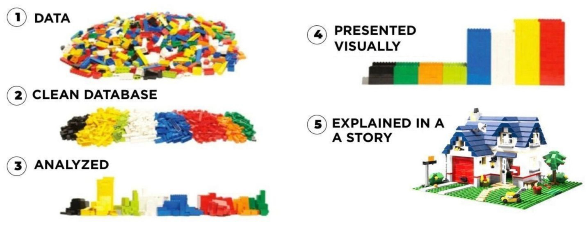
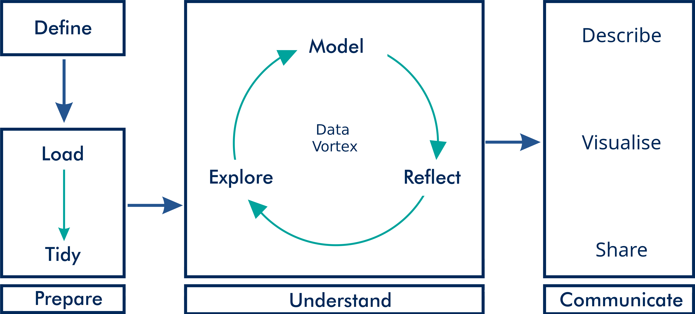

```{r setup, include=FALSE}
knitr::opts_chunk$set(echo = FALSE, message=FALSE, warning=FALSE, dpi=300)
```

# {data-background="images/r4h2o-banner.jpg"}

## Learning Objectives Part 1
- Apply the principles of strategic data science to solve water problems
- Write R code to load, analyse, and visualise data
- Diagnose water quality data with descriptive statistics
- Develop presentations, reports, and applications to share results

## Program Session 1b
1. Summary first session and coding practice
2. Principles of visualisation
3. Visualise data with ggplot2
4. Data science workflow
5. Creating data products

# Summary Session 1a


## Coding Excercise
- Go to the Bureau of Meteorology website
    - http://www.bom.gov.au/climate/data/stations/
- Download rainfall data and for your nearest station
- Determine the top five years with the highest total rainfall
- Tips: 
    - Variable names with spaces need to be between back ticks: \``variable name`\`
    - The data has missing values. Use the `na.rm = TRUE` option in the `sum()` function
    - Use the `top_n()` function to list the top five years

## Solution
```{r, echo=TRUE}
library(tidyverse)
bom <- read_csv("casestudy1/IDCJAC0009_088110_1800_Data.csv")
bom_year <- group_by(filter(bom, Year != 2022), Year)
annual_rain <- summarise(bom_year, 
                         TotalRain = sum(`Rainfall amount (millimetres)`, 
                                         na.rm = TRUE))
top_n(annual_rain, 5)
```


# Visualising Data


## Jackson Pollock


<small> Jackson Pollock (1952) Blue Poles number 11. Drip Painting in enamel and aluminium paint with glass on canvas (National Gallery, Canberra).</small>

## Piet Mondrian

<small>Piet Mondrian (1928) Composition with red, yellow and blue. Oil on canvas (Municipal Museum, the Hague).</small>

## Data-Pixel Ratio


## Data Story-Telling


## {data-background="images/visualisations.jpg"}

## Grammar of Graphics
1. _Data_: exists at the lowest level, without which there is nothing to visualise.
2. _Aesthetics_: defines which graph variables are visualised and how they look (colour, line shapes and sizes).
3. _Geometries_: shapes that represent the data, such as bars, pies or lines.
4. _Facets_: used to divide a visualisation into subplots.
5. _Statistics_: relate to any specific transformations to summarise the data, such as trend lines.
6. _Coordinates_: define how data is represented on the canvas. Mostly used in mapping.
7. _Themes_: defines the non-data pixels (font sizes, backgrounds and so on)

# Base Plots
- Best for exploratory visualisations
- Plotting functions
    - `plot()`
    - `barplot()`
    - `histogram()`
    - `boxplot()` 
- Annotation functions (add elements to the plot)
    - 

## Base plotting parameters
- `pch`: the plotting symbol (default is open circle)
- `lty`: the line type (default is solid line), can be dashed, dotted, etc.
- `lwd`: the line width, specified as an integer multiple
- `col`: the plotting color, specified as a number, string, or hex code
- `xlab`: character string for the x-axis label
- `ylab`: character string for the y-axis label


## Examples

```{r, echo=TRUE, eval=FALSE}
library(tidyverse)
gormsey <- read_csv("casestudy1/gormsey.csv")
turbidity <- filter(gormsey, Measure == "Turbidity")

plot(turbidity$Date, turbidity$Result, 
     type = "l",
     xlab = "Date",
     ylab = "Result",
     main = "Turbidity measurements")
abline(h = 5, col = "red")

boxplot(log10(Result) ~ Town, data = turbidity,
        pch = 19, las = 3, col = "brown",
        main = "Turbidity measurements")
abline(h = log10(5), col = "red")

p95 <- summarise(group_by(turbidity, Town), 
                 p95 = quantile(Result, 0.95))

barplot(p95$p95, names.arg = p95$Town)
abline(h = 5, col = "red")
```


# ggplot2 package
{height=600}

## Examples 1
```{r, echo = TRUE, eval=FALSE}
ggplot(gormsey, aes(Town))

ggplot(gormsey, aes(Measure)) + 
    geom_bar()

turbidity <- filter(gormsey, Measure == "Turbidity")

ggplot(turbidity, aes(Date, Result, col = Town)) + 
    geom_line()
```

## Color Palettes


## ColorBrewer
```{r, echo = TRUE, eval=FALSE}
ggplot(gormsey, aes(Town, fill = Measure)) +
    geom_bar() +
    scale_fill_brewer(type = "qual",
                      palette = "Dark2")

library(RColorBrewer)
display.brewer.all() 

ggplot(gormsey, aes(Town, fill = Measure)) +
    geom_bar() +
    scale_fill_manual(values = c("cornflowerblue",
                                 "darkseagreen",
                                 "#ee6611",
                                 "#ccaa44"))
```

## Facets
```{r, echo = TRUE, eval=FALSE}
ggplot(turbidity, aes(Date, Result, col = Town)) + 
    geom_line() + 
    facet_wrap(~Town)
```

## Statistics
```{r, echo = TRUE, eval=FALSE}
thm <- filter(gormsey, Measure == "THM")
thm_grouped <- group_by(thm, Date)
thm_max <- summarise(thm_grouped, thm_max = max(Result))

ggplot(thm_max, aes(Date, thm_max)) + 
    geom_smooth(method = "lm") + 
    geom_line() + 
    geom_hline(yintercept = 0.25, col = "red")
```

Practice Task: Convert this visualisation to a faceted graph to show the trend per system.

## Coordinates
```{r, echo = TRUE, eval=FALSE}
ggplot(turbidity, aes(Town, Result)) + 
    geom_boxplot() + 
    scale_y_log10(name = "Samples (log)",
                  n.breaks = 10) +
    coord_flip()
```

- `scale_x_log10()`: Logarithmic scale.
- `scale_x_discrete()`: Discrete variables (names).
- `scale_x_continuous()`: Continuous variables, such as measurements.
- `scale_x_date()`: For displaying dates and times.


## Themes
```{r, echo = TRUE, eval=FALSE}
ggplot(turbidity, aes(Date, Result)) + 
    geom_area(col = "dodgerblue", fill = "dodgerblue") + 
    facet_wrap(~Town, ncol = 1) + 
    theme_void(base_size = 24)

ggplot(gormsey, aes(Measure)) +
    geom_bar() +
    theme(axis.text.x = element_text(angle = 90))

ggsave("casestudy1/measures.png", width = 15, height = 10, dpi = 300, units = "cm")
```

## ggplo2 Cheat Sheet
https://raw.githubusercontent.com/rstudio/cheatsheets/master/data-visualization-2.1.pdf

# Data Science Workflow


## Define
> The regulator for water quality has released a new guideline that lowers the maximum value for trihalomethanes (THMs) at the customer tap to 0.20 mg/l. This report assesses the historical performance of the Gormsey water system to evaluate the risk of non-compliance, assuming no operational changes are implemented.

## Load and Tidy
```{r, echo=TRUE}
library(readr)
library(dplyr)
gormsey <- read_csv("casestudy1/gormsey.csv")
thm <- filter(gormsey, Measure == "THM")
glimpse(thm)
```

## Explore


## Model

## Reflect

## Communicate

### Tables
```{r, echo=TRUE}
library(knitr)
thm_fail <- filter(gormsey, Measure == "THM" & Result > .25)
kable(select(thm_fail, Date, Town, Result),
      caption = "Example outut of the `kable()` function.", 
      digits = 2)
```

## Communicate
### Rounding Numbers
```{r, echo=TRUE}
a <- sqrt(777)
round(a)
round(a, 2)
round(a, -1)
floor(a)
ceiling(a)
signif(a, 5)
```


