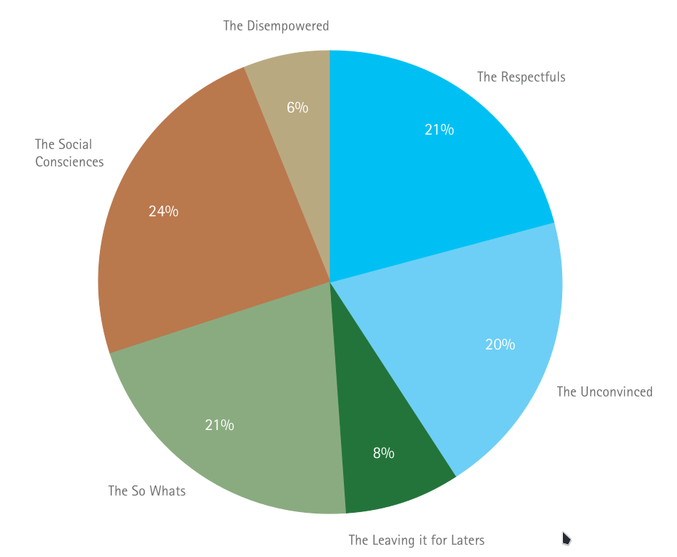
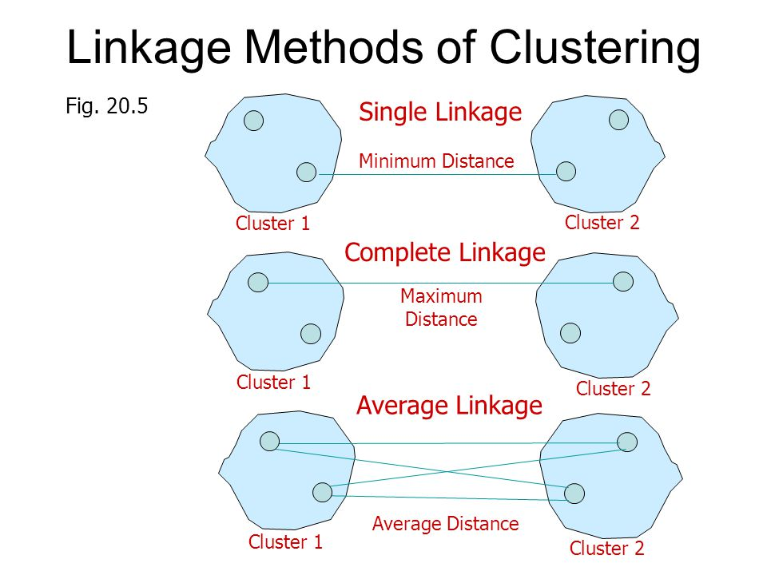
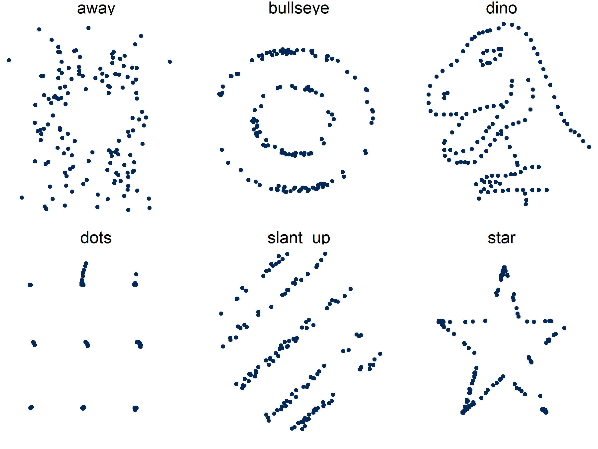

```{r setup, include=FALSE}
knitr::opts_chunk$set(echo = FALSE, message=FALSE, warning=FALSE, dpi=300)
```

# {data-background="images/r4h2o-banner.jpg"}

# Customer Segmentation


## Types of Segmentation
<div class="column" style="float:left; width: 50%">
- Geographic
- Demographic
- Psychographic
- Behavioural
</div>
<div class="column" style="float:left; width: 50%">

<small>What type of segmentation would this be? 

Source: Burns, Vardy & Rowe et al. (2011) _Victorian Water Customer: Water Services Needs & Values Summary Report_.</small>
</div>

## Hierarchical Cluster Analysis
<div class="column" style="float:left; width: 50%">
1. Pre-process the data
2. Scale the data
3. Calculate the distances
4. Cluster the data
5. Review the outcome
</div>
<div class="column" style="float:left; width: 50%">
```{r}
library(tidyverse)

set.seed(314)
consumption <- tibble(id = LETTERS[1:10],
                      property_size = c(rnorm(5, 500, 100),
                                        rnorm(5, 800, 100)),
                      volume = c(rnorm(5, 500, 200),
                                 rnorm(5, 1000, 100)))

consumption_scaled <- scale(consumption[, -1])
consumption_dist <- dist(consumption_scaled)
customer_clusters <- hclust(consumption_dist)
consumption$segment <- cutree(customer_clusters, k = 2)

ggplot(consumption, aes(property_size, volume, fill = factor(segment))) +
  geom_label(aes(label = id), size = 4 ) +
  scale_fill_manual(values = c("darkgreen", "dodgerblue"), name = "Segment") +
  labs(title = "Customer Segmentation Example",
       subtitle = "Hierarchical Cluster Analysis",
       x = "Property Size", y = "Annual volume") +
  theme_bw(base_size = 14)
```
</div>

## Scaling
<div class="column" style="float:left; width: 50%">
- Wide data frame
- Columns: Features
- Rows: Cluster variable

<small>
```{r}
knitr::kable(consumption[,1:3], digits = 0)
```
</small>
</div>
<div class="column" style="float:left; width: 50%">
$$x_s = \frac{x_i - \bar{x}}{s_x}$$
</div>

<small>
```{r, echo=TRUE}
scale(consumption[, 2:3])
```

</small>

## Distance calculations
<div class="column" style="float:left; width: 50%">
1. Euclidean distance
2. Manhattan (taxi cab) distance
3. Maximum (max $\Delta x, \Delta y \ldots$)
4. ...

<small>
```{r, echo=TRUE}
round(dist(consumption_scaled), 1)
```
</small>

</div>
<div class="column" style="float:left; width: 50%">
```{r dis, fig.cap="Euclidean and Taxi Cab distance", fig.asp=9/16, out.width="80%"}
par(mar = rep(0, 4))
plot(c(3, 7), c(3, 7), pch = 19, axes = FALSE, cex = 2)
lines(c(3, 7, 7), c(3, 3, 7), lty = 3, col = "red", lwd = 2)
lines(c(3, 7), c(3, 7), lty = 2, col = "blue", lwd = 2)
legend("topleft", legend = c("Euclidean", "Taxi cab"), col = c("blue", "red"), 
       lwd = 2, lty = c(2, 3), cex = 2, box.col = NA)
```
</div>

## Agglomerative Clustering
<div class="column" style="float:left; width: 50%">
1. Find two closest points
2. Cluster the two points
3. Find next two closets points / clusters
    - Minimum distance (single)
    - Maximum distance (complete): default
    - Average distance (centroid)
4. Repeat 2 and 3 until all points are in one cluster
</div>
<div class="column" style="float:left; width: 50%">

</div>

## Clustering Example

Open: `scripts/10-segmentation.R`

```{r, fig.height=4.5}
ggplot(consumption, aes(property_size, volume, fill = factor(segment))) +
  geom_label(aes(label = id), size = 4 ) +
  scale_fill_manual(values = c("darkgreen", "dodgerblue"), name = "Segment") +
  labs(title = "Customer Segmentation Example",
       subtitle = "Hierarchical Cluster Analysis",
       x = "Property Size", y = "Annual volume") +
  theme_bw(base_size = 14)
```

## Clustering Example
```{r, fig.height=4.5}
plot(customer_clusters)
```

## Interpreting Cluster Analysis


# Linear Regression
<div class="column" style="float:left; width: 60%">
```{r ols}
library(tidyverse)
set.seed(123)
d <- tibble(x = c(sample(22:38, 8), 20, 40),
            y = round(runif(1), 2) * x + sample(5:10 , 1) + rnorm(10) * 2)
d$y[d$x %in% c(20, 40)] <- NA
ab <- lm(y ~ x, d)
a <- coef(ab)[2]
b <- coef(ab)[1]
d$yhat <- a * d$x + b
a1 <- -a / 2
b1 <- mean(d$y, na.rm = TRUE) - a1 * mean(d$x, na.rm = TRUE)
a2 <- a / 2
b2 <- mean(d$y, na.rm = TRUE) - a2 * mean(d$x, na.rm = TRUE)
d1 <- d %>%
    mutate(Mean = mean(y, na.rm = TRUE),
           `Rotate 1`= a1 * x + b1,
           `Rotate 2`= a2 * x + b2) %>%
    select(x, y, Mean, `Rotate 1`, `Rotate 2`, `Best Fit` = yhat) %>%
    pivot_longer(-1:-2) %>%
    mutate(name = fct_relevel(name, c("Mean", "Rotate 1", "Rotate 2", "Best Fit")))
ss <- d1 %>%
    group_by(name) %>%
    summarise(meanx = mean(x),
              meany = mean(y, na.rm = TRUE),
              SS = sum(abs(value - y)^2, na.rm = TRUE),
              SSt = paste("SS =", round(SS, 2))) 
ggplot(d1) +
    geom_segment(aes(x = x, xend = x, y = y, yend = value), col = "red", linetype = 2) + 
    geom_point(aes(x, y), size = 2) +
    geom_line(aes(x, value), col = "blue") +
    geom_point(data = ss, aes(meanx, meany), col = "blue", size = 2) +
    geom_text(data = ss, aes(x = mean(d1$x), y = (min(d1$value) + 5), label = SSt)) + 
    facet_wrap(~name, ncol = 2) +
    coord_equal() +
    theme_minimal(base_size = 16) +
    theme(panel.spacing = unit(2, "lines"))
```

</div>
<div class="column" style="float:left; width: 40%">
$$\hat{y} = \beta_0 + \beta_1 x$$


$$SS = \sum_{i=1}^n (y_i - \hat{y})^2$$


$$\beta_1 = cor(y,x) \frac{s_y}{s_x}$$
$$\beta_0 = \bar{y} - \beta_1  \bar{x}$$
</div>

## Anscombe's Quartet
```{r anscombe, fig.asp=9/16}
op <- par(mfrow = c(2, 2), mar = 0.1+c(4,4,1,1), oma =  c(0, 0, 2, 0))
ff <- y ~ x
mods <- setNames(as.list(1:4), paste0("lm", 1:4))
for(i in 1:4) {
  ff[2:3] <- lapply(paste0(c("y","x"), i), as.name)
  mods[[i]] <- lmi <- lm(ff, data = anscombe)
}
for(i in 1:4) {
  ff[2:3] <- lapply(paste0(c("y", "x"), i),  as.name)
  plot(ff, data = anscombe, col = "red", pch = 21, bg = "orange", cex = 1.2,
       xlim = c(3, 19), ylim = c(3, 13))
  abline(mods[[i]], col = "blue")
}
par(mfrow = c(1, 1))
```

## Datasaurus
{height=400}

<small>[dl.acm.org/doi/10.1145/3025453.3025912](https://dl.acm.org/doi/10.1145/3025453.3025912)</small>

## Case Study
Open `chapter-11.R` script