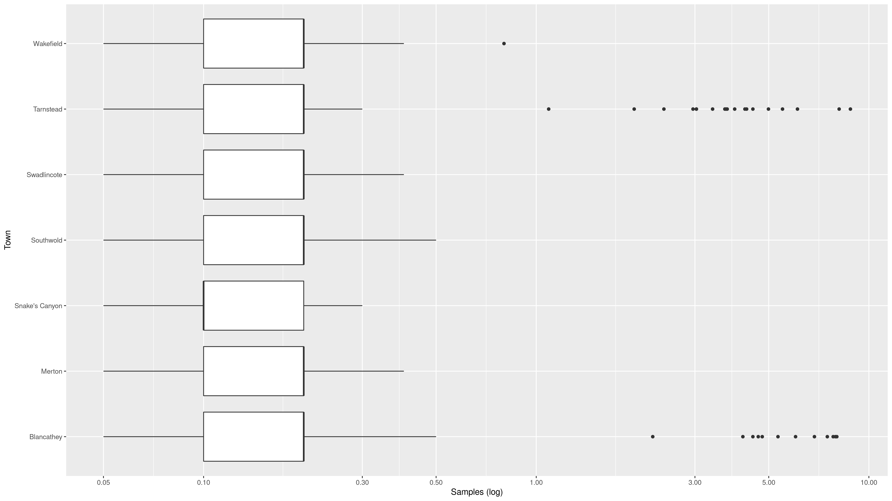
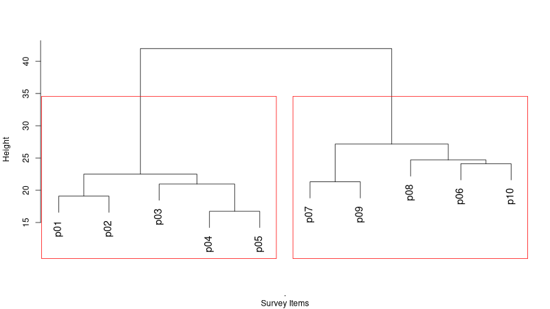

# Introduction {#introduction}

Managing reliable water services requires not only a sufficient volume of water but also significant amounts of data. Water professionals continuously measure the flow and quality of water and assess how customers perceive their service. Water utilities are awash or even flooded with data. Data professionals use data pipelines and data lakes and make data flow from one place to another.

Data and water are, as such, natural partners. Professionals in the water industry rarely directly interact with water or customers, but they constantly analyse data that describes these realities. Analysing data maintains or improves the level of service to customers and minimises the impact on the natural environment.

Most professionals use spreadsheets to collect and analyse data and present the results. While these tools are convenient, they are not ideal when working with large and complex data sets. Specialists in data analysis prefer to write code in one of the many available computing languages.

This book introduces water utility professionals to the [R language](https://www.r-project.org/) for data science. This language is a popular and versatile tool among data scientists to create value from data. R can also be easily integrated with business intelligence systems such as Power BI. Major companies like Google, Facebook, Wipro, Uber, Bing, Accenture, Airbnb use the R programming language for statistical analysis.

Other programming languages, such as Python, SQL or Julia, are equally suitable to analyse data. Computer languages and human languages have a lot in common. Italian seems to be more suitable for singing, while French is considered the language of romance. The same principle applies to data science languages. Each language has its particular strengths, but they are all capable of creating works of beauty. Moreover, the principles and skills taught in this book are easily transferable to other languages.

The R language is specifically designed to analyse and visualise data. The book uses the Tidyverse approach to analysing data. The [Tidyverse](https://tidyverse.org/) is a collection of extensions of the R language that simplifies manipulating, analysing and presenting data science. 

The content of this book represents a steep learning curve because we take a deep dive into the functionalities of the R language. While this might sound daunting, keep in mind that: 

> The steeper the learning curve, the higher to pay-off

This book is not an exhaustive introduction to data science programming but a teaser to inspire water professionals to ditch their spreadsheets and write code to analyse data. The best way to solve problems with computer code is to start with practical examples and understand the principles as you progress through ever more complex cases. This book, therefore, uses realistic water management case studies to introduce you to the R language.

Even if your goal is not to become an R guru, it will also help you to understand the principles and techniques of data science so that you can effectively manage and communicate with experts in the field.

## Learning Objectives

The main objective is to teach water professionals how to use data science code to solve urban water management problems. The learning objectives are:

* Apply the principles of strategic data science to solve water problems
* Understand the principles of writing sound code
* Write R code to load, transform, analyse and visualise data
* Develop presentations, reports and applications to share results

```{r wra, fig.cap="Data Science for Water Professionals workshop in Melbourne (2019).", echo=FALSE, out.width = '80%'}
knitr::include_graphics("images/2019-workshop-melbourne.jpg")
```

The content of this book is also taught in Australia as an online and face-to-face course under auspicious of [Water Research Australia](https://www.waterra.com.au/).

## Prerequisites

To benefit from reading this book you need to have some prior knowledge and experience. Ideally you should be able to:

- Appreciate the issues surrounding urban water management. 
- Have some experience with analysing data, such as spreadsheets.

Experience with writing computer code is helpful but not required.

## Case Study approach

This book shows how to write code to solve data problems and provides a framework to create *sound*, *useful* ad *aesthetic* data products. The next chapter discusses this framework within the context of managing a water utility. These principles are implemented with R code in the remainder of the book. 

The approach in this book is to develop knowledge of data science with R within the context of solving a problem. This book should be read with RStudio open and reproducing the examples. Each chapter contains simple practice assignments to help the reader understand the material. No book on data science can ever be complete. As such, each chapter provides suggestions for further in-dept study.

Chapter three introduces the basics of the R language and concludes with a mini-case study to practice the basic arithmetic and assigning variables.

The remainder of the book follows four case studies that conclude with a practical data product. This approach quickly introduces you to using the R language by solving real-world industry problems. The case studies are:

1. Water quality regulations
2. Customer perception
3. Digital metering (under development)
4. Spatial analysis (under development)

The case studies use material previously published on [The Devil is in the Data](https://lucidmanager.org/tags/hydroinformatics/), a blog about creating value and having fun with the R language, including content about water data science.

Each case study starts with a problem statement and introduces readers to the relevant aspects of the R language. Readers then load, transform, explore and analyse the relevant data to solve the case study problem.

Each case study chapter includes tasks to test your comprehension, a quiz, and suggestions for further study.

### Case Study 1: Water Quality Regulations

In this first case study, participants analyse and visualise laboratory testing data and present descriptive statistics. The case study revolves around checking the data for compliance with water quality regulations to minimise risk to human health. The case study ends with participants creating code that produces a PowerPoint presentation linked to water quality data.

```{r case1, fig.cap="Case study 1 --- visualising turbidity statistics.", echo=FALSE, out.width = "80%", fig.asp=9/16}

```

### Case Study 2: Customer Experience

Water management is not only about cubic metres and milligrams per litre. Water professionals also need to know how to understand the voice of the customer. The second case study discusses how to collect and analyse customer survey data.

The data for the second case study consists of the results of a survey of water consumers about their perception of tap water services. Participants clean, visualise and analyse this data using cluster analysis and linear regression.

```{r case2, fig.cap="Case study 2 --- clustering customer survey responses.", echo=FALSE, out.width = "80%"}

```

### Case Study 3: Digital Metering Data

This case study is under development.

### Case Study 4: Spatial Analysis

This case study is under development.

## Learning the R Language

Reading this book without practising writing code will not make you proficient in the R language, or any other skill for that matter. Your [journey to mastery of data science with R has seven steps](https://www.javaassignmenthelp.com/blog/how-to-learn-r-programming/):

1. Understand the basics
2. Code by hand
3. Create simple programs
4. Practice
5. Ask for help
6. Build projects
7. Help others

This book will help you understand the basics and guides the reader through the case studies. The best way to learn from the text is to code all the example by hand. You can copy and paste them, but that is not the best way to learn, because R will interact and provide guidance as you type. Typing will also install muscle memory and help you remember to syntax. The book also contains several coding challenges to help you practice creating simple programs. 

Beyond this book, you need to practice as it is a skill that will easily fade away over time when not used regularly. The R community is always very willing to help, so do engage with the many channels and groups that are available to seek advice from more advanced users. This book contains some guidance on how to most effectively ask for help in the last chapter.

Once you become proficient and start developing projects, the best way for you to give back to the community is to help others. Helping others is not only an act of altruism, it is also the best way to become a master at your craft.

The [next chapter](#datascience) introduces the principles of good data science to help you write great code to create value from data.

