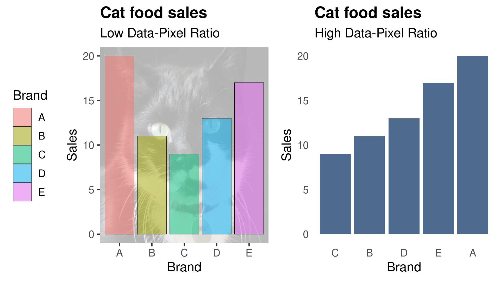

- Bruner, G. (2012). Marketing scales handbook. a compilation of
  multi-item measures for consumer behavior \& advertising
  research. Fort Worth, TX: GCBII Productions.
# Visualising Data with ggplot2 {#ggplot}


Advertising executive Fred Barnard coined the well-worn cliche that "a picture is worth (ten) thousand words" in 1927. Perhaps we should say: “A picture is worth a 1000 numbers”. A simple graph can summarise thousands of numbers and make them understandable in the blink of an eye. 

The internet is awash with infographics and other creative methods to create images from data. However, not all data visualisations are created equal. Some graphics are hard to interpret, which can lead to wrong decisions. Others confuse or even deceive the reader. Scientists have studied how the mind perceives graphics in great depth and devised a comprehensive body of knowledge that helps us create sound, useful and aesthetic visualisations.

This chapter introduces some principles of best practice in data visualisation. The second part presents the *ggplot2* library and some basic techniques to create high-quality graphics. The learning objectives for this chapter are:

* Assess the quality of data visualisations using the data-pixel ratio.
* Apply the principles of the *Grammar of Graphics*.
* Visualise water quality data with the *ggplot2* library.

The data for this chapter is available in the `casestudy1` folder of the RStudio project.

## Principles of Visualisation

In the [first chapter](#datascience) of this course, we saw how the principles of good data visualisation align with the art of architecture. Although visualising data has some parallels with art, it is a very different craft. 

All works of art are a form of deception. An artist paints a three-dimensional world on a flat canvas, and although we see people, we are just looking at blobs of paint. Data visualisation as an art form needs to be truthful and not deceive. The purpose of any graph is to reliably reflect the data without leaving room for the viewer the interpret the scene.  Following some basic rules prevents confusing the consumers of your data products. 

Firstly, visualisation needs to have a straightforward narrative. The reader should be able to draw the intended conclusion without too much mental effort. A graphic should only tell one story, such as comparing numbers, showing a trend and so on. Charts for the sake of themselves are a useless waste of space. Many organisations maintain massive dashboards that contain everything but the kitchen sink. While these displays are impressive, they don't necessarily add value.

A visualisation should ideally contain a point of interest, such as the most recent, the highest, the lowest, an exceedance or anything else worth noting.

Secondly, visualisations should have a minimalist design. Remove any elements that don't add to the story, such as overuse of colour or backgrounds. Graphs with too many lines or colours confuse the reader and increase the difficulty of interpreting the information.

There are no formulas or algorithms that ensure perfect visualisations. The social network Reddit has two groups dedicated to visualisations. Users members of the [Data is Ugly](https://reddit.com/r/dataisugly/) and [Data is Beautiful](https://reddit.com/r/dataisbeautiful/) groups share images of visualisations they consider ugly or beautiful. However, what is a lovely graph to one person, is an abomination to somebody else. The aesthetics of data visualisation is for a significant part in the eye of the beholder. However, when viewing aesthetics from a practical perspective, we can define this with a simple heuristic.

### The aesthetics of visualising data

Data visualisations are everywhere. They are no longer the domain of scientific publications and business reports. Publications in every medium use graphs to tell stories. The internet is awash with infographics on a wide range of topics. These popular images are often not more than data porn because they are designed to entertain and titillate, with limited usability from a business or scientific perspective. They are a fantastic tool to supply information to customers but should not be used to report data science. Aesthetics in data science is not about creating works of art but about producing useful images from a business perspective.

Some data visualisations remind me of a [Jackson Pollock](https://en.wikipedia.org/wiki/Jackson_Pollock) painting (Figure \@ref(fig:bluepoles)). Engineers love to maximise the number of visual elements in a graph, with lines and colours splashed across the screen. Adding too much information to a chart and using too many colours reduces its usability. When visualisations are not aesthetic, they become harder to interpret, which leads to the wrong conclusions or even deceive the viewer.

```{r bluepoles, fig.cap="Jackson Pollock (1952) Blue Poles number 11. Drip Painting in enamel and aluminium paint with glass on canvas (National Gallery, Canberra. Source: Wikimedia).", echo=FALSE, out.width='60%'}
knitr::include_graphics("images/bluepoles.jpg")
```

Perhaps a good data visualisation should look more like a painting by [Piet Mondrian](https://en.wikipedia.org/wiki/Piet_Mondrian), who is famous for his austere compositions with straight lines and primary colours (Figure \@ref(fig:mondrian)). Using art to explain data visualisation is not an accidental metaphor because visual art represents how the artist perceives reality. Therefore, this comparison between Pollock and Mondrian is not a judgement of their artistic abilities. For Pollock, reality was chaotic and messy, while Mondrian saw a geometric order behind the perceived world.

```{r mondrian, fig.cap="Piet Mondrian (1928) Composition with red, yellow and blue. Oil on canvas (Municipal Museum, the Hague).", echo=FALSE, out.width="40%"}
knitr::include_graphics("images/mondrian.jpg")
```

Edward Tufte is an American statistician who is famous for his work on visualisation. Tufte introduced the concept of the data-ink ratio. In simple terms, this ratio expresses the relationship between the ink on the paper that tells a story and the total amount of ink on the paper. Tufte argues that this ratio should be as close to one as possible. In other words, we should not use any graphical elements that don't communicate information, such as background images, redundant lines and verbose text.

Now that we are in the paperless era, we can use the data-pixel ratio as a generic measure for the aesthetics of visualisations. The principle is the same as in the analogue days. Unnecessary lines, multiple colours or multiple narratives risk confusing the user of the report.

The data-pixel ratio is not a mathematical concept that needs to be expressed in exact numbers. Instead, this ratio is a rule-of-thumb for designers of visualisations to help them decide what to include and, more importantly, what to exclude from an image.

Figure \@ref(fig:data-pixel) shows an example of maximising the data-ink ratio. The bar chart on the left has a meagre data-pixel ratio. The background image of a cat might be cute and possibly even related to the topic of the visualisation, but it only distracts from the message. Using colours to identify the variables is unnecessary because the labels are at the bottom of the graph. The legend is not very functional because it also duplicates the labels. Lastly, the lines around the bars have no function.

```{r data-pixel, fig.cap="Examples of low and high data-pixel ratios.", echo=FALSE, out.width="80%"}

```

In the improved version, all unnecessary graphical elements have been removed. Assuming that the story of this graph is to compare variables, the columns have been ranked from large to small. Suppose the narrative of this graph was to compare one or more of the variables with other variables. In that case, groups of bars can be coloured to indicate the categories.

The basic rule of visually communicating data is to not 'pimp' your visualisations with unnecessary graphical elements or verbose text that does not add to the story. When visualising data, austerity is best-practice.

### Telling Stories

First and foremost, visualisations need to tell a story. The story in a graph should not be a mystery novel. A visualisation should not leave the viewer in suspense but get straight to the point. There is no need for spoiler alerts as we want to create clarity, not puzzles.

Trying to squeeze too much information into one graph confuses the reader. Ideally, each visualisation should contain only one or two narratives. It is better to create multiple charts than to combine everything you want to visualise in one image.

Numerical data can contain several types of narratives. A graph can compare data points to show a trend among items or communicate differences between them. Bar charts are the best option to compare data points with each other. A line graph is possibly your best option to compare data points over time. The distribution of data points is best visualised using a histogram or a boxplot. Scatter plots or bubble charts show relationships between two or three variables (Figure \@ref(fig:data-stories)).

```{r data-stories, fig.cap="Examples of stories told with quantitative data.", echo=FALSE, out.width = '100%'}
knitr::include_graphics("images/stories.png")
```

Every visualisation needs to tell a story and not just summarise a bunch of numbers. The detailed considerations of choosing the most suitable visualisation are outside the scope of this course. The internet contains many tools to help you with this choice. [Andrew Abela](https://extremepresentation.typepad.com/blog/2008/06/visualization-taxonomies.html) developed one of the earliest tools to choose the most suitable visualisation. The [R Graph Gallery](https://www.r-graph-gallery.com/) provides some guidance on the methods available in R.

## Visualising data with ggplot

The Tidyverse set of packages contains *ggplot2*, one of the most powerful data visualisation tools. This package follows a layered approach to visualising data, which simplifies the process of producing sophisticated graphics. This session introduces the basics of *ggplot2* using the Gormsey water quality data from the first case study.

The *ggplot2* library applies the *Grammar of Graphics* developed by Leland Wilkinson, hence the gg in ggplot. This grammar is an approach to systematically create visualisations in logical layers:

* *Data* exists at the lowest level, without which there is nothing to visualise. 
* *Aesthetics* defines which graph variables are visualised and how they look (colour, line shapes and sizes). 
* *Geometries* are the shapes that represent the data, such as bars, pies or lines.
* *Facets* can be used to divide a visualisation into subplots.
* *Statistics* relate to any specific transformations to summarise the data, such as trend lines. 
* *Coordinates* define how data is represented on the canvas. Mostly used in mapping. 
* *Themes* define all the non-data pixels (font sizes, backgrounds and so on)

The *ggplot2* package uses this vocabulary and layered approach to build visualisations. The following sections show various examples using Gormsey water quality data, building complexity layer by layer.

### Data

The `ggplot()` function always starts with the data variable, which has to be a data frame or a Tibble. If you evaluate this function with only a data frame, it will draw a canvas and nothing else (Figure \@ref(fig:canvas)). This is the canvas on which we build all further layers.

```{r, message=FALSE, warning=FALSE, eval=FALSE}
library(tidyverse)
gormsey <- read_csv("casestudy1/gormsey.csv")

ggplot(gormsey)
```

### Aesthetics

The next part in the `ggplot()` function defines the aesthetics, consisting of the fields in the data used in the visualisation. The example below plots the `gormsey` data frame and uses the `Measure` variable (Figure \@ref(fig:canvas)).

```{r, message=FALSE, warning=FALSE, eval=FALSE}
ggplot(gormsey, aes(Measure))
```

```{r canvas, message=FALSE, out.width="100%", fig.cap="Empty ggplot canvases.", echo=FALSE}
library(tidyverse)
gormsey <- read_csv("../casestudy1/gormsey.csv")
g1 <- ggplot(gormsey)
g2 <- ggplot(gormsey, aes(Measure))
library(gridExtra)
grid.arrange(g1, g2, ncol=2)
```

When we add the aesthetics, the `ggplot()` function draws a canvas with a spot for each of the measures on the $x$-axis.

Besides the variables on the axes, you can also define colours, line types and other data-related design elements in the aesthetics, but they will only be visible once you define a geometry, discussed in the next section.

>**Practice task**: What will be the result of using `aes(x = Date, y = Result)`? 

### Geometries

To visualise the aesthetics, we need to add a geometry that defines the shapes on the canvas. In *ggplot2*, all geometries start with `geom_`.  You can explore them easily by typing the first few letters and hitting the TAB button to view the completion options. The *ggplot2* package includes the most common shapes to visualise data, and other developers have shared more specialised geometries.

The *[ggplot2](https://ggplot2.tidyverse.org/)* website provides detailed descriptions of each of the available geometries. This chapter introduces some of the most commonly used geometries.

Given that the measure name is a qualitative variable, we can only visualise this data to count the number of samples in each town.  The `geom_bar()` geometry counts the number of occurrences of each data point and plots them as a bar chart (Figure \@ref(fig:barplot)). 

The `ggplot()` function passes the first variable in the aesthetics to the geometry. The bar geometry then counts the number of elements for each category in the `Measure` variable. If you don't write anything between the parenthesis in the geometry, then the function creates a simple grey chart (Figure \@ref(fig:barplot)). The paradigm of maximising the data-pixel ratio suggests that colour should only be used to visualise data. Since we did not instruct R to use colour, it uses grey.

In *ggplot2*, the layers are connected with a `+` sign. In computer science terminology, the plus sign is a pipe, which means that the result from the code before the symbol is moved (piped) to the next section. It expresses that the layers are superimposed on top of each other. If you evaluate layers by themselves, it will result in either an empty canvas or an error.

It is common practice to start a new line after each layer to create readable code. RStudio automatically indents the code so that you know which lines belong together. If your code becomes messy, then you can use `Crtl-i` to align the text.

```{r barplot, fig.cap="Bar chart of the number of samples for each town.", out.width="80%", fig.asp=9/16}
ggplot(gormsey, aes(Measure)) + 
    geom_bar()
```

## Colour Aesthetics

You can add colour to express data to comply with a style guide by using `geom_bar(fill = "royalblue")`, or any other colour you fancy. 

The primary colours, such as red, green, blue, and many more subtle shades, can be mentioned by name. You can see a complete list of the 657 colour name with `colors()`. The [University of Columbia](http://www.stat.columbia.edu/~tzheng/files/Rcolor.pdf) hosts a helpful PDF document with a sample of the available colours. Which one is your favourite?

R also understands colour colours in HTML [hex codes](https://www.w3schools.com/colors/colors_picker.asp). These codes consist of three hexadecimal numbers (ranging from 00 (0) to FF (255)) for each red, green and blue. The hex code `#FF0000` results in purely red colour, `#00FF00` is green. Mixing these three primary colours results in a palette of  16 million theoretical colours; for example, `#78417A` forms a deep purple.

>**Practice Task**: Add your favourite colour to the bar plot.

Adding colour directly into the geometry will give everything the same colour but the colour does not express data. Using the aesthetics function, you can assign colours to data.

The example below creates a time series chart of the turbidity results in Gormsey. The `col = Town` part in the aesthetics instructs ggplot to draw a line for each town and give it a different colour (figure \@ref(fig:timeseries)).

```{r timeseries, fig.cap="Gormsey turbidity time series.", fig.asp=9/16, out.width="80%"}
turbidity <- filter(gormsey, Measure == "Turbidity")

ggplot(turbidity, aes(Date, Result, col = Town)) + 
    geom_line()
```

This example is not an optimal use of this functionality because there are too many lines, which are hard to read. Referring back to the visual arts, this graph is a bit like a Jackson Pollock action painting (Figure \@ref(fig:bluepoles)). We can fix this with the next layer, the facets.

Two colour aesthetics are available: `col` and `fill`. The former defines the colour of lines, like in figure \@ref(fig:timeseries), while the latter describes the colours of shapes.

The *ggplot2* package assigns a default scheme to each colour aesthetic, which you can obviously change. Choosing the optimal colour scheme is part art and part science. There is basically three types of colour schemes (Figure \@ref(fig:colorbrewer)): 

* Sequential
* Diverging
* Qualitative

```{r colorbrewer, fig.cap="Three types of colour schemes.", echo=FALSE, out.width = '40%'}
knitr::include_graphics("images/colorbrewer.png")
```

Sequential schemes contain a series of colours with increasing strength. These colour schemes are most suitable to visualise magnitude from low to high, with light colours usually for low data values and dark colours for high values. The dark colour will grab the viewer's attention, while the light colours fade into the background.

Diverging colours visualise deviations from a norm, such as droughts or floods or water consumption. Green, amber and red are the most common use of this type of palette as business reports are filled with traffic lights to report progress. This type of reporting helps managers focus on problem areas to discuss actions to improve future performance. 

A note of caution is that this technique does not work for people with green/red colour blindness. This condition is not a problem with real traffic lights as the order of the lights is always the same. However, on a business report, the colours will all look the same to roughly eight per cent of men and one percent of women with this condition. The Colorbrewer website lets you choose colourblind-safe palettes.

Qualitative colours are palettes that are aesthetically compatible but without a logical relationship with the data. These palettes can express qualitative values such as categories, such as the name of a town. 

>**Practice Task**: Which type of colour scheme is used in the line chart in figure \@ref(fig:timeseries)?

The R language has many packages that define specific colour pallets. Emil Hvitfeldt has curated a collection of hundreds of [R colour palettes](https://github.com/EmilHvitfeldt/r-color-palettes) to use in your visualisations.

Cartographers Mark Harrower and Cynthia Brewer developed the Color Brewer system ([colorbrewer2.org](http://colorbrewer2.org/)) to help designers of visualisations select a helpful scheme. These colour schemes are designed for choropleth maps but can also be used for non-spatial visualisations. 

The *ggplot2* library includes predefined colour palettes, such as the Color Brewer (Figure \@ref(fig:cbex)). The `scale_fill_brewer()` function assigns the palette to the fill aesthetic. In this case, we have chosen the qualitative palette "Dark2". 

The names of the towns will possibly overlap. You can avoid this in your final product by saving it to disk with enough width (section \@ref(sharing-visualisations)). You can also rotate the complete plot (section \@ref(coordinates)) or adjust the theme and rotate the text (section\@ref(themes)).

```{r cbex, fig.cap="Color Brewer example", fig.asp=9/16, out.width="100%"}
ggplot(gormsey, aes(Town, fill = Measure)) +
    geom_bar() +
    scale_fill_brewer(type = "qual",
                      palette = "Dark2")
```

You can see all the palettes in the Color Brewer schemes by invoking the *RColorBrewer* package:

```{r, eval=FALSE}
library(RColorBrewer)
display.brewer.all() 
```

Various other palettes are available, which you can find by using the tab key completion system. Note that when you use the `col` aesthetic for lines, you need to use the `scale_color_brewer()` function to assign a palette. In some visualisation, you might define a different palette for fills and lines by using both versions.

The `scale_fill_manual()` and `scale_color_manual()` functions let you define your own scheme, for example the corporate style guide. You define the colour with the values parameter. You just need to ensure that the number of colours matches the number of unique values in your aesthetics. You can use the colour names or their hexadecimal values mentioned above, for example:

```{r, eval=FALSE}
ggplot(gormsey, aes(Town, fill = Measure)) +
    geom_bar() +
    scale_fill_manual(values = c("cornflowerblue",
                                 "darkseagreen",
                                 "#ee6611",
                                 "#ccaa44"))
```

### Facets

The time series plotted in Figure \@ref(fig:timeseries) was confusing because there were too many lines on the canvas. A facet allows us to combine multiple plots in one visualisation. 

The example below uses the `facet_wrap()` function to create separate time series for each town. The wrap function finds the best way to fit them on the canvas (Figure \@ref(fig:facets)). Note the tilde at the start of the facet parameter.

```{r facets, fig.cap="Faceted plot of turbidity in water quality zones."}
ggplot(turbidity, aes(Date, Result, col = Town)) + 
    geom_line() + 
    facet_wrap(~Town)
```

>**Practice Task**: This plot contains one redundant part. Which one can you remove without changing the story and clarity of the visualisation?

Facets can also be by two variables. The example below plots a grid with a time series for each town (rows), for each measure (columns). The `scales = "free_y"` parameter sets a different $y$ scale for each row because the scaling between measures has a wide range (figure \@ref(fig:facets)).

```{r, eval=FALSE}
ggplot(gormsey, aes(Date, Result)) +
    geom_line() +
    facet_grid(Town~Measure, scales = "free_y")
```

Note that these graphs suffer from a defect because the dates overlap. We will see how to fix this in the section about coordinates.

Facets are an efficient and commonly used method to communicate multivariate data within one visualisation, without uncompromising readability. 

### Statistics

Now that we have a powerful tool to visualise data, we also want to add additional elements to tell a story. At the moment, our time series is just a series of lines without any context. The statistics layer add summaries and reference points for the viewer to see the data in context.

The example in figure \@ref(fig:thm) adds two further layers to add context. The first three lines create a data frame with the highest measured THM value for each day.

The `geom_smooth()` function draws a regression line on the canvas. The [Loess function](https://en.wikipedia.org/wiki/Local_regression) is the default method, but it can also be used for linear and regression models with the `method` parameter. Note how the smoothing line is drawn first, so it stays in the background. Subsequent geometries are plotted on top of the previous ones. 

The story is completed by drawing a red horizontal line at 0.25 mg/l, the regulatory limit, using the `geom_hline()` geometry. You can add vertical lines with the `geom_vline()` geometry.

We have now reached a point where a graph tells a complete story. This visualisation tells us that there is a flat trend in THMs. Still, we had several spikes above the regulatory limits.

```{r thm, fig.cap="THM Trends.", message=FALSE, out.width="80%", fig.asp=9/16}
thm <- filter(gormsey, Measure == "THM")
thm_grouped <- group_by(thm, Date)
thm_max <- summarise(thm_grouped, thm_max = max(Result))

ggplot(thm_max, aes(Date, thm_max)) + 
    geom_smooth(method = "lm") + 
    geom_line() + 
    geom_hline(yintercept = 0.25, col = "red")
```

>**Practice Task**: Convert this visualisation to a faceted graph to show the trend per system. 

### Coordinates

The penultimate layer defines how we display the coordinate system. The *ggplot2* package can display the standard Cartesian coordinates but also polar and various mapping systems. For now, we will stick to the Cartesian system. All mapping layers star with `coord_`, which you can explore the usual way.

Box plots are a helpful geometry to communicate the distribution of results (\@ref(fig:boxplot)).

The upper whisker extends from the hinge to the largest value, no further than 1.5 times the inter-quartile range (IQR) or distance between the first and third quartile. Likewise, the lower whisker extends from the hinge to the smallest value at most 1.5 IQR of the hinge. 

Data beyond the end of the whiskers are called "outlying" points and are plotted individually. The box plot provides an instant summary of the distribution of your data.

```{r boxplot, fig.cap="Box plot of turbidity in water quality zones.", fig.asp=9/16, out.width="80%"}
ggplot(turbidity, aes(Town, Result)) + 
    geom_boxplot() + 
    scale_y_log10(name = "Samples (log)",
                  n.breaks = 10) +
    coord_flip()
```

```{r, echo=FALSE, message=FALSE}
ggsave("images/case-study-01.png", width = 8, height = 4.5, scale = 2)
```

If we pass one value to the box plot aesthetic, then only one box is plotted. If we add a second value, then ggplot will group the data by that variable.

The third line introduces a new layer that converts the $y$-axis to a logarithmic scale because the data in one town is positively skewed. Without this transformation, the visualisation will be challenging to read.

You can define the $x$ and $y$-axes with the `scale_*` set of functions. This functionality transforms scales, but it also always you to define how the scale is displayed. Some of the most common functions in this group are:

* `scale_x_log10()`: Logarithmic scale.
* `scale_x_discrete()`: Discrete variables (names).
* `scale_x_continuous()`: Continuous variables, such as measurements.
* `scale_x_date()`: For displaying dates and times.

The `scale_*` series of functions have several parameters, for example:

The scale layer also sets the name for the $y$-axis to "Samples" and displays up to 10 breaks. Further parameters are available to fine-tune how axes are displayed. More advanced examples in the following chapters provide some more guidance.

The `coord_flip()` transformation flips the two axes. This was needed because the names of the towns can overlap when the $x$-axis is horizontal. 

To prevent the overlap of dates in the timeseries graph in figure \@ref(fig:facets) we need to define how dates are displayed, which is explained in more detail in chapter \@ref(time).

### Themes

The theme of a graph defines the aesthetic aspects of the background, fonts, axes and so on. The *ggplot2* library has extensive options to change the theme of a graph. Every element of the canvas colours and lines, text sizes, fonts, and so on can be changed. This is quite a complex topic due to the countless variations.

The *ggplot2* package contains a collection of predefined themes. To use one of these themes, simply add `theme_name()` to the *ggplot* call and replace `name` with the name of the theme, for example:

```{r, eval=FALSE}
ggplot(turbidity, aes(Date, Result)) + 
    geom_line() + 
    facet_wrap(~Town, ncol = 1) + 
    theme_void(base_size = 12)
```

You can try different themes by typing `theme_` and hitting the tab button to see the available themes. 

The text in ggplot can sometimes be a bit small, and you can change this with the `base_size = x` option, where `x` is an integer.

>**Practice Task**: Try various themes and select the one that suits you best.

```{r themes, fig.cap="Some examples of ggplot themes.", out.width="80%", echo=FALSE, message=FALSE, fig.asp=9/16}
library(gridExtra)
p <- ggplot(gormsey, aes(Measure)) + geom_bar(fill = "dodgerblue")
a <- p + theme_classic(base_size = 11) + ggtitle("theme_clasic()")
b <- a + theme_bw(base_size = 11) + ggtitle("theme_bw()")
c <- a + theme_dark(base_size = 11) + ggtitle("theme_dark()")
d <- a + theme_void(base_size = 11) + ggtitle("theme_void()")
grid.arrange(a, b, c, d)
```

The void theme removes all axes and background, so we only see the geometries.  This code creates eleven lines that communicate the trend to the viewer, without worrying about the mathematical details (figure  \@ref(fig:sparks)), a so-called sparkline. 

```{r sparks, fig.cap="Void theme for time series.", fig.asp=9/16, out.width="80%"}
ggplot(turbidity, aes(Date, Result)) + 
    geom_area(fill = "red", col = "black") + 
    facet_wrap(~Town, ncol = 1) + 
    theme_void()
```

The *ggplot2* package has extensive capabilities to [finetune the design](https://ggplot2.tidyverse.org/reference/theme.html) of a visualisation. The example below rotates the text on the $x$-axis by 90 degrees. The theming capabilities in the *ggplot2* package allow you to create corporate house styles.

Several external themes are available, such as this one from the [BBC](https://bbc.github.io/rcookbook/).

```{r rotate, fig.cap="Rotating axis text.", fig.asp=9/16, out.width="60%"}
ggplot(gormsey, aes(Measure)) +
    geom_bar() +
    theme(axis.text.x = element_text(angle = 90))
```

## Sharing visualisations

The graphs we have created so far don't include much context to know what we are looking at. The `labs()` function is useful to add text to the plot and change the axes labels, as shown in the example below (Figure  \@ref(fig:labels)). Adding text to the plot prevents any confusion in case the file is separated from its context.

```{r labels, fig.cap="Adding text to a plot.", fig.asp=9/16, out.width="80%"}
ggplot(filter(turbidity, Town == "Tarnstead"), aes(Date, Result)) + 
  geom_line() +
  geom_hline(yintercept = 5, col = "red", linetype = 2) +
  labs(title = "Turbidity Spikes", 
       subtitle = "Strathmore customer taps",
       caption = "Source: Gormsey laboratory",
       x = "Date sampled", y = "NTU") + 
  theme_bw(base_size = 10)
```

This visualisation is an example of a complete data story. Anyone looking at this graph has all information available to conclude that we had three spikes of turbidity data in Strathmore, sourced from the Gormsey laboratory. The chart is easy to read, and the criterion for what constitutes a spike is also visible.

Showing the graphs on the screen is fine, but you will most likely want to share it with colleagues. The `ggsave()` function provides a convenient method to save a *ggplot2* graph to a file in png, pdf, jpg or many other formats. 

The default settings save the figure at a high resolution of 300 DPI, suitable for printed publications. The width and height default to inches. You can also set the `units` parameter to change this to cm, mm or pixels (px).

The `dpi` option sets the pixel density in dots per inch for the saved plot, if saved as a raster image. A density of 300 dpi or greater is print quality. When preparing visualisations for printed publications best practice is to save them as postscript (`.ps`) or other [vector graphics](https://en.wikipedia.org/wiki/Vector_graphics).

The `ggsave()` function always saves the most recent plot.

```{r, eval=FALSE}
ggsave("test.png", width = 15, height = 10, dpi = 320, units = "cm")
```

## Further Study

This book does not pay much attention to the basic plotting functionality in the R language. Creating presentatble graphs is often a bit more cumbersome in the basic functionality than in *ggplot2*, but you do have a lot more freedom to create graphics. Further chapters will use the basic plotting functionality for some advanced visualisations.

This chapter is only a brief overview of *ggplot2*, focusing on the principles. However, the capabilities of this package are extensive and far beyond what can be covered in one chapter. Further examples in this book show more advanced uses of this package.

The Tidyverse website contains comprehensive information about the *ggplot2* package. 

The RStudio [Data Visualisation Cheat Sheet](https://raw.githubusercontent.com/rstudio/cheatsheets/master/data-visualization-2.1.pdf) provides a comprehensive summary of the functionality on one double-sided A3 PDF file.

The [next chapter](#dataproducts) discusses a reproducible method to share the results of your analysis with colleagues or the general public with a PowerPoint slide deck.
